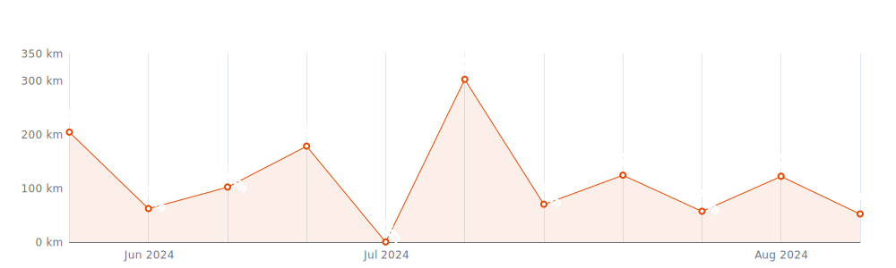
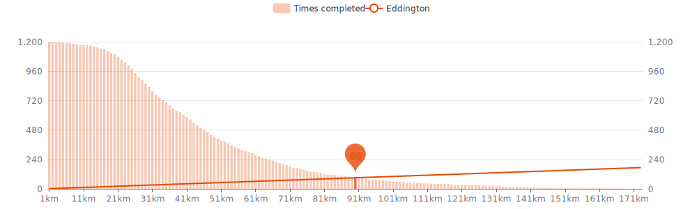
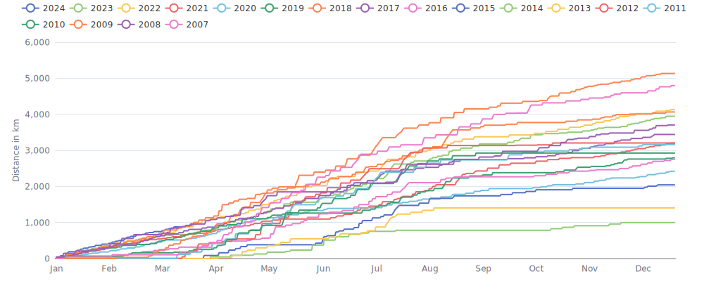

    

Since I began cycling `18 years and 7 months` ago on `02-01-2007`,
I had `1267 cycling days`. 
I recorded a total distance of `53 597 km`
(`1.34` trips around the world 🌍 and
`0.139` trips to the moon 🌕),
an elevation of `635 473 m`
(`71.8` times Mount Everest 🏔)
and a total time of `4mos 2w 3d 2h 12m` 🎉

That's a daily average of `9 km`,
a weekly average of `60 km` and a
monthly average of `260 km` 🐣

I burned `1349309 calories` doing so, that's about `4 997` pizza slices 🍕

---

<kbd><a href="#weekly-distances">Weekly distances</a></kbd> |
<kbd><a href="#activities">Activities</a></kbd> |
<kbd><a href="#monthly-stats">Monthly stats</a></kbd> |
<kbd><a href="#activity-intensity">Activity intensity</a></kbd> |
<kbd><a href="#stats-per-weekday">Stats per weekday</a></kbd> |
<kbd><a href="#daytime-stats">Daytime stats</a></kbd> |
<kbd><a href="#stats-per-bike">Stats per bike</a></kbd> |
<kbd><a href="#best-power-outputs-over-time">Power outputs</a></kbd> |
<kbd><a href="#eddington-chart">Eddington</a></kbd> |
<kbd><a href="#yearly-distances">Yearly distances</a></kbd> |
<kbd><a href="#distance-breakdown">Distance breakdown</a></kbd> |
<kbd><a href="#challenge-consistency">Challenge consistency</a></kbd> |
<kbd><a href="#completed-challenges">Completed challenges</a></kbd>

## Weekly distances

## Activities

<table>
    <tr>
        <th></th>
        <th></th>
        <th align="center"></th>
        <th align="center"></th>
        <th align="center"></th>
        <th align="center"></th>
        <th align="center"></th>
        <th align="center"></th>
    </tr>
            <tr>
            <td>15-02-24</td>
            <td>
                                
<a href="https://www.strava.com/activities/10767507476" title="Kcal: 499 | Gear: Tacx Neo ">24 Shots to Fire in Watopia</a>
            </td>
            <td align="center">25 km</td>
            <td align="center">316 m</td>
            <td align="center">59:28</td>
            <td align="center">147 w</td>
            <td align="center">25 km/h</td>
            <td align="center">131</td>
        </tr>
            <tr>
            <td>13-02-24</td>
            <td>
                                
<a href="https://www.strava.com/activities/10754544228" title="Kcal: 678 | Gear: Tacx Neo ">Saw Legs in Makuri Islands</a>
            </td>
            <td align="center">29 km</td>
            <td align="center">393 m</td>
            <td align="center">1:17:20</td>
            <td align="center">153 w</td>
            <td align="center">22.3 km/h</td>
            <td align="center">129</td>
        </tr>
            <tr>
            <td>12-02-24</td>
            <td>
                                
<a href="https://www.strava.com/activities/10747671867" title="Kcal: 602 | Gear: Tacx Neo ">Lumpy Ramps in Watopia</a>
            </td>
            <td align="center">34 km</td>
            <td align="center">160 m</td>
            <td align="center">1:06:53</td>
            <td align="center">157 w</td>
            <td align="center">30.6 km/h</td>
            <td align="center">136</td>
        </tr>
            <tr>
            <td>11-02-24</td>
            <td>
                                
<a href="https://www.strava.com/activities/10739744699" title="Kcal: 524 | Gear: Tacx Neo ">Over-Under&#039;s, MTB Style in...</a>
            </td>
            <td align="center">28 km</td>
            <td align="center">205 m</td>
            <td align="center">1:00:22</td>
            <td align="center">152 w</td>
            <td align="center">28.1 km/h</td>
            <td align="center">138</td>
        </tr>
            <tr>
            <td>08-02-24</td>
            <td>
                                
<a href="https://www.strava.com/activities/10721942311" title="Kcal: 388 | Gear: Tacx Neo ">The &#039;Grind&#039; Finale in New ...</a>
            </td>
            <td align="center">18 km</td>
            <td align="center">331 m</td>
            <td align="center">52:01</td>
            <td align="center">131 w</td>
            <td align="center">20.5 km/h</td>
            <td align="center">128</td>
        </tr>
        </table>

    
Older activities

    <table>
        <tr>
            <th></th>
            <th></th>
            <th align="center"></th>
            <th align="center"></th>
            <th align="center"></th>
            <th align="center"></th>
            <th align="center"></th>
            <th align="center"></th>
        </tr>
                    <tr>
                <td>06-02-24</td>
                <td>
                                    
<a href="https://www.strava.com/activities/10708598341" title="Kcal: 531 | Gear: Tacx Neo ">The Rollercoaster in New York</a>
                </td>
                <td align="center">27 km</td>
                <td align="center">328 m</td>
                <td align="center">1:00:43</td>
                <td align="center">153 w</td>
                <td align="center">26.3 km/h</td>
                <td align="center">134</td>
            </tr>
                    <tr>
                <td>04-02-24</td>
                <td>
                                    
<a href="https://www.strava.com/activities/10693341214" title="Kcal: 853 | Gear: Tacx Neo ">Climb Portal: Bealach na B...</a>
                </td>
                <td align="center">31 km</td>
                <td align="center">721 m</td>
                <td align="center">1:30:27</td>
                <td align="center">165 w</td>
                <td align="center">20.8 km/h</td>
                <td align="center">151</td>
            </tr>
                    <tr>
                <td>02-02-24</td>
                <td>
                                    
<a href="https://www.strava.com/activities/10681655455" title="Kcal: 437 | Gear: Tacx Neo ">Strength Surges in Watopia</a>
                </td>
                <td align="center">25 km</td>
                <td align="center">96 m</td>
                <td align="center">53:14</td>
                <td align="center">144 w</td>
                <td align="center">27.6 km/h</td>
                <td align="center">128</td>
            </tr>
                    <tr>
                <td>29-01-24</td>
                <td>
                                    
<a href="https://www.strava.com/activities/10654647729" title="Kcal: 636 | Gear: Tacx Neo ">Threshold Scatter in Watopia</a>
                </td>
                <td align="center">35 km</td>
                <td align="center">137 m</td>
                <td align="center">1:11:08</td>
                <td align="center">156 w</td>
                <td align="center">29.5 km/h</td>
                <td align="center">141</td>
            </tr>
                    <tr>
                <td>25-01-24</td>
                <td>
                                    
<a href="https://www.strava.com/activities/10627783777" title="Kcal: 629 | Gear: Tacx Neo ">Varying Threshold in Scotland</a>
                </td>
                <td align="center">31 km</td>
                <td align="center">338 m</td>
                <td align="center">1:10:26</td>
                <td align="center">156 w</td>
                <td align="center">26.7 km/h</td>
                <td align="center">143</td>
            </tr>
                    <tr>
                <td>23-01-24</td>
                <td>
                                    
<a href="https://www.strava.com/activities/10614501104" title="Kcal: 527 | Gear: Tacx Neo ">65rpm Strength Ramps in Fr...</a>
                </td>
                <td align="center">15 km</td>
                <td align="center">492 m</td>
                <td align="center">1:01:06</td>
                <td align="center">151 w</td>
                <td align="center">14.6 km/h</td>
                <td align="center">137</td>
            </tr>
                    <tr>
                <td>21-01-24</td>
                <td>
                                    
<a href="https://www.strava.com/activities/10600175517" title="Kcal: 515 | Gear: Tacx Neo ">Surge to the Max in Scotland</a>
                </td>
                <td align="center">28 km</td>
                <td align="center">224 m</td>
                <td align="center">1:03:41</td>
                <td align="center">141 w</td>
                <td align="center">26.7 km/h</td>
                <td align="center">136</td>
            </tr>
                    <tr>
                <td>18-01-24</td>
                <td>
                                    
<a href="https://www.strava.com/activities/10582728399" title="Kcal: 491 | Gear: Tacx Neo ">70rpm Strength Ramps in Wa...</a>
                </td>
                <td align="center">30 km</td>
                <td align="center">46 m</td>
                <td align="center">1:01:20</td>
                <td align="center">140 w</td>
                <td align="center">28.9 km/h</td>
                <td align="center">138</td>
            </tr>
                    <tr>
                <td>16-01-24</td>
                <td>
                                    
<a href="https://www.strava.com/activities/10570468839" title="Kcal: 588 | Gear: Tacx Neo ">Back to Basics in Makuri I...</a>
                </td>
                <td align="center">32 km</td>
                <td align="center">173 m</td>
                <td align="center">1:09:07</td>
                <td align="center">149 w</td>
                <td align="center">27.7 km/h</td>
                <td align="center">135</td>
            </tr>
                    <tr>
                <td>14-01-24</td>
                <td>
                                    
<a href="https://www.strava.com/activities/10555967538" title="Kcal: 696 | Gear: Tacx Neo ">Sugar Cookie in Watopia</a>
                </td>
                <td align="center">40 km</td>
                <td align="center">260 m</td>
                <td align="center">1:19:17</td>
                <td align="center">153 w</td>
                <td align="center">30.4 km/h</td>
                <td align="center">135</td>
            </tr>
                    <tr>
                <td>09-01-24</td>
                <td>
                                    
<a href="https://www.strava.com/activities/10525291237" title="Kcal: 582 | Gear: Tacx Neo ">ROUVY - Tour Down Under 20...</a>
                </td>
                <td align="center">32 km</td>
                <td align="center">486 m</td>
                <td align="center">1:19:20</td>
                <td align="center">128 w</td>
                <td align="center">24.5 km/h</td>
                <td align="center">120</td>
            </tr>
                    <tr>
                <td>08-01-24</td>
                <td>
                                    
<a href="https://www.strava.com/activities/10518782642" title="Kcal: 631 | Gear: Tacx Neo ">ROUVY - DATEV Challenge Ro...</a>
                </td>
                <td align="center">38 km</td>
                <td align="center">414 m</td>
                <td align="center">1:21:28</td>
                <td align="center">135 w</td>
                <td align="center">28 km/h</td>
                <td align="center">130</td>
            </tr>
                    <tr>
                <td>07-01-24</td>
                <td>
                                    
<a href="https://www.strava.com/activities/10511079567" title="Kcal: 667 | Gear: Tacx Neo ">ROUVY - Challenge Peguera ...</a>
                </td>
                <td align="center">40 km</td>
                <td align="center">500 m</td>
                <td align="center">1:26:09</td>
                <td align="center">135 w</td>
                <td align="center">27.9 km/h</td>
                <td align="center">132</td>
            </tr>
                    <tr>
                <td>04-01-24</td>
                <td>
                                    
<a href="https://www.strava.com/activities/10493450113" title="Kcal: 594 | Gear: Tacx Neo ">ROUVY - Tour Down Under 20...</a>
                </td>
                <td align="center">35 km</td>
                <td align="center">332 m</td>
                <td align="center">1:16:41</td>
                <td align="center">135 w</td>
                <td align="center">27.6 km/h</td>
                <td align="center">135</td>
            </tr>
                    <tr>
                <td>02-01-24</td>
                <td>
                                    
<a href="https://www.strava.com/activities/10480422697" title="Kcal: 688 | Gear: Tacx Neo ">ROUVY - Lake Pukaki | New ...</a>
                </td>
                <td align="center">42 km</td>
                <td align="center">269 m</td>
                <td align="center">1:21:39</td>
                <td align="center">147 w</td>
                <td align="center">30.8 km/h</td>
                <td align="center">145</td>
            </tr>
                    <tr>
                <td>26-12-23</td>
                <td>
                                    
<a href="https://www.strava.com/activities/10440344414" title="Kcal: 210 | Gear: Tacx Neo ">ROUVY - Valdresflye to Sjo...</a>
                </td>
                <td align="center">22 km</td>
                <td align="center">80 m</td>
                <td align="center">37:48</td>
                <td align="center">97 w</td>
                <td align="center">34.7 km/h</td>
                <td align="center">116</td>
            </tr>
                    <tr>
                <td>26-12-23</td>
                <td>
                                    
<a href="https://www.strava.com/activities/10440118301" title="Kcal: 290 | Gear: Tacx Neo ">ROUVY - Atlantic Road | No...</a>
                </td>
                <td align="center">19 km</td>
                <td align="center">120 m</td>
                <td align="center">36:54</td>
                <td align="center">137 w</td>
                <td align="center">30.2 km/h</td>
                <td align="center">127</td>
            </tr>
                    <tr>
                <td>23-12-23</td>
                <td>
                                    
<a href="https://www.strava.com/activities/10425665938" title="Kcal: 573 | Gear: Tacx Neo ">ROUVY - Zion National Park...</a>
                </td>
                <td align="center">18 km</td>
                <td align="center">548 m</td>
                <td align="center">1:00:12</td>
                <td align="center">166 w</td>
                <td align="center">18.3 km/h</td>
                <td align="center">138</td>
            </tr>
                    <tr>
                <td>19-12-23</td>
                <td>
                                    
<a href="https://www.strava.com/activities/10405328999" title="Kcal: 677 | Gear: Tacx Neo ">ROUVY - Around Mara Dam | ...</a>
                </td>
                <td align="center">23 km</td>
                <td align="center">615 m</td>
                <td align="center">1:09:53</td>
                <td align="center">169 w</td>
                <td align="center">19.7 km/h</td>
                <td align="center">138</td>
            </tr>
                    <tr>
                <td>17-12-23</td>
                <td>
                                    
<a href="https://www.strava.com/activities/10393805186" title="Kcal: 826 | Gear: Tacx Neo ">ROUVY - Panorama Route 2 |...</a>
                </td>
                <td align="center">32 km</td>
                <td align="center">735 m</td>
                <td align="center">1:34:46</td>
                <td align="center">152 w</td>
                <td align="center">20.5 km/h</td>
                <td align="center">137</td>
            </tr>
                    <tr>
                <td>14-12-23</td>
                <td>
                                    
<a href="https://www.strava.com/activities/10379873729" title="Kcal: 487 | Gear: Tacx Neo ">ROUVY - Through Moravian H...</a>
                </td>
                <td align="center">31 km</td>
                <td align="center">463 m</td>
                <td align="center">1:07:54</td>
                <td align="center">125 w</td>
                <td align="center">27.3 km/h</td>
                <td align="center">133</td>
            </tr>
                    <tr>
                <td>12-12-23</td>
                <td>
                                    
<a href="https://www.strava.com/activities/10369280368" title="Kcal: 616 | Gear: Tacx Neo ">ROUVY - Kralova Lehota | L...</a>
                </td>
                <td align="center">18 km</td>
                <td align="center">580 m</td>
                <td align="center">1:01:46</td>
                <td align="center">174 w</td>
                <td align="center">17.8 km/h</td>
                <td align="center">136</td>
            </tr>
                    <tr>
                <td>10-12-23</td>
                <td>
                                    
<a href="https://www.strava.com/activities/10357843621" title="Kcal: 753 | Gear: Tacx Neo ">ROUVY - Panorama Route 1 |...</a>
                </td>
                <td align="center">33 km</td>
                <td align="center">640 m</td>
                <td align="center">1:37:23</td>
                <td align="center">135 w</td>
                <td align="center">20.2 km/h</td>
                <td align="center">137</td>
            </tr>
                    <tr>
                <td>07-12-23</td>
                <td>
                                    
<a href="https://www.strava.com/activities/10343598574" title="Kcal: 551 | Gear: Tacx Neo ">ROUVY - Demanovska Valley ...</a>
                </td>
                <td align="center">14 km</td>
                <td align="center">548 m</td>
                <td align="center">53:38</td>
                <td align="center">179 w</td>
                <td align="center">15.9 km/h</td>
                <td align="center">153</td>
            </tr>
                    <tr>
                <td>05-12-23</td>
                <td>
                                    
<a href="https://www.strava.com/activities/10332904831" title="Kcal: 495 | Gear: Tacx Neo ">ROUVY - Arthur&#039;s Pass Nati...</a>
                </td>
                <td align="center">21 km</td>
                <td align="center">401 m</td>
                <td align="center">56:44</td>
                <td align="center">152 w</td>
                <td align="center">22.3 km/h</td>
                <td align="center">135</td>
            </tr>
                    <tr>
                <td>03-12-23</td>
                <td>
                                    
<a href="https://www.strava.com/activities/10321137116" title="Kcal: 831 | Gear: Tacx Neo ">ROUVY - Three Valley Lake ...</a>
                </td>
                <td align="center">49 km</td>
                <td align="center">329 m</td>
                <td align="center">1:44:13</td>
                <td align="center">139 w</td>
                <td align="center">28.3 km/h</td>
                <td align="center">142</td>
            </tr>
                    <tr>
                <td>30-11-23</td>
                <td>
                                    
<a href="https://www.strava.com/activities/10306851472" title="Kcal: 428 | Gear: Tacx Neo ">ROUVY - Biggesee | Germany</a>
                </td>
                <td align="center">27 km</td>
                <td align="center">276 m</td>
                <td align="center">56:09</td>
                <td align="center">133 w</td>
                <td align="center">28.4 km/h</td>
                <td align="center">134</td>
            </tr>
                    <tr>
                <td>20-11-23</td>
                <td>
                                    
<a href="https://www.strava.com/activities/10251798166" title="Kcal: 404 | Gear: Tacx Neo ">ROUVY - Challenge Canberra...</a>
                </td>
                <td align="center">21 km</td>
                <td align="center">314 m</td>
                <td align="center">48:52</td>
                <td align="center">144 w</td>
                <td align="center">25.5 km/h</td>
                <td align="center">139</td>
            </tr>
                    <tr>
                <td>16-11-23</td>
                <td>
                                    
<a href="https://www.strava.com/activities/10229400306" title="Kcal: 179 | Gear: Tacx Neo ">ROUVY - Along the North Sa...</a>
                </td>
                <td align="center">12 km</td>
                <td align="center">93 m</td>
                <td align="center">24:55</td>
                <td align="center">125 w</td>
                <td align="center">28.7 km/h</td>
                <td align="center">140</td>
            </tr>
                    <tr>
                <td>16-11-23</td>
                <td>
                                    
<a href="https://www.strava.com/activities/10229281385" title="Kcal: 299 | Gear: Tacx Neo ">ROUVY - Valley of Yoho Nat...</a>
                </td>
                <td align="center">17 km</td>
                <td align="center">179 m</td>
                <td align="center">36:43</td>
                <td align="center">142 w</td>
                <td align="center">27.7 km/h</td>
                <td align="center">137</td>
            </tr>
                    <tr>
                <td>14-11-23</td>
                <td>
                                    
<a href="https://www.strava.com/activities/10217587901" title="Kcal: 353 | Gear: Tacx Neo ">ROUVY - Three Valley Lake ...</a>
                </td>
                <td align="center">23 km</td>
                <td align="center">155 m</td>
                <td align="center">43:37</td>
                <td align="center">141 w</td>
                <td align="center">31 km/h</td>
                <td align="center">143</td>
            </tr>
                    <tr>
                <td>12-11-23</td>
                <td>
                                    
<a href="https://www.strava.com/activities/10204590126" title="Kcal: 374 | Gear: Tacx Neo ">ROUVY - Along the Okanagan...</a>
                </td>
                <td align="center">18 km</td>
                <td align="center">251 m</td>
                <td align="center">40:27</td>
                <td align="center">161 w</td>
                <td align="center">26 km/h</td>
                <td align="center">146</td>
            </tr>
                    <tr>
                <td>12-11-23</td>
                <td>
                                    
<a href="https://www.strava.com/activities/10204230023" title="Kcal: 159 | Gear: Tacx Neo ">ROUVY - Lake Minnewanka to...</a>
                </td>
                <td align="center">10 km</td>
                <td align="center">75 m</td>
                <td align="center">19:04</td>
                <td align="center">147 w</td>
                <td align="center">32.5 km/h</td>
                <td align="center">124</td>
            </tr>
                    <tr>
                <td>07-11-23</td>
                <td>
                                    
<a href="https://www.strava.com/activities/10177403978" title="Kcal: 552 | Gear: Tacx Neo ">ROUVY - Lavender fields in...</a>
                </td>
                <td align="center">34 km</td>
                <td align="center">281 m</td>
                <td align="center">1:09:44</td>
                <td align="center">139 w</td>
                <td align="center">29.3 km/h</td>
                <td align="center">135</td>
            </tr>
                    <tr>
                <td>29-10-23</td>
                <td>
                                    
<a href="https://www.strava.com/activities/10123915600" title="Kcal: 145 | Gear: Tacx Neo ">ROUVY - West Coast Nationa...</a>
                </td>
                <td align="center">8 km</td>
                <td align="center">123 m</td>
                <td align="center">20:25</td>
                <td align="center">124 w</td>
                <td align="center">24.1 km/h</td>
                <td align="center">130</td>
            </tr>
                    <tr>
                <td>29-10-23</td>
                <td>
                                    
<a href="https://www.strava.com/activities/10123726786" title="Kcal: 421 | Gear: Tacx Neo ">ROUVY - High Alpine Road |...</a>
                </td>
                <td align="center">13 km</td>
                <td align="center">371 m</td>
                <td align="center">43:25</td>
                <td align="center">170 w</td>
                <td align="center">18 km/h</td>
                <td align="center">132</td>
            </tr>
                    <tr>
                <td>24-10-23</td>
                <td>
                                    
<a href="https://www.strava.com/activities/10096677515" title="Kcal: 51 | Gear: Tacx Neo ">ROUVY - High Alpine Road |...</a>
                </td>
                <td align="center">3 km</td>
                <td align="center">37 m</td>
                <td align="center">10:19</td>
                <td align="center">86 w</td>
                <td align="center">18 km/h</td>
                <td align="center">121</td>
            </tr>
                    <tr>
                <td>24-10-23</td>
                <td>
                                    
<a href="https://www.strava.com/activities/10096616987" title="Kcal: 297 | Gear: Tacx Neo ">ROUVY - Devils Tower Natio...</a>
                </td>
                <td align="center">15 km</td>
                <td align="center">244 m</td>
                <td align="center">36:10</td>
                <td align="center">143 w</td>
                <td align="center">24.6 km/h</td>
                <td align="center">131</td>
            </tr>
                    <tr>
                <td>14-10-23</td>
                <td>
                                    
<a href="https://www.strava.com/activities/10037541921" title="Kcal: 405 | Gear: Tacx Neo ">ROUVY - Colorado River | U...</a>
                </td>
                <td align="center">31 km</td>
                <td align="center">153 m</td>
                <td align="center">57:54</td>
                <td align="center">122 w</td>
                <td align="center">31.9 km/h</td>
                <td align="center">121</td>
            </tr>
                    <tr>
                <td>13-10-23</td>
                <td>
                                    
<a href="https://www.strava.com/activities/10031184594" title="Kcal: 42 | Gear: Tacx Neo ">ROUVY - ROUVY Tutorial ride</a>
                </td>
                <td align="center">3 km</td>
                <td align="center">20 m</td>
                <td align="center">6:35</td>
                <td align="center">111 w</td>
                <td align="center">29.2 km/h</td>
                <td align="center">n/a</td>
            </tr>
                    <tr>
                <td>07-10-23</td>
                <td>
                    
<a href="https://www.strava.com/activities/9993028435" title="Kcal: 2717 | Gear: YT Szepter ">🌧 Maasmechelen, Vlaanderen...</a>
                </td>
                <td align="center">94 km</td>
                <td align="center">509 m</td>
                <td align="center">4:15:01</td>
                <td align="center">154 w</td>
                <td align="center">22.1 km/h</td>
                <td align="center">150</td>
            </tr>
                    <tr>
                <td>01-10-23</td>
                <td>
                    
<a href="https://www.strava.com/activities/9958644119" title="Kcal: 1127 | Gear: Stumpie ">☀️ Herentals, Vlaanderen -...</a>
                </td>
                <td align="center">34 km</td>
                <td align="center">217 m</td>
                <td align="center">1:47:06</td>
                <td align="center">143 w</td>
                <td align="center">19 km/h</td>
                <td align="center">148</td>
            </tr>
                    <tr>
                <td>28-09-23</td>
                <td>
                    
<a href="https://www.strava.com/activities/9937923689" title="Kcal: 1101 | Gear: Litespeed T5G ">⛅ Sint-Pieters-Woluwe, Bru...</a>
                </td>
                <td align="center">46 km</td>
                <td align="center">535 m</td>
                <td align="center">2:18:43</td>
                <td align="center">104 w</td>
                <td align="center">19.9 km/h</td>
                <td align="center">127</td>
            </tr>
                    <tr>
                <td>24-09-23</td>
                <td>
                    
<a href="https://www.strava.com/activities/9910498448" title="Kcal: 1314 | Gear: YT Szepter ">☀️ Zoersel, Vlaanderen - M...</a>
                </td>
                <td align="center">46 km</td>
                <td align="center">102 m</td>
                <td align="center">1:59:47</td>
                <td align="center">159 w</td>
                <td align="center">23.3 km/h</td>
                <td align="center">152</td>
            </tr>
                    <tr>
                <td>07-09-23</td>
                <td>
                    
<a href="https://www.strava.com/activities/9801960528" title="Kcal: 1265 | Gear: YT Szepter ">⛅ Een boodschap met een de...</a>
                </td>
                <td align="center">54 km</td>
                <td align="center">147 m</td>
                <td align="center">2:41:42</td>
                <td align="center">106 w</td>
                <td align="center">20 km/h</td>
                <td align="center">124</td>
            </tr>
                    <tr>
                <td>03-09-23</td>
                <td>
                    
<a href="https://www.strava.com/activities/9774140038" title="Kcal: 1818 | Gear: YT Szepter ">⛅ Gravel op de TT Poederlee</a>
                </td>
                <td align="center">61 km</td>
                <td align="center">122 m</td>
                <td align="center">2:44:00</td>
                <td align="center">161 w</td>
                <td align="center">22.2 km/h</td>
                <td align="center">157</td>
            </tr>
                    <tr>
                <td>27-08-23</td>
                <td>
                    
<a href="https://www.strava.com/activities/9729997442" title="Kcal: 1482 | Gear: YT Szepter ">⛅ Zoersel, Vlaanderen - Mo...</a>
                </td>
                <td align="center">53 km</td>
                <td align="center">72 m</td>
                <td align="center">2:15:28</td>
                <td align="center">159 w</td>
                <td align="center">23.5 km/h</td>
                <td align="center">127</td>
            </tr>
                    <tr>
                <td>22-08-23</td>
                <td>
                    
<a href="https://www.strava.com/activities/9699500721" title="Kcal: 1359 | Gear: Stumpie ">⛅ Aarschot, Vlaanderen - A...</a>
                </td>
                <td align="center">39 km</td>
                <td align="center">498 m</td>
                <td align="center">2:17:41</td>
                <td align="center">135 w</td>
                <td align="center">17.1 km/h</td>
                <td align="center">130</td>
            </tr>
                    <tr>
                <td>20-08-23</td>
                <td>
                    
<a href="https://www.strava.com/activities/9684999438" title="Kcal: 2714 | Gear: YT Szepter ">☀️ Sint-Katelijne-Waver, V...</a>
                </td>
                <td align="center">100 km</td>
                <td align="center">185 m</td>
                <td align="center">4:20:32</td>
                <td align="center">150 w</td>
                <td align="center">23.1 km/h</td>
                <td align="center">144</td>
            </tr>
                    <tr>
                <td>16-08-23</td>
                <td>
                    
<a href="https://www.strava.com/activities/9660205552" title="Kcal: 1164 | Gear: Stumpie ">⛅ Oud-Heverlee, Vlaanderen...</a>
                </td>
                <td align="center">32 km</td>
                <td align="center">454 m</td>
                <td align="center">1:55:28</td>
                <td align="center">142 w</td>
                <td align="center">16.4 km/h</td>
                <td align="center">133</td>
            </tr>
            </table>

## Monthly stats

<table>
    <thead>
    <tr>
        <th>&nbsp;&nbsp;&nbsp;&nbsp;&nbsp;</th>
        <th># of rides</th>
        <th align="center"></th>
        <th align="center"></th>
        <th align="center"></th>
        <th align="center"></th>
    </tr>
    </thead>
    <tbody>
            <tr>
            <td align="center">February 2024</td>
            <td align="center">8</td>
            <td align="center">216 km</td>
            <td align="center">2 550 m</td>
            <td align="center">8h 40m</td>
            <td align="center">0</td>
        </tr>
            <tr>
            <td align="center">January 2024</td>
            <td align="center">12</td>
            <td align="center">399 km</td>
            <td align="center">3 671 m</td>
            <td align="center">14h 41m</td>
            <td align="center">2</td>
        </tr>
            <tr>
            <td align="center">December 2023</td>
            <td align="center">11</td>
            <td align="center">281 km</td>
            <td align="center">5 059 m</td>
            <td align="center">12h 21m</td>
            <td align="center">0</td>
        </tr>
            <tr>
            <td align="center">November 2023</td>
            <td align="center">8</td>
            <td align="center">161 km</td>
            <td align="center">1 624 m</td>
            <td align="center">5h 39m</td>
            <td align="center">0</td>
        </tr>
            <tr>
            <td align="center">October 2023</td>
            <td align="center">8</td>
            <td align="center">201 km</td>
            <td align="center">1 674 m</td>
            <td align="center">8h 56m</td>
            <td align="center">2</td>
        </tr>
            <tr>
            <td align="center">September 2023</td>
            <td align="center">4</td>
            <td align="center">207 km</td>
            <td align="center">906 m</td>
            <td align="center">9h 44m</td>
            <td align="center">2</td>
        </tr>
            <tr>
            <td align="center">August 2023</td>
            <td align="center">8</td>
            <td align="center">358 km</td>
            <td align="center">2 679 m</td>
            <td align="center">17h 42m</td>
            <td align="center">3</td>
        </tr>
            <tr>
            <td align="center">July 2023</td>
            <td align="center">11</td>
            <td align="center">650 km</td>
            <td align="center">14 737 m</td>
            <td align="center">1d 21h 55m</td>
            <td align="center">7</td>
        </tr>
            <tr>
            <td align="center">June 2023</td>
            <td align="center">9</td>
            <td align="center">494 km</td>
            <td align="center">5 206 m</td>
            <td align="center">1d 3h</td>
            <td align="center">4</td>
        </tr>
            <tr>
            <td align="center">May 2023</td>
            <td align="center">5</td>
            <td align="center">307 km</td>
            <td align="center">2 129 m</td>
            <td align="center">14h 25m</td>
            <td align="center">5</td>
        </tr>
            <tr>
            <td align="center">April 2023</td>
            <td align="center">10</td>
            <td align="center">466 km</td>
            <td align="center">4 120 m</td>
            <td align="center">20h 46m</td>
            <td align="center">1</td>
        </tr>
            <tr>
            <td align="center">March 2023</td>
            <td align="center">6</td>
            <td align="center">165 km</td>
            <td align="center">1 877 m</td>
            <td align="center">6h 44m</td>
            <td align="center">0</td>
        </tr>
            <tr>
            <td align="center">February 2023</td>
            <td align="center">10</td>
            <td align="center">278 km</td>
            <td align="center">2 158 m</td>
            <td align="center">11h 7m</td>
            <td align="center">0</td>
        </tr>
            <tr>
            <td align="center">January 2023</td>
            <td align="center">11</td>
            <td align="center">321 km</td>
            <td align="center">4 055 m</td>
            <td align="center">13h 28m</td>
            <td align="center">0</td>
        </tr>
            <tr>
            <td align="center">December 2022</td>
            <td align="center">6</td>
            <td align="center">196 km</td>
            <td align="center">2 228 m</td>
            <td align="center">8h 37m</td>
            <td align="center">0</td>
        </tr>
            <tr>
            <td align="center">November 2022</td>
            <td align="center">8</td>
            <td align="center">298 km</td>
            <td align="center">2 318 m</td>
            <td align="center">11h 22m</td>
            <td align="center">0</td>
        </tr>
            <tr>
            <td align="center">October 2022</td>
            <td align="center">4</td>
            <td align="center">212 km</td>
            <td align="center">404 m</td>
            <td align="center">10h 25m</td>
            <td align="center">0</td>
        </tr>
            <tr>
            <td align="center">September 2022</td>
            <td align="center">2</td>
            <td align="center">116 km</td>
            <td align="center">1 131 m</td>
            <td align="center">5h 57m</td>
            <td align="center">0</td>
        </tr>
            <tr>
            <td align="center">August 2022</td>
            <td align="center">8</td>
            <td align="center">394 km</td>
            <td align="center">3 335 m</td>
            <td align="center">19h 45m</td>
            <td align="center">0</td>
        </tr>
            <tr>
            <td align="center">July 2022</td>
            <td align="center">10</td>
            <td align="center">528 km</td>
            <td align="center">11 436 m</td>
            <td align="center">1d 16h 26m</td>
            <td align="center">1</td>
        </tr>
            <tr>
            <td align="center">June 2022</td>
            <td align="center">6</td>
            <td align="center">366 km</td>
            <td align="center">8 219 m</td>
            <td align="center">1d 2h 10m</td>
            <td align="center">8</td>
        </tr>
            <tr>
            <td align="center">May 2022</td>
            <td align="center">12</td>
            <td align="center">591 km</td>
            <td align="center">8 352 m</td>
            <td align="center">1d 9h 44m</td>
            <td align="center">7</td>
        </tr>
            <tr>
            <td align="center">April 2022</td>
            <td align="center">8</td>
            <td align="center">283 km</td>
            <td align="center">2 497 m</td>
            <td align="center">14h 39m</td>
            <td align="center">0</td>
        </tr>
            <tr>
            <td align="center">March 2022</td>
            <td align="center">13</td>
            <td align="center">485 km</td>
            <td align="center">2 565 m</td>
            <td align="center">20h 30m</td>
            <td align="center">0</td>
        </tr>
            <tr>
            <td align="center">February 2022</td>
            <td align="center">7</td>
            <td align="center">204 km</td>
            <td align="center">1 464 m</td>
            <td align="center">7h 13m</td>
            <td align="center">0</td>
        </tr>
            <tr>
            <td align="center">January 2022</td>
            <td align="center">14</td>
            <td align="center">360 km</td>
            <td align="center">4 125 m</td>
            <td align="center">15h 2m</td>
            <td align="center">0</td>
        </tr>
            <tr>
            <td align="center">December 2021</td>
            <td align="center">11</td>
            <td align="center">233 km</td>
            <td align="center">2 027 m</td>
            <td align="center">8h 14m</td>
            <td align="center">0</td>
        </tr>
            <tr>
            <td align="center">November 2021</td>
            <td align="center">7</td>
            <td align="center">158 km</td>
            <td align="center">1 247 m</td>
            <td align="center">6h 22m</td>
            <td align="center">0</td>
        </tr>
            <tr>
            <td align="center">October 2021</td>
            <td align="center">5</td>
            <td align="center">154 km</td>
            <td align="center">1 618 m</td>
            <td align="center">8h 22m</td>
            <td align="center">0</td>
        </tr>
            <tr>
            <td align="center">September 2021</td>
            <td align="center">6</td>
            <td align="center">283 km</td>
            <td align="center">1 756 m</td>
            <td align="center">14h 57m</td>
            <td align="center">3</td>
        </tr>
            <tr>
            <td align="center">August 2021</td>
            <td align="center">14</td>
            <td align="center">508 km</td>
            <td align="center">10 550 m</td>
            <td align="center">1d 13h 20m</td>
            <td align="center">3</td>
        </tr>
            <tr>
            <td align="center">July 2021</td>
            <td align="center">11</td>
            <td align="center">456 km</td>
            <td align="center">3 604 m</td>
            <td align="center">22h 46m</td>
            <td align="center">2</td>
        </tr>
            <tr>
            <td align="center">June 2021</td>
            <td align="center">9</td>
            <td align="center">301 km</td>
            <td align="center">2 382 m</td>
            <td align="center">15h 22m</td>
            <td align="center">0</td>
        </tr>
            <tr>
            <td align="center">May 2021</td>
            <td align="center">3</td>
            <td align="center">91 km</td>
            <td align="center">420 m</td>
            <td align="center">4h 39m</td>
            <td align="center">0</td>
        </tr>
            <tr>
            <td align="center">April 2021</td>
            <td align="center">9</td>
            <td align="center">214 km</td>
            <td align="center">1 475 m</td>
            <td align="center">10h 20m</td>
            <td align="center">0</td>
        </tr>
            <tr>
            <td align="center">March 2021</td>
            <td align="center">9</td>
            <td align="center">216 km</td>
            <td align="center">2 797 m</td>
            <td align="center">8h 52m</td>
            <td align="center">0</td>
        </tr>
            <tr>
            <td align="center">February 2021</td>
            <td align="center">9</td>
            <td align="center">248 km</td>
            <td align="center">1 454 m</td>
            <td align="center">10h 32m</td>
            <td align="center">0</td>
        </tr>
            <tr>
            <td align="center">January 2021</td>
            <td align="center">12</td>
            <td align="center">276 km</td>
            <td align="center">3 134 m</td>
            <td align="center">12h 47m</td>
            <td align="center">0</td>
        </tr>
            <tr>
            <td align="center">December 2020</td>
            <td align="center">8</td>
            <td align="center">186 km</td>
            <td align="center">2 410 m</td>
            <td align="center">8h 37m</td>
            <td align="center">0</td>
        </tr>
            <tr>
            <td align="center">November 2020</td>
            <td align="center">6</td>
            <td align="center">189 km</td>
            <td align="center">801 m</td>
            <td align="center">9h 58m</td>
            <td align="center">0</td>
        </tr>
            <tr>
            <td align="center">October 2020</td>
            <td align="center">4</td>
            <td align="center">104 km</td>
            <td align="center">1 122 m</td>
            <td align="center">5h 24m</td>
            <td align="center">0</td>
        </tr>
            <tr>
            <td align="center">September 2020</td>
            <td align="center">3</td>
            <td align="center">129 km</td>
            <td align="center">765 m</td>
            <td align="center">6h 52m</td>
            <td align="center">0</td>
        </tr>
            <tr>
            <td align="center">August 2020</td>
            <td align="center">8</td>
            <td align="center">226 km</td>
            <td align="center">1 281 m</td>
            <td align="center">16h 56m</td>
            <td align="center">0</td>
        </tr>
            <tr>
            <td align="center">July 2020</td>
            <td align="center">5</td>
            <td align="center">175 km</td>
            <td align="center">1 598 m</td>
            <td align="center">10h 46m</td>
            <td align="center">0</td>
        </tr>
            <tr>
            <td align="center">June 2020</td>
            <td align="center">3</td>
            <td align="center">81 km</td>
            <td align="center">875 m</td>
            <td align="center">5h 1m</td>
            <td align="center">0</td>
        </tr>
            <tr>
            <td align="center">May 2020</td>
            <td align="center">9</td>
            <td align="center">239 km</td>
            <td align="center">1 902 m</td>
            <td align="center">14h 1m</td>
            <td align="center">0</td>
        </tr>
            <tr>
            <td align="center">April 2020</td>
            <td align="center">13</td>
            <td align="center">404 km</td>
            <td align="center">1 850 m</td>
            <td align="center">23h 29m</td>
            <td align="center">0</td>
        </tr>
            <tr>
            <td align="center">March 2020</td>
            <td align="center">10</td>
            <td align="center">217 km</td>
            <td align="center">3 169 m</td>
            <td align="center">10h 35m</td>
            <td align="center">0</td>
        </tr>
            <tr>
            <td align="center">February 2020</td>
            <td align="center">10</td>
            <td align="center">237 km</td>
            <td align="center">2 817 m</td>
            <td align="center">10h 33m</td>
            <td align="center">0</td>
        </tr>
            <tr>
            <td align="center">January 2020</td>
            <td align="center">12</td>
            <td align="center">182 km</td>
            <td align="center">2 476 m</td>
            <td align="center">8h 49m</td>
            <td align="center">0</td>
        </tr>
            <tr>
            <td align="center">December 2019</td>
            <td align="center">5</td>
            <td align="center">100 km</td>
            <td align="center">621 m</td>
            <td align="center">5h 13m</td>
            <td align="center">0</td>
        </tr>
            <tr>
            <td align="center">November 2019</td>
            <td align="center">7</td>
            <td align="center">198 km</td>
            <td align="center">1 754 m</td>
            <td align="center">8h 28m</td>
            <td align="center">0</td>
        </tr>
            <tr>
            <td align="center">October 2019</td>
            <td align="center">2</td>
            <td align="center">72 km</td>
            <td align="center">426 m</td>
            <td align="center">2h 26m</td>
            <td align="center">0</td>
        </tr>
            <tr>
            <td align="center">September 2019</td>
            <td align="center">3</td>
            <td align="center">149 km</td>
            <td align="center">2 073 m</td>
            <td align="center">7h 59m</td>
            <td align="center">0</td>
        </tr>
            <tr>
            <td align="center">August 2019</td>
            <td align="center">9</td>
            <td align="center">473 km</td>
            <td align="center">7 241 m</td>
            <td align="center">1d 14h 12m</td>
            <td align="center">0</td>
        </tr>
            <tr>
            <td align="center">July 2019</td>
            <td align="center">11</td>
            <td align="center">422 km</td>
            <td align="center">4 562 m</td>
            <td align="center">1d 1h 18m</td>
            <td align="center">0</td>
        </tr>
            <tr>
            <td align="center">June 2019</td>
            <td align="center">1</td>
            <td align="center">76 km</td>
            <td align="center">105 m</td>
            <td align="center">3h 28m</td>
            <td align="center">0</td>
        </tr>
            <tr>
            <td align="center">May 2019</td>
            <td align="center">6</td>
            <td align="center">157 km</td>
            <td align="center">0 m</td>
            <td align="center">6h 26m</td>
            <td align="center">0</td>
        </tr>
            <tr>
            <td align="center">April 2019</td>
            <td align="center">8</td>
            <td align="center">345 km</td>
            <td align="center">1 085 m</td>
            <td align="center">13h 7m</td>
            <td align="center">0</td>
        </tr>
            <tr>
            <td align="center">March 2019</td>
            <td align="center">9</td>
            <td align="center">299 km</td>
            <td align="center">2 410 m</td>
            <td align="center">12h 41m</td>
            <td align="center">0</td>
        </tr>
            <tr>
            <td align="center">February 2019</td>
            <td align="center">4</td>
            <td align="center">120 km</td>
            <td align="center">1 557 m</td>
            <td align="center">4h 38m</td>
            <td align="center">0</td>
        </tr>
            <tr>
            <td align="center">January 2019</td>
            <td align="center">9</td>
            <td align="center">297 km</td>
            <td align="center">3 384 m</td>
            <td align="center">10h 58m</td>
            <td align="center">0</td>
        </tr>
            <tr>
            <td align="center">December 2018</td>
            <td align="center">3</td>
            <td align="center">75 km</td>
            <td align="center">693 m</td>
            <td align="center">2h 31m</td>
            <td align="center">0</td>
        </tr>
            <tr>
            <td align="center">November 2018</td>
            <td align="center">6</td>
            <td align="center">181 km</td>
            <td align="center">832 m</td>
            <td align="center">8h 18m</td>
            <td align="center">0</td>
        </tr>
            <tr>
            <td align="center">October 2018</td>
            <td align="center">1</td>
            <td align="center">37 km</td>
            <td align="center">22 m</td>
            <td align="center">2h 14m</td>
            <td align="center">0</td>
        </tr>
            <tr>
            <td align="center">September 2018</td>
            <td align="center">5</td>
            <td align="center">203 km</td>
            <td align="center">943 m</td>
            <td align="center">11h 5m</td>
            <td align="center">0</td>
        </tr>
            <tr>
            <td align="center">August 2018</td>
            <td align="center">13</td>
            <td align="center">614 km</td>
            <td align="center">10 639 m</td>
            <td align="center">1d 22h 37m</td>
            <td align="center">1</td>
        </tr>
            <tr>
            <td align="center">July 2018</td>
            <td align="center">10</td>
            <td align="center">489 km</td>
            <td align="center">3 422 m</td>
            <td align="center">1d 7h 29m</td>
            <td align="center">1</td>
        </tr>
            <tr>
            <td align="center">June 2018</td>
            <td align="center">7</td>
            <td align="center">338 km</td>
            <td align="center">2 315 m</td>
            <td align="center">19h 13m</td>
            <td align="center">0</td>
        </tr>
            <tr>
            <td align="center">May 2018</td>
            <td align="center">6</td>
            <td align="center">267 km</td>
            <td align="center">1 547 m</td>
            <td align="center">12h 13m</td>
            <td align="center">0</td>
        </tr>
            <tr>
            <td align="center">April 2018</td>
            <td align="center">14</td>
            <td align="center">643 km</td>
            <td align="center">5 795 m</td>
            <td align="center">1d 6h 29m</td>
            <td align="center">0</td>
        </tr>
            <tr>
            <td align="center">March 2018</td>
            <td align="center">15</td>
            <td align="center">482 km</td>
            <td align="center">3 606 m</td>
            <td align="center">23h 49m</td>
            <td align="center">0</td>
        </tr>
            <tr>
            <td align="center">February 2018</td>
            <td align="center">8</td>
            <td align="center">263 km</td>
            <td align="center">2 701 m</td>
            <td align="center">10h 47m</td>
            <td align="center">0</td>
        </tr>
            <tr>
            <td align="center">January 2018</td>
            <td align="center">11</td>
            <td align="center">344 km</td>
            <td align="center">3 686 m</td>
            <td align="center">12h 34m</td>
            <td align="center">0</td>
        </tr>
            <tr>
            <td align="center">December 2017</td>
            <td align="center">5</td>
            <td align="center">153 km</td>
            <td align="center">1 212 m</td>
            <td align="center">5h 17m</td>
            <td align="center">0</td>
        </tr>
            <tr>
            <td align="center">November 2017</td>
            <td align="center">11</td>
            <td align="center">345 km</td>
            <td align="center">4 078 m</td>
            <td align="center">14h 40m</td>
            <td align="center">0</td>
        </tr>
            <tr>
            <td align="center">October 2017</td>
            <td align="center">6</td>
            <td align="center">174 km</td>
            <td align="center">1 194 m</td>
            <td align="center">6h 23m</td>
            <td align="center">0</td>
        </tr>
            <tr>
            <td align="center">September 2017</td>
            <td align="center">1</td>
            <td align="center">22 km</td>
            <td align="center">96 m</td>
            <td align="center">1h 41m</td>
            <td align="center">0</td>
        </tr>
            <tr>
            <td align="center">August 2017</td>
            <td align="center">7</td>
            <td align="center">248 km</td>
            <td align="center">1 171 m</td>
            <td align="center">15h 30m</td>
            <td align="center">1</td>
        </tr>
            <tr>
            <td align="center">July 2017</td>
            <td align="center">11</td>
            <td align="center">398 km</td>
            <td align="center">11 626 m</td>
            <td align="center">1d 14h 35m</td>
            <td align="center">3</td>
        </tr>
            <tr>
            <td align="center">June 2017</td>
            <td align="center">7</td>
            <td align="center">434 km</td>
            <td align="center">4 919 m</td>
            <td align="center">1d 1h 8m</td>
            <td align="center">0</td>
        </tr>
            <tr>
            <td align="center">May 2017</td>
            <td align="center">9</td>
            <td align="center">423 km</td>
            <td align="center">5 498 m</td>
            <td align="center">1d 59m</td>
            <td align="center">0</td>
        </tr>
            <tr>
            <td align="center">April 2017</td>
            <td align="center">9</td>
            <td align="center">373 km</td>
            <td align="center">3 922 m</td>
            <td align="center">16h 47m</td>
            <td align="center">0</td>
        </tr>
            <tr>
            <td align="center">March 2017</td>
            <td align="center">7</td>
            <td align="center">268 km</td>
            <td align="center">1 940 m</td>
            <td align="center">12h 9m</td>
            <td align="center">0</td>
        </tr>
            <tr>
            <td align="center">February 2017</td>
            <td align="center">9</td>
            <td align="center">277 km</td>
            <td align="center">2 316 m</td>
            <td align="center">12h 20m</td>
            <td align="center">0</td>
        </tr>
            <tr>
            <td align="center">January 2017</td>
            <td align="center">10</td>
            <td align="center">297 km</td>
            <td align="center">3 611 m</td>
            <td align="center">11h 46m</td>
            <td align="center">0</td>
        </tr>
            <tr>
            <td align="center">December 2016</td>
            <td align="center">8</td>
            <td align="center">255 km</td>
            <td align="center">928 m</td>
            <td align="center">12h 22m</td>
            <td align="center">0</td>
        </tr>
            <tr>
            <td align="center">November 2016</td>
            <td align="center">3</td>
            <td align="center">73 km</td>
            <td align="center">0 m</td>
            <td align="center">2h 58m</td>
            <td align="center">0</td>
        </tr>
            <tr>
            <td align="center">October 2016</td>
            <td align="center">4</td>
            <td align="center">157 km</td>
            <td align="center">273 m</td>
            <td align="center">7h 43m</td>
            <td align="center">0</td>
        </tr>
            <tr>
            <td align="center">August 2016</td>
            <td align="center">4</td>
            <td align="center">161 km</td>
            <td align="center">1 751 m</td>
            <td align="center">10h 51m</td>
            <td align="center">0</td>
        </tr>
            <tr>
            <td align="center">July 2016</td>
            <td align="center">12</td>
            <td align="center">608 km</td>
            <td align="center">13 766 m</td>
            <td align="center">1d 17h 10m</td>
            <td align="center">1</td>
        </tr>
            <tr>
            <td align="center">June 2016</td>
            <td align="center">9</td>
            <td align="center">352 km</td>
            <td align="center">2 796 m</td>
            <td align="center">20h 40m</td>
            <td align="center">0</td>
        </tr>
            <tr>
            <td align="center">May 2016</td>
            <td align="center">10</td>
            <td align="center">596 km</td>
            <td align="center">5 746 m</td>
            <td align="center">1d 4h 56m</td>
            <td align="center">1</td>
        </tr>
            <tr>
            <td align="center">April 2016</td>
            <td align="center">10</td>
            <td align="center">216 km</td>
            <td align="center">1 242 m</td>
            <td align="center">15h 8m</td>
            <td align="center">0</td>
        </tr>
            <tr>
            <td align="center">March 2016</td>
            <td align="center">6</td>
            <td align="center">93 km</td>
            <td align="center">62 m</td>
            <td align="center">6h 57m</td>
            <td align="center">0</td>
        </tr>
            <tr>
            <td align="center">February 2016</td>
            <td align="center">17</td>
            <td align="center">223 km</td>
            <td align="center">0 m</td>
            <td align="center">14h 41m</td>
            <td align="center">0</td>
        </tr>
            <tr>
            <td align="center">January 2016</td>
            <td align="center">11</td>
            <td align="center">0 km</td>
            <td align="center">0 m</td>
            <td align="center">10h 57m</td>
            <td align="center">0</td>
        </tr>
            <tr>
            <td align="center">December 2015</td>
            <td align="center">10</td>
            <td align="center">95 km</td>
            <td align="center">0 m</td>
            <td align="center">8h 33m</td>
            <td align="center">0</td>
        </tr>
            <tr>
            <td align="center">November 2015</td>
            <td align="center">8</td>
            <td align="center">41 km</td>
            <td align="center">80 m</td>
            <td align="center">10h 3m</td>
            <td align="center">0</td>
        </tr>
            <tr>
            <td align="center">October 2015</td>
            <td align="center">2</td>
            <td align="center">82 km</td>
            <td align="center">64 m</td>
            <td align="center">4h 13m</td>
            <td align="center">0</td>
        </tr>
            <tr>
            <td align="center">September 2015</td>
            <td align="center">2</td>
            <td align="center">88 km</td>
            <td align="center">180 m</td>
            <td align="center">5h 54m</td>
            <td align="center">0</td>
        </tr>
            <tr>
            <td align="center">August 2015</td>
            <td align="center">5</td>
            <td align="center">264 km</td>
            <td align="center">833 m</td>
            <td align="center">12h 36m</td>
            <td align="center">0</td>
        </tr>
            <tr>
            <td align="center">July 2015</td>
            <td align="center">9</td>
            <td align="center">423 km</td>
            <td align="center">12 983 m</td>
            <td align="center">1d 11h 12m</td>
            <td align="center">3</td>
        </tr>
            <tr>
            <td align="center">June 2015</td>
            <td align="center">12</td>
            <td align="center">670 km</td>
            <td align="center">6 405 m</td>
            <td align="center">1d 10h 40m</td>
            <td align="center">1</td>
        </tr>
            <tr>
            <td align="center">May 2015</td>
            <td align="center">5</td>
            <td align="center">0 km</td>
            <td align="center">0 m</td>
            <td align="center">9h 7m</td>
            <td align="center">0</td>
        </tr>
            <tr>
            <td align="center">April 2015</td>
            <td align="center">7</td>
            <td align="center">298 km</td>
            <td align="center">410 m</td>
            <td align="center">14h 16m</td>
            <td align="center">0</td>
        </tr>
            <tr>
            <td align="center">March 2015</td>
            <td align="center">9</td>
            <td align="center">83 km</td>
            <td align="center">127 m</td>
            <td align="center">11h 28m</td>
            <td align="center">0</td>
        </tr>
            <tr>
            <td align="center">February 2015</td>
            <td align="center">9</td>
            <td align="center">0 km</td>
            <td align="center">0 m</td>
            <td align="center">8h 35m</td>
            <td align="center">0</td>
        </tr>
            <tr>
            <td align="center">January 2015</td>
            <td align="center">12</td>
            <td align="center">0 km</td>
            <td align="center">0 m</td>
            <td align="center">12h 41m</td>
            <td align="center">0</td>
        </tr>
            <tr>
            <td align="center">December 2014</td>
            <td align="center">6</td>
            <td align="center">0 km</td>
            <td align="center">0 m</td>
            <td align="center">6h 5m</td>
            <td align="center">0</td>
        </tr>
            <tr>
            <td align="center">November 2014</td>
            <td align="center">7</td>
            <td align="center">130 km</td>
            <td align="center">188 m</td>
            <td align="center">10h 10m</td>
            <td align="center">0</td>
        </tr>
            <tr>
            <td align="center">October 2014</td>
            <td align="center">2</td>
            <td align="center">84 km</td>
            <td align="center">130 m</td>
            <td align="center">4h 18m</td>
            <td align="center">0</td>
        </tr>
            <tr>
            <td align="center">July 2014</td>
            <td align="center">2</td>
            <td align="center">75 km</td>
            <td align="center">490 m</td>
            <td align="center">3h 40m</td>
            <td align="center">0</td>
        </tr>
            <tr>
            <td align="center">June 2014</td>
            <td align="center">5</td>
            <td align="center">340 km</td>
            <td align="center">3 544 m</td>
            <td align="center">15h 59m</td>
            <td align="center">0</td>
        </tr>
            <tr>
            <td align="center">May 2014</td>
            <td align="center">4</td>
            <td align="center">242 km</td>
            <td align="center">2 324 m</td>
            <td align="center">11h 51m</td>
            <td align="center">0</td>
        </tr>
            <tr>
            <td align="center">April 2014</td>
            <td align="center">3</td>
            <td align="center">126 km</td>
            <td align="center">353 m</td>
            <td align="center">5h 26m</td>
            <td align="center">0</td>
        </tr>
            <tr>
            <td align="center">August 2013</td>
            <td align="center">2</td>
            <td align="center">121 km</td>
            <td align="center">2 454 m</td>
            <td align="center">7h 47m</td>
            <td align="center">0</td>
        </tr>
            <tr>
            <td align="center">July 2013</td>
            <td align="center">11</td>
            <td align="center">560 km</td>
            <td align="center">14 940 m</td>
            <td align="center">1d 19h 28m</td>
            <td align="center">0</td>
        </tr>
            <tr>
            <td align="center">June 2013</td>
            <td align="center">4</td>
            <td align="center">175 km</td>
            <td align="center">2 105 m</td>
            <td align="center">10h 28m</td>
            <td align="center">0</td>
        </tr>
            <tr>
            <td align="center">May 2013</td>
            <td align="center">4</td>
            <td align="center">254 km</td>
            <td align="center">2 560 m</td>
            <td align="center">11h 25m</td>
            <td align="center">0</td>
        </tr>
            <tr>
            <td align="center">April 2013</td>
            <td align="center">5</td>
            <td align="center">294 km</td>
            <td align="center">2 448 m</td>
            <td align="center">14h 22m</td>
            <td align="center">0</td>
        </tr>
            <tr>
            <td align="center">December 2012</td>
            <td align="center">1</td>
            <td align="center">5 km</td>
            <td align="center">16 m</td>
            <td align="center">1h 2m</td>
            <td align="center">0</td>
        </tr>
            <tr>
            <td align="center">October 2012</td>
            <td align="center">2</td>
            <td align="center">62 km</td>
            <td align="center">77 m</td>
            <td align="center">2h 56m</td>
            <td align="center">0</td>
        </tr>
            <tr>
            <td align="center">September 2012</td>
            <td align="center">1</td>
            <td align="center">8 km</td>
            <td align="center">30 m</td>
            <td align="center">53m</td>
            <td align="center">0</td>
        </tr>
            <tr>
            <td align="center">August 2012</td>
            <td align="center">3</td>
            <td align="center">191 km</td>
            <td align="center">2 232 m</td>
            <td align="center">8h 58m</td>
            <td align="center">0</td>
        </tr>
            <tr>
            <td align="center">July 2012</td>
            <td align="center">12</td>
            <td align="center">624 km</td>
            <td align="center">23 529 m</td>
            <td align="center">2d 22m</td>
            <td align="center">0</td>
        </tr>
            <tr>
            <td align="center">June 2012</td>
            <td align="center">7</td>
            <td align="center">556 km</td>
            <td align="center">11 841 m</td>
            <td align="center">1d 4h 8m</td>
            <td align="center">0</td>
        </tr>
            <tr>
            <td align="center">May 2012</td>
            <td align="center">9</td>
            <td align="center">894 km</td>
            <td align="center">13 319 m</td>
            <td align="center">1d 18h 53m</td>
            <td align="center">0</td>
        </tr>
            <tr>
            <td align="center">April 2012</td>
            <td align="center">4</td>
            <td align="center">258 km</td>
            <td align="center">3 375 m</td>
            <td align="center">12h 48m</td>
            <td align="center">0</td>
        </tr>
            <tr>
            <td align="center">March 2012</td>
            <td align="center">6</td>
            <td align="center">398 km</td>
            <td align="center">2 610 m</td>
            <td align="center">17h 52m</td>
            <td align="center">0</td>
        </tr>
            <tr>
            <td align="center">January 2012</td>
            <td align="center">1</td>
            <td align="center">5 km</td>
            <td align="center">29 m</td>
            <td align="center">58m</td>
            <td align="center">0</td>
        </tr>
            <tr>
            <td align="center">December 2011</td>
            <td align="center">3</td>
            <td align="center">69 km</td>
            <td align="center">1 589 m</td>
            <td align="center">6h 48m</td>
            <td align="center">0</td>
        </tr>
            <tr>
            <td align="center">November 2011</td>
            <td align="center">2</td>
            <td align="center">68 km</td>
            <td align="center">556 m</td>
            <td align="center">4h 11m</td>
            <td align="center">0</td>
        </tr>
            <tr>
            <td align="center">October 2011</td>
            <td align="center">3</td>
            <td align="center">146 km</td>
            <td align="center">1 033 m</td>
            <td align="center">6h 53m</td>
            <td align="center">0</td>
        </tr>
            <tr>
            <td align="center">September 2011</td>
            <td align="center">2</td>
            <td align="center">140 km</td>
            <td align="center">632 m</td>
            <td align="center">6h 35m</td>
            <td align="center">0</td>
        </tr>
            <tr>
            <td align="center">August 2011</td>
            <td align="center">3</td>
            <td align="center">204 km</td>
            <td align="center">1 953 m</td>
            <td align="center">10h 7m</td>
            <td align="center">0</td>
        </tr>
            <tr>
            <td align="center">July 2011</td>
            <td align="center">9</td>
            <td align="center">593 km</td>
            <td align="center">18 607 m</td>
            <td align="center">1d 19h 30m</td>
            <td align="center">0</td>
        </tr>
            <tr>
            <td align="center">June 2011</td>
            <td align="center">8</td>
            <td align="center">446 km</td>
            <td align="center">9 958 m</td>
            <td align="center">1d 6h 48m</td>
            <td align="center">0</td>
        </tr>
            <tr>
            <td align="center">May 2011</td>
            <td align="center">10</td>
            <td align="center">640 km</td>
            <td align="center">9 971 m</td>
            <td align="center">1d 17h 57m</td>
            <td align="center">0</td>
        </tr>
            <tr>
            <td align="center">April 2011</td>
            <td align="center">6</td>
            <td align="center">548 km</td>
            <td align="center">4 385 m</td>
            <td align="center">1d 2h 30m</td>
            <td align="center">0</td>
        </tr>
            <tr>
            <td align="center">March 2011</td>
            <td align="center">3</td>
            <td align="center">249 km</td>
            <td align="center">2 520 m</td>
            <td align="center">12h 39m</td>
            <td align="center">0</td>
        </tr>
            <tr>
            <td align="center">September 2010</td>
            <td align="center">1</td>
            <td align="center">75 km</td>
            <td align="center">116 m</td>
            <td align="center">3h 42m</td>
            <td align="center">0</td>
        </tr>
            <tr>
            <td align="center">August 2010</td>
            <td align="center">4</td>
            <td align="center">282 km</td>
            <td align="center">1 387 m</td>
            <td align="center">14h 8m</td>
            <td align="center">0</td>
        </tr>
            <tr>
            <td align="center">July 2010</td>
            <td align="center">11</td>
            <td align="center">655 km</td>
            <td align="center">18 867 m</td>
            <td align="center">2d 4h 55m</td>
            <td align="center">0</td>
        </tr>
            <tr>
            <td align="center">June 2010</td>
            <td align="center">9</td>
            <td align="center">569 km</td>
            <td align="center">4 396 m</td>
            <td align="center">1d 4h 59m</td>
            <td align="center">0</td>
        </tr>
            <tr>
            <td align="center">May 2010</td>
            <td align="center">8</td>
            <td align="center">494 km</td>
            <td align="center">8 400 m</td>
            <td align="center">1d 7h 3m</td>
            <td align="center">0</td>
        </tr>
            <tr>
            <td align="center">April 2010</td>
            <td align="center">10</td>
            <td align="center">523 km</td>
            <td align="center">2 124 m</td>
            <td align="center">1d 7h 6m</td>
            <td align="center">0</td>
        </tr>
            <tr>
            <td align="center">March 2010</td>
            <td align="center">3</td>
            <td align="center">99 km</td>
            <td align="center">3 688 m</td>
            <td align="center">12h 13m</td>
            <td align="center">0</td>
        </tr>
            <tr>
            <td align="center">February 2010</td>
            <td align="center">3</td>
            <td align="center">92 km</td>
            <td align="center">0 m</td>
            <td align="center">4h 37m</td>
            <td align="center">0</td>
        </tr>
            <tr>
            <td align="center">January 2010</td>
            <td align="center">7</td>
            <td align="center">66 km</td>
            <td align="center">0 m</td>
            <td align="center">11h 6m</td>
            <td align="center">0</td>
        </tr>
            <tr>
            <td align="center">December 2009</td>
            <td align="center">10</td>
            <td align="center">215 km</td>
            <td align="center">14 m</td>
            <td align="center">11h 3m</td>
            <td align="center">0</td>
        </tr>
            <tr>
            <td align="center">November 2009</td>
            <td align="center">10</td>
            <td align="center">286 km</td>
            <td align="center">404 m</td>
            <td align="center">13h 46m</td>
            <td align="center">0</td>
        </tr>
            <tr>
            <td align="center">October 2009</td>
            <td align="center">7</td>
            <td align="center">323 km</td>
            <td align="center">868 m</td>
            <td align="center">17h 28m</td>
            <td align="center">0</td>
        </tr>
            <tr>
            <td align="center">September 2009</td>
            <td align="center">3</td>
            <td align="center">157 km</td>
            <td align="center">759 m</td>
            <td align="center">7h 59m</td>
            <td align="center">0</td>
        </tr>
            <tr>
            <td align="center">August 2009</td>
            <td align="center">6</td>
            <td align="center">536 km</td>
            <td align="center">3 007 m</td>
            <td align="center">1d 1h 21m</td>
            <td align="center">0</td>
        </tr>
            <tr>
            <td align="center">July 2009</td>
            <td align="center">15</td>
            <td align="center">750 km</td>
            <td align="center">24 648 m</td>
            <td align="center">2d 15h 51m</td>
            <td align="center">0</td>
        </tr>
            <tr>
            <td align="center">June 2009</td>
            <td align="center">8</td>
            <td align="center">555 km</td>
            <td align="center">8 477 m</td>
            <td align="center">1d 6h 29m</td>
            <td align="center">0</td>
        </tr>
            <tr>
            <td align="center">May 2009</td>
            <td align="center">10</td>
            <td align="center">694 km</td>
            <td align="center">13 570 m</td>
            <td align="center">1d 17h 53m</td>
            <td align="center">0</td>
        </tr>
            <tr>
            <td align="center">April 2009</td>
            <td align="center">11</td>
            <td align="center">834 km</td>
            <td align="center">5 066 m</td>
            <td align="center">1d 12h 38m</td>
            <td align="center">0</td>
        </tr>
            <tr>
            <td align="center">March 2009</td>
            <td align="center">13</td>
            <td align="center">540 km</td>
            <td align="center">445 m</td>
            <td align="center">1d 2h 17m</td>
            <td align="center">0</td>
        </tr>
            <tr>
            <td align="center">February 2009</td>
            <td align="center">7</td>
            <td align="center">112 km</td>
            <td align="center">56 m</td>
            <td align="center">8h 56m</td>
            <td align="center">0</td>
        </tr>
            <tr>
            <td align="center">January 2009</td>
            <td align="center">1</td>
            <td align="center">0 km</td>
            <td align="center">0 m</td>
            <td align="center">1h 21m</td>
            <td align="center">0</td>
        </tr>
            <tr>
            <td align="center">December 2008</td>
            <td align="center">7</td>
            <td align="center">221 km</td>
            <td align="center">220 m</td>
            <td align="center">13h 49m</td>
            <td align="center">0</td>
        </tr>
            <tr>
            <td align="center">November 2008</td>
            <td align="center">8</td>
            <td align="center">180 km</td>
            <td align="center">34 m</td>
            <td align="center">10h 26m</td>
            <td align="center">0</td>
        </tr>
            <tr>
            <td align="center">October 2008</td>
            <td align="center">6</td>
            <td align="center">329 km</td>
            <td align="center">3 027 m</td>
            <td align="center">20h 9m</td>
            <td align="center">0</td>
        </tr>
            <tr>
            <td align="center">September 2008</td>
            <td align="center">4</td>
            <td align="center">225 km</td>
            <td align="center">2 111 m</td>
            <td align="center">12h 56m</td>
            <td align="center">0</td>
        </tr>
            <tr>
            <td align="center">August 2008</td>
            <td align="center">1</td>
            <td align="center">134 km</td>
            <td align="center">1 404 m</td>
            <td align="center">5h 19m</td>
            <td align="center">0</td>
        </tr>
            <tr>
            <td align="center">July 2008</td>
            <td align="center">8</td>
            <td align="center">520 km</td>
            <td align="center">13 435 m</td>
            <td align="center">1d 14h 31m</td>
            <td align="center">0</td>
        </tr>
            <tr>
            <td align="center">June 2008</td>
            <td align="center">3</td>
            <td align="center">245 km</td>
            <td align="center">2 250 m</td>
            <td align="center">10h 23m</td>
            <td align="center">0</td>
        </tr>
            <tr>
            <td align="center">May 2008</td>
            <td align="center">5</td>
            <td align="center">327 km</td>
            <td align="center">7 899 m</td>
            <td align="center">1d 2h</td>
            <td align="center">0</td>
        </tr>
            <tr>
            <td align="center">April 2008</td>
            <td align="center">8</td>
            <td align="center">418 km</td>
            <td align="center">2 055 m</td>
            <td align="center">21h 20m</td>
            <td align="center">0</td>
        </tr>
            <tr>
            <td align="center">March 2008</td>
            <td align="center">7</td>
            <td align="center">386 km</td>
            <td align="center">1 426 m</td>
            <td align="center">19h 59m</td>
            <td align="center">0</td>
        </tr>
            <tr>
            <td align="center">February 2008</td>
            <td align="center">5</td>
            <td align="center">381 km</td>
            <td align="center">2 299 m</td>
            <td align="center">17h 22m</td>
            <td align="center">0</td>
        </tr>
            <tr>
            <td align="center">January 2008</td>
            <td align="center">6</td>
            <td align="center">281 km</td>
            <td align="center">668 m</td>
            <td align="center">13h 12m</td>
            <td align="center">0</td>
        </tr>
            <tr>
            <td align="center">December 2007</td>
            <td align="center">6</td>
            <td align="center">201 km</td>
            <td align="center">403 m</td>
            <td align="center">12h 54m</td>
            <td align="center">0</td>
        </tr>
            <tr>
            <td align="center">November 2007</td>
            <td align="center">6</td>
            <td align="center">225 km</td>
            <td align="center">1 369 m</td>
            <td align="center">12h 12m</td>
            <td align="center">0</td>
        </tr>
            <tr>
            <td align="center">October 2007</td>
            <td align="center">7</td>
            <td align="center">337 km</td>
            <td align="center">6 117 m</td>
            <td align="center">22h 20m</td>
            <td align="center">0</td>
        </tr>
            <tr>
            <td align="center">September 2007</td>
            <td align="center">7</td>
            <td align="center">384 km</td>
            <td align="center">3 588 m</td>
            <td align="center">17h 44m</td>
            <td align="center">0</td>
        </tr>
            <tr>
            <td align="center">August 2007</td>
            <td align="center">5</td>
            <td align="center">498 km</td>
            <td align="center">4 581 m</td>
            <td align="center">1d 24m</td>
            <td align="center">0</td>
        </tr>
            <tr>
            <td align="center">July 2007</td>
            <td align="center">7</td>
            <td align="center">259 km</td>
            <td align="center">1 809 m</td>
            <td align="center">21h 9m</td>
            <td align="center">0</td>
        </tr>
            <tr>
            <td align="center">June 2007</td>
            <td align="center">19</td>
            <td align="center">837 km</td>
            <td align="center">18 459 m</td>
            <td align="center">2d 15h 14m</td>
            <td align="center">0</td>
        </tr>
            <tr>
            <td align="center">May 2007</td>
            <td align="center">10</td>
            <td align="center">723 km</td>
            <td align="center">12 200 m</td>
            <td align="center">1d 16h 58m</td>
            <td align="center">0</td>
        </tr>
            <tr>
            <td align="center">April 2007</td>
            <td align="center">12</td>
            <td align="center">805 km</td>
            <td align="center">7 808 m</td>
            <td align="center">1d 16h 20m</td>
            <td align="center">0</td>
        </tr>
            <tr>
            <td align="center">March 2007</td>
            <td align="center">9</td>
            <td align="center">342 km</td>
            <td align="center">1 525 m</td>
            <td align="center">1d 1h 21m</td>
            <td align="center">0</td>
        </tr>
            <tr>
            <td align="center">February 2007</td>
            <td align="center">10</td>
            <td align="center">62 km</td>
            <td align="center">0 m</td>
            <td align="center">19h 21m</td>
            <td align="center">0</td>
        </tr>
            <tr>
            <td align="center">January 2007</td>
            <td align="center">9</td>
            <td align="center">42 km</td>
            <td align="center">0 m</td>
            <td align="center">15h 3m</td>
            <td align="center">0</td>
        </tr>
        <tr>
        <td align="center"><b>Virtual/Indoor</b></td>
        <td align="center"><b>422</td>
        <td align="center"><b>10 111 km</b></td>
        <td align="center"><b>101 621 m</b></td>
        <td align="center"><b>2w 5d 6h 57m</b></td>
        <td align="center"></td>
    </tr>
    <tr>
        <td align="center"><b>Outside</b></td>
        <td align="center"><b>924</td>
        <td align="center"><b>43 486 km</b></td>
        <td align="center"><b>533 853 m</b></td>
        <td align="center"><b>3mos 3w 4d 19h 15m</b></td>
        <td align="center"></td>
    </tr>
    <tr>
        <td align="center"><b>Total</b></td>
        <td align="center"><b>1346</td>
        <td align="center"><b>53 597 km</b></td>
        <td align="center"><b>635 473 m</b></td>
        <td align="center"><b>4mos 2w 3d 2h 12m</b></td>
        <td align="center"></td>
    </tr>
    </tbody>
</table>

## Activity intensity

## Stats per weekday

<table>
    <thead>
    <tr>
        <th></th>
        <th># of rides</th>
        <th align="center"></th>
        <th align="center"></th>
        <th align="center"></th>
        <th align="center"></th>
    </tr>
    </thead>
    <tbody>
            <tr>
            <td align="center">Monday</td>
            <td align="center">118</td>
            <td align="center">
                                    34 km avg /
                    3 968 km total
                            </td>
            <td align="center">62 767 m</td>
            <td align="center">1w 3d 22h 20m</td>
            <td align="center">15.1 km/h</td>
        </tr>
            <tr>
            <td align="center">Tuesday</td>
            <td align="center">275</td>
            <td align="center">
                                    28 km avg /
                    7 576 km total
                            </td>
            <td align="center">85 248 m</td>
            <td align="center">2w 3d 14h 57m</td>
            <td align="center">17.9 km/h</td>
        </tr>
            <tr>
            <td align="center">Wednesday</td>
            <td align="center">42</td>
            <td align="center">
                                    35 km avg /
                    1 462 km total
                            </td>
            <td align="center">32 594 m</td>
            <td align="center">4d 14h 57m</td>
            <td align="center">13.2 km/h</td>
        </tr>
            <tr>
            <td align="center">Thursday</td>
            <td align="center">200</td>
            <td align="center">
                                    30 km avg /
                    6 034 km total
                            </td>
            <td align="center">77 188 m</td>
            <td align="center">2w 6h 33m</td>
            <td align="center">17.6 km/h</td>
        </tr>
            <tr>
            <td align="center">Friday</td>
            <td align="center">95</td>
            <td align="center">
                                    39 km avg /
                    3 699 km total
                            </td>
            <td align="center">63 795 m</td>
            <td align="center">1w 2d 15h 52m</td>
            <td align="center">16.0 km/h</td>
        </tr>
            <tr>
            <td align="center">Saturday</td>
            <td align="center">210</td>
            <td align="center">
                                    59 km avg /
                    12 404 km total
                            </td>
            <td align="center">126 493 m</td>
            <td align="center">1mo 13h 26m</td>
            <td align="center">18.1 km/h</td>
        </tr>
            <tr>
            <td align="center">Sunday</td>
            <td align="center">406</td>
            <td align="center">
                                    45 km avg /
                    18 455 km total
                            </td>
            <td align="center">187 388 m</td>
            <td align="center">1mo 2w 1d 10h 5m</td>
            <td align="center">17.7 km/h</td>
        </tr>
        </tbody>
</table>

## Daytime stats

<table>
    <thead>
    <tr>
        <th></th>
        <th># of rides</th>
        <th align="center"></th>
        <th align="center"></th>
        <th align="center"></th>
        <th align="center"></th>
    </tr>
    </thead>
    <tbody>
            <tr>
            <td align="center">Morning (6h - 12h)</td>
            <td align="center">663</td>
            <td align="center">
                                    53 km avg /
                    35 460 km total
                            </td>
            <td align="center">486 931 m</td>
            <td align="center">3mos 4d 17h 47m</td>
            <td align="center">16.6 km/h</td>
        </tr>
            <tr>
            <td align="center">Afternoon (12h - 17h)</td>
            <td align="center">592</td>
            <td align="center">
                                    27 km avg /
                    15 861 km total
                            </td>
            <td align="center">144 452 m</td>
            <td align="center">1mo 6d 23h 59m</td>
            <td align="center">18.9 km/h</td>
        </tr>
            <tr>
            <td align="center">Evening (17h - 23h)</td>
            <td align="center">65</td>
            <td align="center">
                                    21 km avg /
                    1 393 km total
                            </td>
            <td align="center">4 091 m</td>
            <td align="center">3d 17h</td>
            <td align="center">15.7 km/h</td>
        </tr>
            <tr>
            <td align="center">Night (23h - 6h)</td>
            <td align="center">26</td>
            <td align="center">
                                    34 km avg /
                    882 km total
                            </td>
            <td align="center">0 m</td>
            <td align="center">1d 15h 26m</td>
            <td align="center">22.4 km/h</td>
        </tr>
        </tbody>
</table>

## Stats per bike

<table>
    <thead>
    <tr>
        <th></th>
        <th># of rides</th>
        <th align="center"></th>
        <th align="center"></th>
        <th align="center"></th>
        <th align="center"></th>
    </tr>
    </thead>
    <tbody>
            <tr>
            <td align="center">Tacx Neo</td>
            <td align="center">392</td>
            <td align="center">
                                    25 km avg /
                    9 634 km total
                            </td>
            <td align="center">101 642 m</td>
            <td align="center">2w 3d 4h 54m</td>
            <td align="center">23.3 km/h</td>
        </tr>
            <tr>
            <td align="center">Stumpie</td>
            <td align="center">151</td>
            <td align="center">
                                    43 km avg /
                    6 440 km total
                            </td>
            <td align="center">83 853 m</td>
            <td align="center">2w 2d 22h 44m</td>
            <td align="center">15.8 km/h</td>
        </tr>
            <tr>
            <td align="center">Specialized Roubaix ☠️</td>
            <td align="center">35</td>
            <td align="center">
                                    77 km avg /
                    2 707 km total
                            </td>
            <td align="center">30 557 m</td>
            <td align="center">5d 9h 34m</td>
            <td align="center">20.9 km/h</td>
        </tr>
            <tr>
            <td align="center">Cannondale Jekyll ☠️</td>
            <td align="center">64</td>
            <td align="center">
                                    41 km avg /
                    2 621 km total
                            </td>
            <td align="center">53 859 m</td>
            <td align="center">1w 1d 6h 51m</td>
            <td align="center">13.2 km/h</td>
        </tr>
            <tr>
            <td align="center">Litespeed T5G</td>
            <td align="center">37</td>
            <td align="center">
                                    58 km avg /
                    2 130 km total
                            </td>
            <td align="center">10 942 m</td>
            <td align="center">3d 18h 25m</td>
            <td align="center">23.6 km/h</td>
        </tr>
            <tr>
            <td align="center">Cheetah Forpleasure</td>
            <td align="center">30</td>
            <td align="center">
                                    50 km avg /
                    1 489 km total
                            </td>
            <td align="center">13 130 m</td>
            <td align="center">3d 17h 8m</td>
            <td align="center">16.7 km/h</td>
        </tr>
            <tr>
            <td align="center">YT Szepter</td>
            <td align="center">22</td>
            <td align="center">
                                    65 km avg /
                    1 439 km total
                            </td>
            <td align="center">8 468 m</td>
            <td align="center">2d 19h 40m</td>
            <td align="center">21.3 km/h</td>
        </tr>
            <tr>
            <td align="center">Nicolai ☠️</td>
            <td align="center">19</td>
            <td align="center">
                                    48 km avg /
                    907 km total
                            </td>
            <td align="center">8 871 m</td>
            <td align="center">2d 6h 44m</td>
            <td align="center">16.6 km/h</td>
        </tr>
            <tr>
            <td align="center">Huurfiets ☠️</td>
            <td align="center">5</td>
            <td align="center">
                                    72 km avg /
                    359 km total
                            </td>
            <td align="center">4 504 m</td>
            <td align="center">19h 10m</td>
            <td align="center">18.7 km/h</td>
        </tr>
            <tr>
            <td align="center">Tacx Bushido ☠️</td>
            <td align="center">50</td>
            <td align="center">
                                    5 km avg /
                    252 km total
                            </td>
            <td align="center">411 m</td>
            <td align="center">2d 13h 40m</td>
            <td align="center">4.1 km/h</td>
        </tr>
            <tr>
            <td align="center">Other</td>
            <td align="center">541</td>
            <td align="center">
                                    48 km avg /
                    25 809 km total
                            </td>
            <td align="center">319 238 m</td>
            <td align="center">2mos 1w 2d 7h 19m</td>
            <td align="center">16.5 km/h</td>
        </tr>
        </tbody>
</table>

## Best power outputs over time

<table>
    <tr>
        <th align="center"></th>
        <th align="center" colspan="2"></th>
        <th></th>
    </tr>
                                <tr>
            <td align="center">5 s</td>
            <td align="center">786 w</td>
            <td align="center">10.05 w/kg</td>
            <td>
                                
<a href="https://www.strava.com/activities/1433581937" title="Kcal: 948 | Gear: None ">Londen 3 hill loop</a>
            </td>
        </tr>
                            <tr>
            <td align="center">10 s</td>
            <td align="center">743 w</td>
            <td align="center">9.5 w/kg</td>
            <td>
                                
<a href="https://www.strava.com/activities/1433581937" title="Kcal: 948 | Gear: None ">Londen 3 hill loop</a>
            </td>
        </tr>
                            <tr>
            <td align="center">30 s</td>
            <td align="center">524 w</td>
            <td align="center">6.7 w/kg</td>
            <td>
                
<a href="https://www.strava.com/activities/5567747480" title="Kcal: 1815 | Gear: None ">☀️ Droog maar saai parcours</a>
            </td>
        </tr>
                            <tr>
            <td align="center">1 m</td>
            <td align="center">407 w</td>
            <td align="center">5.2 w/kg</td>
            <td>
                
<a href="https://www.strava.com/activities/5706679299" title="Kcal: 1796 | Gear: None ">☀️ rondje Overijse</a>
            </td>
        </tr>
                            <tr>
            <td align="center">5 m</td>
            <td align="center">276 w</td>
            <td align="center">3.53 w/kg</td>
            <td>
                
<a href="https://www.strava.com/activities/9993028435" title="Kcal: 2717 | Gear: None ">🌧 Maasmechelen, Vlaanderen - Morning Gravel Ride</a>
            </td>
        </tr>
                            <tr>
            <td align="center">8 m</td>
            <td align="center">250 w</td>
            <td align="center">3.2 w/kg</td>
            <td>
                
<a href="https://www.strava.com/activities/9095070860" title="Kcal: 1287 | Gear: None ">☀️ Mortsel, Vlaanderen - Afternoon Gravel Ride</a>
            </td>
        </tr>
                            <tr>
            <td align="center">20 m</td>
            <td align="center">230 w</td>
            <td align="center">2.94 w/kg</td>
            <td>
                
<a href="https://www.strava.com/activities/5567747480" title="Kcal: 1815 | Gear: None ">☀️ Droog maar saai parcours</a>
            </td>
        </tr>
                            <tr>
            <td align="center">1 h</td>
            <td align="center">203 w</td>
            <td align="center">2.6 w/kg</td>
            <td>
                
<a href="https://www.strava.com/activities/5757817499" title="Kcal: 2456 | Gear: None ">⛅ TT Grobbendonk</a>
            </td>
        </tr>
    </table>

## Eddington chart

> The Eddington number in the context of cycling is defined as the maximum number E such that the cyclist has cycled at least E km on at least E days.
>
> For example, an Eddington number of 70 would imply that the cyclist has cycled at least 70 km in a day on at least 70 occasions.
> Achieving a high Eddington number is difficult, since moving from, say, 70 to 75 will (probably) require more than five new long-distance rides, since any rides shorter than 75 km will no longer be included in the reckoning.

<table align="center">
    <tr>
        <th align="center">Eddington</th>
            <th align="center">90 km</th>
            <th align="center">91 km</th>
            <th align="center">92 km</th>
            <th align="center">93 km</th>
            <th align="center">94 km</th>
            <th align="center">95 km</th>
            <th align="center">96 km</th>
            <th align="center">97 km</th>
            <th align="center">98 km</th>
            <th align="center">99 km</th>
            <th align="center">100 km</th>
        </tr>
    <tr>
        <td align="center">Days needed</td>
            <td align="center">1</td>
            <td align="center">6</td>
            <td align="center">9</td>
            <td align="center">13</td>
            <td align="center">19</td>
            <td align="center">22</td>
            <td align="center">24</td>
            <td align="center">27</td>
            <td align="center">29</td>
            <td align="center">33</td>
            <td align="center">37</td>
        </tr>
</table>

## Yearly distances

<table>
    <thead>
    <tr>
        <th>Year</th>
        <th align="center"></th>
        <th>Δ prev year</th>
        <th align="center"></th>
        <th align="center"></th>
    </tr>
    </thead>
    <tbody>
            <tr>
            <td align="center">2024</td>
            <td align="center">615 km</td>
            <td align="center">
                                    -3 273 km
                            </td>
            <td align="center">6 221 m</td>
            <td align="center">23h 21m</td>
        </tr>
            <tr>
            <td align="center">2023</td>
            <td align="center">3 888 km</td>
            <td align="center">
                                    -144 km
                            </td>
            <td align="center">46 224 m</td>
            <td align="center">1w 1d 1h 53m</td>
        </tr>
            <tr>
            <td align="center">2022</td>
            <td align="center">4 032 km</td>
            <td align="center">
                                    893 km
                            </td>
            <td align="center">48 074 m</td>
            <td align="center">1w 1d 21h 55m</td>
        </tr>
            <tr>
            <td align="center">2021</td>
            <td align="center">3 139 km</td>
            <td align="center">
                                    769 km
                            </td>
            <td align="center">32 464 m</td>
            <td align="center">6d 16h 38m</td>
        </tr>
            <tr>
            <td align="center">2020</td>
            <td align="center">2 370 km</td>
            <td align="center">
                                    -337 km
                            </td>
            <td align="center">21 066 m</td>
            <td align="center">5d 11h 5m</td>
        </tr>
            <tr>
            <td align="center">2019</td>
            <td align="center">2 707 km</td>
            <td align="center">
                                    -1 228 km
                            </td>
            <td align="center">25 218 m</td>
            <td align="center">5d 18h 59m</td>
        </tr>
            <tr>
            <td align="center">2018</td>
            <td align="center">3 935 km</td>
            <td align="center">
                                    523 km
                            </td>
            <td align="center">36 202 m</td>
            <td align="center">1w 1d 19h 24m</td>
        </tr>
            <tr>
            <td align="center">2017</td>
            <td align="center">3 412 km</td>
            <td align="center">
                                    678 km
                            </td>
            <td align="center">41 583 m</td>
            <td align="center">1w 17h 21m</td>
        </tr>
            <tr>
            <td align="center">2016</td>
            <td align="center">2 734 km</td>
            <td align="center">
                                    690 km
                            </td>
            <td align="center">26 564 m</td>
            <td align="center">1w 4h 28m</td>
        </tr>
            <tr>
            <td align="center">2015</td>
            <td align="center">2 044 km</td>
            <td align="center">
                                    1 047 km
                            </td>
            <td align="center">21 082 m</td>
            <td align="center">6d 23h 23m</td>
        </tr>
            <tr>
            <td align="center">2014</td>
            <td align="center">997 km</td>
            <td align="center">
                                    -406 km
                            </td>
            <td align="center">7 029 m</td>
            <td align="center">2d 9h 31m</td>
        </tr>
            <tr>
            <td align="center">2013</td>
            <td align="center">1 403 km</td>
            <td align="center">
                                    -1 598 km
                            </td>
            <td align="center">24 507 m</td>
            <td align="center">3d 15h 32m</td>
        </tr>
            <tr>
            <td align="center">2012</td>
            <td align="center">3 001 km</td>
            <td align="center">
                                    -102 km
                            </td>
            <td align="center">57 058 m</td>
            <td align="center">6d 20h 55m</td>
        </tr>
            <tr>
            <td align="center">2011</td>
            <td align="center">3 103 km</td>
            <td align="center">
                                    248 km
                            </td>
            <td align="center">51 202 m</td>
            <td align="center">1w 22h 3m</td>
        </tr>
            <tr>
            <td align="center">2010</td>
            <td align="center">2 855 km</td>
            <td align="center">
                                    -2 147 km
                            </td>
            <td align="center">38 977 m</td>
            <td align="center">1w 21h 54m</td>
        </tr>
            <tr>
            <td align="center">2009</td>
            <td align="center">5 001 km</td>
            <td align="center">
                                    1 354 km
                            </td>
            <td align="center">57 314 m</td>
            <td align="center">1w 4d 21h 5m</td>
        </tr>
            <tr>
            <td align="center">2008</td>
            <td align="center">3 648 km</td>
            <td align="center">
                                    -1 066 km
                            </td>
            <td align="center">36 828 m</td>
            <td align="center">1w 1d 17h 32m</td>
        </tr>
            <tr>
            <td align="center">2007</td>
            <td align="center">4 713 km</td>
            <td align="center">
                            </td>
            <td align="center">57 860 m</td>
            <td align="center">1w 6d 3h 5m</td>
        </tr>
        </tbody>
</table>

## Distance breakdown

<table>
    <thead>
    <tr>
        <th></th>
        <th># of rides</th>
        <th align="center"></th>
        <th align="center"></th>
        <th align="center"></th>
        <th align="center"></th>
    </tr>
    </thead>
    <tbody>
            <tr>
            <td align="center">0 - 20 km</td>
            <td align="center">139</td>
            <td align="center">
                                     13 km avg /
                     1 838 km total
                            </td>
            <td align="center">22 167 m</td>
            <td align="center">4d 13h 50m</td>
            <td align="center">16.7 km/h</td>
        </tr>
            <tr>
            <td align="center">20 - 40 km</td>
            <td align="center">508</td>
            <td align="center">
                                     30 km avg /
                     15 013 km total
                            </td>
            <td align="center">159 009 m</td>
            <td align="center">1mo 4d 5h 47m</td>
            <td align="center">19.4 km/h</td>
        </tr>
            <tr>
            <td align="center">40 - 60 km</td>
            <td align="center">296</td>
            <td align="center">
                                     48 km avg /
                     14 292 km total
                            </td>
            <td align="center">176 038 m</td>
            <td align="center">1mo 6d 13h 12m</td>
            <td align="center">17.2 km/h</td>
        </tr>
            <tr>
            <td align="center">60 - 80 km</td>
            <td align="center">152</td>
            <td align="center">
                                     69 km avg /
                     10 417 km total
                            </td>
            <td align="center">142 726 m</td>
            <td align="center">3w 4d 15h</td>
            <td align="center">16.9 km/h</td>
        </tr>
            <tr>
            <td align="center">80 - 100 km</td>
            <td align="center">56</td>
            <td align="center">
                                     89 km avg /
                     4 987 km total
                            </td>
            <td align="center">62 671 m</td>
            <td align="center">1w 4d 7h 23m</td>
            <td align="center">18.4 km/h</td>
        </tr>
            <tr>
            <td align="center">100 - 120 km</td>
            <td align="center">30</td>
            <td align="center">
                                     109 km avg /
                     3 274 km total
                            </td>
            <td align="center">29 549 m</td>
            <td align="center">6d 5h 45m</td>
            <td align="center">21.9 km/h</td>
        </tr>
            <tr>
            <td align="center">120 - 140 km</td>
            <td align="center">18</td>
            <td align="center">
                                     133 km avg /
                     2 393 km total
                            </td>
            <td align="center">30 700 m</td>
            <td align="center">4d 10h 54m</td>
            <td align="center">22.4 km/h</td>
        </tr>
            <tr>
            <td align="center">140 - 160 km</td>
            <td align="center">6</td>
            <td align="center">
                                     147 km avg /
                     882 km total
                            </td>
            <td align="center">7 018 m</td>
            <td align="center">1d 12h 1m</td>
            <td align="center">24.5 km/h</td>
        </tr>
            <tr>
            <td align="center">160 - 180 km</td>
            <td align="center">3</td>
            <td align="center">
                                     167 km avg /
                     501 km total
                            </td>
            <td align="center">5 594 m</td>
            <td align="center">21h 16m</td>
            <td align="center">23.6 km/h</td>
        </tr>
        </tbody>
</table>

## Challenge consistency

<table>
    <thead>
    <tr>
        <th></th>
                <th align="center">Feb 2024</th>
                <th align="center">Jan 2024</th>
                <th align="center">Dec 2023</th>
                <th align="center">Nov 2023</th>
                <th align="center">Oct 2023</th>
                <th align="center">Sep 2023</th>
                <th align="center">Aug 2023</th>
                <th align="center">Jul 2023</th>
                <th align="center">Jun 2023</th>
                <th align="center">May 2023</th>
                <th align="center">Apr 2023</th>
                <th align="center">Mar 2023</th>
                <th align="center">Feb 2023</th>
                <th align="center">Jan 2023</th>
                <th align="center">Dec 2022</th>
                <th align="center">Nov 2022</th>
                <th align="center">Oct 2022</th>
                <th align="center">Sep 2022</th>
                <th align="center">Aug 2022</th>
                <th align="center">Jul 2022</th>
                <th align="center">Jun 2022</th>
                <th align="center">May 2022</th>
                <th align="center">Apr 2022</th>
                <th align="center">Mar 2022</th>
                <th align="center">Feb 2022</th>
                <th align="center">Jan 2022</th>
                <th align="center">Dec 2021</th>
                <th align="center">Nov 2021</th>
                <th align="center">Oct 2021</th>
                <th align="center">Sep 2021</th>
                <th align="center">Aug 2021</th>
                <th align="center">Jul 2021</th>
                <th align="center">Jun 2021</th>
                <th align="center">May 2021</th>
                <th align="center">Apr 2021</th>
                <th align="center">Mar 2021</th>
                <th align="center">Feb 2021</th>
                <th align="center">Jan 2021</th>
                <th align="center">Dec 2020</th>
                <th align="center">Nov 2020</th>
                <th align="center">Oct 2020</th>
                <th align="center">Sep 2020</th>
                <th align="center">Aug 2020</th>
                <th align="center">Jul 2020</th>
                <th align="center">Jun 2020</th>
                <th align="center">May 2020</th>
                <th align="center">Apr 2020</th>
                <th align="center">Mar 2020</th>
                <th align="center">Feb 2020</th>
                <th align="center">Jan 2020</th>
                <th align="center">Dec 2019</th>
                <th align="center">Nov 2019</th>
                <th align="center">Oct 2019</th>
                <th align="center">Sep 2019</th>
                <th align="center">Aug 2019</th>
                <th align="center">Jul 2019</th>
                <th align="center">Jun 2019</th>
                <th align="center">May 2019</th>
                <th align="center">Apr 2019</th>
                <th align="center">Mar 2019</th>
                <th align="center">Feb 2019</th>
                <th align="center">Jan 2019</th>
                <th align="center">Dec 2018</th>
                <th align="center">Nov 2018</th>
                <th align="center">Oct 2018</th>
                <th align="center">Sep 2018</th>
                <th align="center">Aug 2018</th>
                <th align="center">Jul 2018</th>
                <th align="center">Jun 2018</th>
                <th align="center">May 2018</th>
                <th align="center">Apr 2018</th>
                <th align="center">Mar 2018</th>
                <th align="center">Feb 2018</th>
                <th align="center">Jan 2018</th>
                <th align="center">Dec 2017</th>
                <th align="center">Nov 2017</th>
                <th align="center">Oct 2017</th>
                <th align="center">Sep 2017</th>
                <th align="center">Aug 2017</th>
                <th align="center">Jul 2017</th>
                <th align="center">Jun 2017</th>
                <th align="center">May 2017</th>
                <th align="center">Apr 2017</th>
                <th align="center">Mar 2017</th>
                <th align="center">Feb 2017</th>
                <th align="center">Jan 2017</th>
                <th align="center">Dec 2016</th>
                <th align="center">Nov 2016</th>
                <th align="center">Oct 2016</th>
                <th align="center">Sep 2016</th>
                <th align="center">Aug 2016</th>
                <th align="center">Jul 2016</th>
                <th align="center">Jun 2016</th>
                <th align="center">May 2016</th>
                <th align="center">Apr 2016</th>
                <th align="center">Mar 2016</th>
                <th align="center">Feb 2016</th>
                <th align="center">Jan 2016</th>
                <th align="center">Dec 2015</th>
                <th align="center">Nov 2015</th>
                <th align="center">Oct 2015</th>
                <th align="center">Sep 2015</th>
                <th align="center">Aug 2015</th>
                <th align="center">Jul 2015</th>
                <th align="center">Jun 2015</th>
                <th align="center">May 2015</th>
                <th align="center">Apr 2015</th>
                <th align="center">Mar 2015</th>
                <th align="center">Feb 2015</th>
                <th align="center">Jan 2015</th>
                <th align="center">Dec 2014</th>
                <th align="center">Nov 2014</th>
                <th align="center">Oct 2014</th>
                <th align="center">Sep 2014</th>
                <th align="center">Aug 2014</th>
                <th align="center">Jul 2014</th>
                <th align="center">Jun 2014</th>
                <th align="center">May 2014</th>
                <th align="center">Apr 2014</th>
                <th align="center">Mar 2014</th>
                <th align="center">Feb 2014</th>
                <th align="center">Jan 2014</th>
                <th align="center">Dec 2013</th>
                <th align="center">Nov 2013</th>
                <th align="center">Oct 2013</th>
                <th align="center">Sep 2013</th>
                <th align="center">Aug 2013</th>
                <th align="center">Jul 2013</th>
                <th align="center">Jun 2013</th>
                <th align="center">May 2013</th>
                <th align="center">Apr 2013</th>
                <th align="center">Mar 2013</th>
                <th align="center">Feb 2013</th>
                <th align="center">Jan 2013</th>
                <th align="center">Dec 2012</th>
                <th align="center">Nov 2012</th>
                <th align="center">Oct 2012</th>
                <th align="center">Sep 2012</th>
                <th align="center">Aug 2012</th>
                <th align="center">Jul 2012</th>
                <th align="center">Jun 2012</th>
                <th align="center">May 2012</th>
                <th align="center">Apr 2012</th>
                <th align="center">Mar 2012</th>
                <th align="center">Feb 2012</th>
                <th align="center">Jan 2012</th>
                <th align="center">Dec 2011</th>
                <th align="center">Nov 2011</th>
                <th align="center">Oct 2011</th>
                <th align="center">Sep 2011</th>
                <th align="center">Aug 2011</th>
                <th align="center">Jul 2011</th>
                <th align="center">Jun 2011</th>
                <th align="center">May 2011</th>
                <th align="center">Apr 2011</th>
                <th align="center">Mar 2011</th>
                <th align="center">Feb 2011</th>
                <th align="center">Jan 2011</th>
                <th align="center">Dec 2010</th>
                <th align="center">Nov 2010</th>
                <th align="center">Oct 2010</th>
                <th align="center">Sep 2010</th>
                <th align="center">Aug 2010</th>
                <th align="center">Jul 2010</th>
                <th align="center">Jun 2010</th>
                <th align="center">May 2010</th>
                <th align="center">Apr 2010</th>
                <th align="center">Mar 2010</th>
                <th align="center">Feb 2010</th>
                <th align="center">Jan 2010</th>
                <th align="center">Dec 2009</th>
                <th align="center">Nov 2009</th>
                <th align="center">Oct 2009</th>
                <th align="center">Sep 2009</th>
                <th align="center">Aug 2009</th>
                <th align="center">Jul 2009</th>
                <th align="center">Jun 2009</th>
                <th align="center">May 2009</th>
                <th align="center">Apr 2009</th>
                <th align="center">Mar 2009</th>
                <th align="center">Feb 2009</th>
                <th align="center">Jan 2009</th>
                <th align="center">Dec 2008</th>
                <th align="center">Nov 2008</th>
                <th align="center">Oct 2008</th>
                <th align="center">Sep 2008</th>
                <th align="center">Aug 2008</th>
                <th align="center">Jul 2008</th>
                <th align="center">Jun 2008</th>
                <th align="center">May 2008</th>
                <th align="center">Apr 2008</th>
                <th align="center">Mar 2008</th>
                <th align="center">Feb 2008</th>
                <th align="center">Jan 2008</th>
                <th align="center">Dec 2007</th>
                <th align="center">Nov 2007</th>
                <th align="center">Oct 2007</th>
                <th align="center">Sep 2007</th>
                <th align="center">Aug 2007</th>
                <th align="center">Jul 2007</th>
                <th align="center">Jun 2007</th>
                <th align="center">May 2007</th>
                <th align="center">Apr 2007</th>
                <th align="center">Mar 2007</th>
                <th align="center">Feb 2007</th>
                <th align="center">Jan 2007</th>
            </tr>
    </thead>
    <tbody>
            <tr>
            <td align="center">Ride a total of 200km</td>
                        <td align="center">
                                    
                            </td>
                        <td align="center">
                                    
                            </td>
                        <td align="center">
                                    
                            </td>
                        <td align="center">
                            </td>
                        <td align="center">
                                    
                            </td>
                        <td align="center">
                                    
                            </td>
                        <td align="center">
                                    
                            </td>
                        <td align="center">
                                    
                            </td>
                        <td align="center">
                                    
                            </td>
                        <td align="center">
                                    
                            </td>
                        <td align="center">
                                    
                            </td>
                        <td align="center">
                            </td>
                        <td align="center">
                                    
                            </td>
                        <td align="center">
                                    
                            </td>
                        <td align="center">
                            </td>
                        <td align="center">
                                    
                            </td>
                        <td align="center">
                                    
                            </td>
                        <td align="center">
                            </td>
                        <td align="center">
                                    
                            </td>
                        <td align="center">
                                    
                            </td>
                        <td align="center">
                                    
                            </td>
                        <td align="center">
                                    
                            </td>
                        <td align="center">
                                    
                            </td>
                        <td align="center">
                                    
                            </td>
                        <td align="center">
                                    
                            </td>
                        <td align="center">
                                    
                            </td>
                        <td align="center">
                                    
                            </td>
                        <td align="center">
                            </td>
                        <td align="center">
                            </td>
                        <td align="center">
                                    
                            </td>
                        <td align="center">
                                    
                            </td>
                        <td align="center">
                                    
                            </td>
                        <td align="center">
                                    
                            </td>
                        <td align="center">
                            </td>
                        <td align="center">
                                    
                            </td>
                        <td align="center">
                                    
                            </td>
                        <td align="center">
                                    
                            </td>
                        <td align="center">
                                    
                            </td>
                        <td align="center">
                            </td>
                        <td align="center">
                            </td>
                        <td align="center">
                            </td>
                        <td align="center">
                            </td>
                        <td align="center">
                                    
                            </td>
                        <td align="center">
                            </td>
                        <td align="center">
                            </td>
                        <td align="center">
                                    
                            </td>
                        <td align="center">
                                    
                            </td>
                        <td align="center">
                                    
                            </td>
                        <td align="center">
                                    
                            </td>
                        <td align="center">
                            </td>
                        <td align="center">
                            </td>
                        <td align="center">
                            </td>
                        <td align="center">
                            </td>
                        <td align="center">
                            </td>
                        <td align="center">
                                    
                            </td>
                        <td align="center">
                                    
                            </td>
                        <td align="center">
                            </td>
                        <td align="center">
                            </td>
                        <td align="center">
                                    
                            </td>
                        <td align="center">
                                    
                            </td>
                        <td align="center">
                            </td>
                        <td align="center">
                                    
                            </td>
                        <td align="center">
                            </td>
                        <td align="center">
                            </td>
                        <td align="center">
                            </td>
                        <td align="center">
                                    
                            </td>
                        <td align="center">
                                    
                            </td>
                        <td align="center">
                                    
                            </td>
                        <td align="center">
                                    
                            </td>
                        <td align="center">
                                    
                            </td>
                        <td align="center">
                                    
                            </td>
                        <td align="center">
                                    
                            </td>
                        <td align="center">
                                    
                            </td>
                        <td align="center">
                                    
                            </td>
                        <td align="center">
                            </td>
                        <td align="center">
                                    
                            </td>
                        <td align="center">
                            </td>
                        <td align="center">
                            </td>
                        <td align="center">
                                    
                            </td>
                        <td align="center">
                                    
                            </td>
                        <td align="center">
                                    
                            </td>
                        <td align="center">
                                    
                            </td>
                        <td align="center">
                                    
                            </td>
                        <td align="center">
                                    
                            </td>
                        <td align="center">
                                    
                            </td>
                        <td align="center">
                                    
                            </td>
                        <td align="center">
                                    
                            </td>
                        <td align="center">
                            </td>
                        <td align="center">
                            </td>
                        <td align="center">
                            </td>
                        <td align="center">
                            </td>
                        <td align="center">
                                    
                            </td>
                        <td align="center">
                                    
                            </td>
                        <td align="center">
                                    
                            </td>
                        <td align="center">
                                    
                            </td>
                        <td align="center">
                            </td>
                        <td align="center">
                                    
                            </td>
                        <td align="center">
                            </td>
                        <td align="center">
                            </td>
                        <td align="center">
                            </td>
                        <td align="center">
                            </td>
                        <td align="center">
                            </td>
                        <td align="center">
                                    
                            </td>
                        <td align="center">
                                    
                            </td>
                        <td align="center">
                                    
                            </td>
                        <td align="center">
                            </td>
                        <td align="center">
                                    
                            </td>
                        <td align="center">
                            </td>
                        <td align="center">
                            </td>
                        <td align="center">
                            </td>
                        <td align="center">
                            </td>
                        <td align="center">
                            </td>
                        <td align="center">
                            </td>
                        <td align="center">
                            </td>
                        <td align="center">
                            </td>
                        <td align="center">
                            </td>
                        <td align="center">
                                    
                            </td>
                        <td align="center">
                                    
                            </td>
                        <td align="center">
                            </td>
                        <td align="center">
                            </td>
                        <td align="center">
                            </td>
                        <td align="center">
                            </td>
                        <td align="center">
                            </td>
                        <td align="center">
                            </td>
                        <td align="center">
                            </td>
                        <td align="center">
                            </td>
                        <td align="center">
                            </td>
                        <td align="center">
                                    
                            </td>
                        <td align="center">
                            </td>
                        <td align="center">
                                    
                            </td>
                        <td align="center">
                                    
                            </td>
                        <td align="center">
                            </td>
                        <td align="center">
                            </td>
                        <td align="center">
                            </td>
                        <td align="center">
                            </td>
                        <td align="center">
                            </td>
                        <td align="center">
                            </td>
                        <td align="center">
                            </td>
                        <td align="center">
                            </td>
                        <td align="center">
                                    
                            </td>
                        <td align="center">
                                    
                            </td>
                        <td align="center">
                                    
                            </td>
                        <td align="center">
                                    
                            </td>
                        <td align="center">
                                    
                            </td>
                        <td align="center">
                            </td>
                        <td align="center">
                            </td>
                        <td align="center">
                            </td>
                        <td align="center">
                            </td>
                        <td align="center">
                            </td>
                        <td align="center">
                            </td>
                        <td align="center">
                                    
                            </td>
                        <td align="center">
                                    
                            </td>
                        <td align="center">
                                    
                            </td>
                        <td align="center">
                                    
                            </td>
                        <td align="center">
                                    
                            </td>
                        <td align="center">
                                    
                            </td>
                        <td align="center">
                            </td>
                        <td align="center">
                            </td>
                        <td align="center">
                            </td>
                        <td align="center">
                            </td>
                        <td align="center">
                            </td>
                        <td align="center">
                            </td>
                        <td align="center">
                                    
                            </td>
                        <td align="center">
                                    
                            </td>
                        <td align="center">
                                    
                            </td>
                        <td align="center">
                                    
                            </td>
                        <td align="center">
                                    
                            </td>
                        <td align="center">
                            </td>
                        <td align="center">
                            </td>
                        <td align="center">
                            </td>
                        <td align="center">
                                    
                            </td>
                        <td align="center">
                                    
                            </td>
                        <td align="center">
                                    
                            </td>
                        <td align="center">
                            </td>
                        <td align="center">
                                    
                            </td>
                        <td align="center">
                                    
                            </td>
                        <td align="center">
                                    
                            </td>
                        <td align="center">
                                    
                            </td>
                        <td align="center">
                                    
                            </td>
                        <td align="center">
                                    
                            </td>
                        <td align="center">
                            </td>
                        <td align="center">
                            </td>
                        <td align="center">
                                    
                            </td>
                        <td align="center">
                            </td>
                        <td align="center">
                                    
                            </td>
                        <td align="center">
                                    
                            </td>
                        <td align="center">
                            </td>
                        <td align="center">
                                    
                            </td>
                        <td align="center">
                                    
                            </td>
                        <td align="center">
                                    
                            </td>
                        <td align="center">
                                    
                            </td>
                        <td align="center">
                                    
                            </td>
                        <td align="center">
                                    
                            </td>
                        <td align="center">
                                    
                            </td>
                        <td align="center">
                                    
                            </td>
                        <td align="center">
                                    
                            </td>
                        <td align="center">
                                    
                            </td>
                        <td align="center">
                                    
                            </td>
                        <td align="center">
                                    
                            </td>
                        <td align="center">
                                    
                            </td>
                        <td align="center">
                                    
                            </td>
                        <td align="center">
                                    
                            </td>
                        <td align="center">
                                    
                            </td>
                        <td align="center">
                                    
                            </td>
                        <td align="center">
                            </td>
                        <td align="center">
                            </td>
                    </tr>
            <tr>
            <td align="center">Ride a total of 600km</td>
                        <td align="center">
                            </td>
                        <td align="center">
                            </td>
                        <td align="center">
                            </td>
                        <td align="center">
                            </td>
                        <td align="center">
                            </td>
                        <td align="center">
                            </td>
                        <td align="center">
                            </td>
                        <td align="center">
                                    
                            </td>
                        <td align="center">
                            </td>
                        <td align="center">
                            </td>
                        <td align="center">
                            </td>
                        <td align="center">
                            </td>
                        <td align="center">
                            </td>
                        <td align="center">
                            </td>
                        <td align="center">
                            </td>
                        <td align="center">
                            </td>
                        <td align="center">
                            </td>
                        <td align="center">
                            </td>
                        <td align="center">
                            </td>
                        <td align="center">
                            </td>
                        <td align="center">
                            </td>
                        <td align="center">
                            </td>
                        <td align="center">
                            </td>
                        <td align="center">
                            </td>
                        <td align="center">
                            </td>
                        <td align="center">
                            </td>
                        <td align="center">
                            </td>
                        <td align="center">
                            </td>
                        <td align="center">
                            </td>
                        <td align="center">
                            </td>
                        <td align="center">
                            </td>
                        <td align="center">
                            </td>
                        <td align="center">
                            </td>
                        <td align="center">
                            </td>
                        <td align="center">
                            </td>
                        <td align="center">
                            </td>
                        <td align="center">
                            </td>
                        <td align="center">
                            </td>
                        <td align="center">
                            </td>
                        <td align="center">
                            </td>
                        <td align="center">
                            </td>
                        <td align="center">
                            </td>
                        <td align="center">
                            </td>
                        <td align="center">
                            </td>
                        <td align="center">
                            </td>
                        <td align="center">
                            </td>
                        <td align="center">
                            </td>
                        <td align="center">
                            </td>
                        <td align="center">
                            </td>
                        <td align="center">
                            </td>
                        <td align="center">
                            </td>
                        <td align="center">
                            </td>
                        <td align="center">
                            </td>
                        <td align="center">
                            </td>
                        <td align="center">
                            </td>
                        <td align="center">
                            </td>
                        <td align="center">
                            </td>
                        <td align="center">
                            </td>
                        <td align="center">
                            </td>
                        <td align="center">
                            </td>
                        <td align="center">
                            </td>
                        <td align="center">
                            </td>
                        <td align="center">
                            </td>
                        <td align="center">
                            </td>
                        <td align="center">
                            </td>
                        <td align="center">
                            </td>
                        <td align="center">
                                    
                            </td>
                        <td align="center">
                            </td>
                        <td align="center">
                            </td>
                        <td align="center">
                            </td>
                        <td align="center">
                                    
                            </td>
                        <td align="center">
                            </td>
                        <td align="center">
                            </td>
                        <td align="center">
                            </td>
                        <td align="center">
                            </td>
                        <td align="center">
                            </td>
                        <td align="center">
                            </td>
                        <td align="center">
                            </td>
                        <td align="center">
                            </td>
                        <td align="center">
                            </td>
                        <td align="center">
                            </td>
                        <td align="center">
                            </td>
                        <td align="center">
                            </td>
                        <td align="center">
                            </td>
                        <td align="center">
                            </td>
                        <td align="center">
                            </td>
                        <td align="center">
                            </td>
                        <td align="center">
                            </td>
                        <td align="center">
                            </td>
                        <td align="center">
                            </td>
                        <td align="center">
                            </td>
                        <td align="center">
                                    
                            </td>
                        <td align="center">
                            </td>
                        <td align="center">
                            </td>
                        <td align="center">
                            </td>
                        <td align="center">
                            </td>
                        <td align="center">
                            </td>
                        <td align="center">
                            </td>
                        <td align="center">
                            </td>
                        <td align="center">
                            </td>
                        <td align="center">
                            </td>
                        <td align="center">
                            </td>
                        <td align="center">
                            </td>
                        <td align="center">
                            </td>
                        <td align="center">
                                    
                            </td>
                        <td align="center">
                            </td>
                        <td align="center">
                            </td>
                        <td align="center">
                            </td>
                        <td align="center">
                            </td>
                        <td align="center">
                            </td>
                        <td align="center">
                            </td>
                        <td align="center">
                            </td>
                        <td align="center">
                            </td>
                        <td align="center">
                            </td>
                        <td align="center">
                            </td>
                        <td align="center">
                            </td>
                        <td align="center">
                            </td>
                        <td align="center">
                            </td>
                        <td align="center">
                            </td>
                        <td align="center">
                            </td>
                        <td align="center">
                            </td>
                        <td align="center">
                            </td>
                        <td align="center">
                            </td>
                        <td align="center">
                            </td>
                        <td align="center">
                            </td>
                        <td align="center">
                            </td>
                        <td align="center">
                            </td>
                        <td align="center">
                            </td>
                        <td align="center">
                            </td>
                        <td align="center">
                            </td>
                        <td align="center">
                            </td>
                        <td align="center">
                            </td>
                        <td align="center">
                            </td>
                        <td align="center">
                            </td>
                        <td align="center">
                            </td>
                        <td align="center">
                            </td>
                        <td align="center">
                            </td>
                        <td align="center">
                            </td>
                        <td align="center">
                            </td>
                        <td align="center">
                                    
                            </td>
                        <td align="center">
                            </td>
                        <td align="center">
                                    
                            </td>
                        <td align="center">
                            </td>
                        <td align="center">
                            </td>
                        <td align="center">
                            </td>
                        <td align="center">
                            </td>
                        <td align="center">
                            </td>
                        <td align="center">
                            </td>
                        <td align="center">
                            </td>
                        <td align="center">
                            </td>
                        <td align="center">
                            </td>
                        <td align="center">
                            </td>
                        <td align="center">
                            </td>
                        <td align="center">
                                    
                            </td>
                        <td align="center">
                            </td>
                        <td align="center">
                            </td>
                        <td align="center">
                            </td>
                        <td align="center">
                            </td>
                        <td align="center">
                            </td>
                        <td align="center">
                            </td>
                        <td align="center">
                            </td>
                        <td align="center">
                            </td>
                        <td align="center">
                            </td>
                        <td align="center">
                                    
                            </td>
                        <td align="center">
                            </td>
                        <td align="center">
                            </td>
                        <td align="center">
                            </td>
                        <td align="center">
                            </td>
                        <td align="center">
                            </td>
                        <td align="center">
                            </td>
                        <td align="center">
                            </td>
                        <td align="center">
                            </td>
                        <td align="center">
                            </td>
                        <td align="center">
                            </td>
                        <td align="center">
                            </td>
                        <td align="center">
                                    
                            </td>
                        <td align="center">
                            </td>
                        <td align="center">
                                    
                            </td>
                        <td align="center">
                                    
                            </td>
                        <td align="center">
                            </td>
                        <td align="center">
                            </td>
                        <td align="center">
                            </td>
                        <td align="center">
                            </td>
                        <td align="center">
                            </td>
                        <td align="center">
                            </td>
                        <td align="center">
                            </td>
                        <td align="center">
                            </td>
                        <td align="center">
                            </td>
                        <td align="center">
                            </td>
                        <td align="center">
                            </td>
                        <td align="center">
                            </td>
                        <td align="center">
                            </td>
                        <td align="center">
                            </td>
                        <td align="center">
                            </td>
                        <td align="center">
                            </td>
                        <td align="center">
                            </td>
                        <td align="center">
                            </td>
                        <td align="center">
                            </td>
                        <td align="center">
                            </td>
                        <td align="center">
                            </td>
                        <td align="center">
                                    
                            </td>
                        <td align="center">
                                    
                            </td>
                        <td align="center">
                                    
                            </td>
                        <td align="center">
                            </td>
                        <td align="center">
                            </td>
                        <td align="center">
                            </td>
                    </tr>
            <tr>
            <td align="center">Climb a total of 7500m</td>
                        <td align="center">
                            </td>
                        <td align="center">
                            </td>
                        <td align="center">
                            </td>
                        <td align="center">
                            </td>
                        <td align="center">
                            </td>
                        <td align="center">
                            </td>
                        <td align="center">
                            </td>
                        <td align="center">
                                    
                            </td>
                        <td align="center">
                            </td>
                        <td align="center">
                            </td>
                        <td align="center">
                            </td>
                        <td align="center">
                            </td>
                        <td align="center">
                            </td>
                        <td align="center">
                            </td>
                        <td align="center">
                            </td>
                        <td align="center">
                            </td>
                        <td align="center">
                            </td>
                        <td align="center">
                            </td>
                        <td align="center">
                            </td>
                        <td align="center">
                                    
                            </td>
                        <td align="center">
                                    
                            </td>
                        <td align="center">
                                    
                            </td>
                        <td align="center">
                            </td>
                        <td align="center">
                            </td>
                        <td align="center">
                            </td>
                        <td align="center">
                            </td>
                        <td align="center">
                            </td>
                        <td align="center">
                            </td>
                        <td align="center">
                            </td>
                        <td align="center">
                            </td>
                        <td align="center">
                                    
                            </td>
                        <td align="center">
                            </td>
                        <td align="center">
                            </td>
                        <td align="center">
                            </td>
                        <td align="center">
                            </td>
                        <td align="center">
                            </td>
                        <td align="center">
                            </td>
                        <td align="center">
                            </td>
                        <td align="center">
                            </td>
                        <td align="center">
                            </td>
                        <td align="center">
                            </td>
                        <td align="center">
                            </td>
                        <td align="center">
                            </td>
                        <td align="center">
                            </td>
                        <td align="center">
                            </td>
                        <td align="center">
                            </td>
                        <td align="center">
                            </td>
                        <td align="center">
                            </td>
                        <td align="center">
                            </td>
                        <td align="center">
                            </td>
                        <td align="center">
                            </td>
                        <td align="center">
                            </td>
                        <td align="center">
                            </td>
                        <td align="center">
                            </td>
                        <td align="center">
                            </td>
                        <td align="center">
                            </td>
                        <td align="center">
                            </td>
                        <td align="center">
                            </td>
                        <td align="center">
                            </td>
                        <td align="center">
                            </td>
                        <td align="center">
                            </td>
                        <td align="center">
                            </td>
                        <td align="center">
                            </td>
                        <td align="center">
                            </td>
                        <td align="center">
                            </td>
                        <td align="center">
                            </td>
                        <td align="center">
                                    
                            </td>
                        <td align="center">
                            </td>
                        <td align="center">
                            </td>
                        <td align="center">
                            </td>
                        <td align="center">
                            </td>
                        <td align="center">
                            </td>
                        <td align="center">
                            </td>
                        <td align="center">
                            </td>
                        <td align="center">
                            </td>
                        <td align="center">
                            </td>
                        <td align="center">
                            </td>
                        <td align="center">
                            </td>
                        <td align="center">
                            </td>
                        <td align="center">
                                    
                            </td>
                        <td align="center">
                            </td>
                        <td align="center">
                            </td>
                        <td align="center">
                            </td>
                        <td align="center">
                            </td>
                        <td align="center">
                            </td>
                        <td align="center">
                            </td>
                        <td align="center">
                            </td>
                        <td align="center">
                            </td>
                        <td align="center">
                            </td>
                        <td align="center">
                            </td>
                        <td align="center">
                            </td>
                        <td align="center">
                                    
                            </td>
                        <td align="center">
                            </td>
                        <td align="center">
                            </td>
                        <td align="center">
                            </td>
                        <td align="center">
                            </td>
                        <td align="center">
                            </td>
                        <td align="center">
                            </td>
                        <td align="center">
                            </td>
                        <td align="center">
                            </td>
                        <td align="center">
                            </td>
                        <td align="center">
                            </td>
                        <td align="center">
                            </td>
                        <td align="center">
                                    
                            </td>
                        <td align="center">
                            </td>
                        <td align="center">
                            </td>
                        <td align="center">
                            </td>
                        <td align="center">
                            </td>
                        <td align="center">
                            </td>
                        <td align="center">
                            </td>
                        <td align="center">
                            </td>
                        <td align="center">
                            </td>
                        <td align="center">
                            </td>
                        <td align="center">
                            </td>
                        <td align="center">
                            </td>
                        <td align="center">
                            </td>
                        <td align="center">
                            </td>
                        <td align="center">
                            </td>
                        <td align="center">
                            </td>
                        <td align="center">
                            </td>
                        <td align="center">
                            </td>
                        <td align="center">
                            </td>
                        <td align="center">
                            </td>
                        <td align="center">
                            </td>
                        <td align="center">
                            </td>
                        <td align="center">
                            </td>
                        <td align="center">
                            </td>
                        <td align="center">
                                    
                            </td>
                        <td align="center">
                            </td>
                        <td align="center">
                            </td>
                        <td align="center">
                            </td>
                        <td align="center">
                            </td>
                        <td align="center">
                            </td>
                        <td align="center">
                            </td>
                        <td align="center">
                            </td>
                        <td align="center">
                            </td>
                        <td align="center">
                            </td>
                        <td align="center">
                            </td>
                        <td align="center">
                            </td>
                        <td align="center">
                                    
                            </td>
                        <td align="center">
                                    
                            </td>
                        <td align="center">
                                    
                            </td>
                        <td align="center">
                            </td>
                        <td align="center">
                            </td>
                        <td align="center">
                            </td>
                        <td align="center">
                            </td>
                        <td align="center">
                            </td>
                        <td align="center">
                            </td>
                        <td align="center">
                            </td>
                        <td align="center">
                            </td>
                        <td align="center">
                            </td>
                        <td align="center">
                                    
                            </td>
                        <td align="center">
                                    
                            </td>
                        <td align="center">
                                    
                            </td>
                        <td align="center">
                            </td>
                        <td align="center">
                            </td>
                        <td align="center">
                            </td>
                        <td align="center">
                            </td>
                        <td align="center">
                            </td>
                        <td align="center">
                            </td>
                        <td align="center">
                            </td>
                        <td align="center">
                            </td>
                        <td align="center">
                            </td>
                        <td align="center">
                                    
                            </td>
                        <td align="center">
                            </td>
                        <td align="center">
                                    
                            </td>
                        <td align="center">
                            </td>
                        <td align="center">
                            </td>
                        <td align="center">
                            </td>
                        <td align="center">
                            </td>
                        <td align="center">
                            </td>
                        <td align="center">
                            </td>
                        <td align="center">
                            </td>
                        <td align="center">
                            </td>
                        <td align="center">
                            </td>
                        <td align="center">
                                    
                            </td>
                        <td align="center">
                                    
                            </td>
                        <td align="center">
                                    
                            </td>
                        <td align="center">
                            </td>
                        <td align="center">
                            </td>
                        <td align="center">
                            </td>
                        <td align="center">
                            </td>
                        <td align="center">
                            </td>
                        <td align="center">
                            </td>
                        <td align="center">
                            </td>
                        <td align="center">
                            </td>
                        <td align="center">
                            </td>
                        <td align="center">
                                    
                            </td>
                        <td align="center">
                            </td>
                        <td align="center">
                                    
                            </td>
                        <td align="center">
                            </td>
                        <td align="center">
                            </td>
                        <td align="center">
                            </td>
                        <td align="center">
                            </td>
                        <td align="center">
                            </td>
                        <td align="center">
                            </td>
                        <td align="center">
                            </td>
                        <td align="center">
                            </td>
                        <td align="center">
                            </td>
                        <td align="center">
                            </td>
                        <td align="center">
                                    
                            </td>
                        <td align="center">
                                    
                            </td>
                        <td align="center">
                                    
                            </td>
                        <td align="center">
                            </td>
                        <td align="center">
                            </td>
                        <td align="center">
                            </td>
                    </tr>
            <tr>
            <td align="center">Complete a 100km ride</td>
                        <td align="center">
                            </td>
                        <td align="center">
                            </td>
                        <td align="center">
                            </td>
                        <td align="center">
                            </td>
                        <td align="center">
                            </td>
                        <td align="center">
                            </td>
                        <td align="center">
                                    
                            </td>
                        <td align="center">
                                    
                            </td>
                        <td align="center">
                                    
                            </td>
                        <td align="center">
                                    
                            </td>
                        <td align="center">
                            </td>
                        <td align="center">
                            </td>
                        <td align="center">
                            </td>
                        <td align="center">
                            </td>
                        <td align="center">
                            </td>
                        <td align="center">
                            </td>
                        <td align="center">
                            </td>
                        <td align="center">
                            </td>
                        <td align="center">
                            </td>
                        <td align="center">
                                    
                            </td>
                        <td align="center">
                            </td>
                        <td align="center">
                                    
                            </td>
                        <td align="center">
                            </td>
                        <td align="center">
                            </td>
                        <td align="center">
                            </td>
                        <td align="center">
                            </td>
                        <td align="center">
                            </td>
                        <td align="center">
                            </td>
                        <td align="center">
                            </td>
                        <td align="center">
                            </td>
                        <td align="center">
                            </td>
                        <td align="center">
                            </td>
                        <td align="center">
                            </td>
                        <td align="center">
                            </td>
                        <td align="center">
                            </td>
                        <td align="center">
                            </td>
                        <td align="center">
                            </td>
                        <td align="center">
                            </td>
                        <td align="center">
                            </td>
                        <td align="center">
                            </td>
                        <td align="center">
                            </td>
                        <td align="center">
                            </td>
                        <td align="center">
                            </td>
                        <td align="center">
                            </td>
                        <td align="center">
                            </td>
                        <td align="center">
                            </td>
                        <td align="center">
                            </td>
                        <td align="center">
                            </td>
                        <td align="center">
                            </td>
                        <td align="center">
                            </td>
                        <td align="center">
                            </td>
                        <td align="center">
                            </td>
                        <td align="center">
                            </td>
                        <td align="center">
                            </td>
                        <td align="center">
                            </td>
                        <td align="center">
                            </td>
                        <td align="center">
                            </td>
                        <td align="center">
                            </td>
                        <td align="center">
                                    
                            </td>
                        <td align="center">
                            </td>
                        <td align="center">
                            </td>
                        <td align="center">
                            </td>
                        <td align="center">
                            </td>
                        <td align="center">
                            </td>
                        <td align="center">
                            </td>
                        <td align="center">
                            </td>
                        <td align="center">
                            </td>
                        <td align="center">
                            </td>
                        <td align="center">
                            </td>
                        <td align="center">
                            </td>
                        <td align="center">
                                    
                            </td>
                        <td align="center">
                            </td>
                        <td align="center">
                            </td>
                        <td align="center">
                            </td>
                        <td align="center">
                            </td>
                        <td align="center">
                            </td>
                        <td align="center">
                            </td>
                        <td align="center">
                            </td>
                        <td align="center">
                            </td>
                        <td align="center">
                            </td>
                        <td align="center">
                            </td>
                        <td align="center">
                            </td>
                        <td align="center">
                            </td>
                        <td align="center">
                            </td>
                        <td align="center">
                            </td>
                        <td align="center">
                            </td>
                        <td align="center">
                            </td>
                        <td align="center">
                            </td>
                        <td align="center">
                            </td>
                        <td align="center">
                            </td>
                        <td align="center">
                            </td>
                        <td align="center">
                            </td>
                        <td align="center">
                            </td>
                        <td align="center">
                                    
                            </td>
                        <td align="center">
                                    
                            </td>
                        <td align="center">
                            </td>
                        <td align="center">
                            </td>
                        <td align="center">
                            </td>
                        <td align="center">
                            </td>
                        <td align="center">
                            </td>
                        <td align="center">
                            </td>
                        <td align="center">
                            </td>
                        <td align="center">
                                    
                            </td>
                        <td align="center">
                            </td>
                        <td align="center">
                                    
                            </td>
                        <td align="center">
                            </td>
                        <td align="center">
                            </td>
                        <td align="center">
                            </td>
                        <td align="center">
                            </td>
                        <td align="center">
                            </td>
                        <td align="center">
                            </td>
                        <td align="center">
                            </td>
                        <td align="center">
                            </td>
                        <td align="center">
                            </td>
                        <td align="center">
                            </td>
                        <td align="center">
                            </td>
                        <td align="center">
                                    
                            </td>
                        <td align="center">
                                    
                            </td>
                        <td align="center">
                            </td>
                        <td align="center">
                            </td>
                        <td align="center">
                            </td>
                        <td align="center">
                            </td>
                        <td align="center">
                            </td>
                        <td align="center">
                            </td>
                        <td align="center">
                            </td>
                        <td align="center">
                            </td>
                        <td align="center">
                            </td>
                        <td align="center">
                                    
                            </td>
                        <td align="center">
                            </td>
                        <td align="center">
                            </td>
                        <td align="center">
                                    
                            </td>
                        <td align="center">
                            </td>
                        <td align="center">
                            </td>
                        <td align="center">
                            </td>
                        <td align="center">
                            </td>
                        <td align="center">
                            </td>
                        <td align="center">
                            </td>
                        <td align="center">
                            </td>
                        <td align="center">
                            </td>
                        <td align="center">
                            </td>
                        <td align="center">
                                    
                            </td>
                        <td align="center">
                                    
                            </td>
                        <td align="center">
                                    
                            </td>
                        <td align="center">
                                    
                            </td>
                        <td align="center">
                            </td>
                        <td align="center">
                            </td>
                        <td align="center">
                            </td>
                        <td align="center">
                            </td>
                        <td align="center">
                            </td>
                        <td align="center">
                            </td>
                        <td align="center">
                            </td>
                        <td align="center">
                                    
                            </td>
                        <td align="center">
                            </td>
                        <td align="center">
                                    
                            </td>
                        <td align="center">
                                    
                            </td>
                        <td align="center">
                                    
                            </td>
                        <td align="center">
                            </td>
                        <td align="center">
                            </td>
                        <td align="center">
                            </td>
                        <td align="center">
                            </td>
                        <td align="center">
                            </td>
                        <td align="center">
                            </td>
                        <td align="center">
                            </td>
                        <td align="center">
                                    
                            </td>
                        <td align="center">
                            </td>
                        <td align="center">
                                    
                            </td>
                        <td align="center">
                                    
                            </td>
                        <td align="center">
                            </td>
                        <td align="center">
                            </td>
                        <td align="center">
                            </td>
                        <td align="center">
                            </td>
                        <td align="center">
                            </td>
                        <td align="center">
                            </td>
                        <td align="center">
                            </td>
                        <td align="center">
                                    
                            </td>
                        <td align="center">
                            </td>
                        <td align="center">
                                    
                            </td>
                        <td align="center">
                                    
                            </td>
                        <td align="center">
                                    
                            </td>
                        <td align="center">
                            </td>
                        <td align="center">
                            </td>
                        <td align="center">
                            </td>
                        <td align="center">
                            </td>
                        <td align="center">
                            </td>
                        <td align="center">
                            </td>
                        <td align="center">
                            </td>
                        <td align="center">
                                    
                            </td>
                        <td align="center">
                            </td>
                        <td align="center">
                                    
                            </td>
                        <td align="center">
                                    
                            </td>
                        <td align="center">
                                    
                            </td>
                        <td align="center">
                                    
                            </td>
                        <td align="center">
                                    
                            </td>
                        <td align="center">
                            </td>
                        <td align="center">
                            </td>
                        <td align="center">
                            </td>
                        <td align="center">
                            </td>
                        <td align="center">
                            </td>
                        <td align="center">
                                    
                            </td>
                        <td align="center">
                            </td>
                        <td align="center">
                                    
                            </td>
                        <td align="center">
                                    
                            </td>
                        <td align="center">
                                    
                            </td>
                        <td align="center">
                            </td>
                        <td align="center">
                            </td>
                        <td align="center">
                            </td>
                    </tr>
            <tr>
            <td align="center">2 days of activity for 4 weeks</td>
                        <td align="center">
                            </td>
                        <td align="center">
                                    
                            </td>
                        <td align="center">
                                    
                            </td>
                        <td align="center">
                            </td>
                        <td align="center">
                            </td>
                        <td align="center">
                            </td>
                        <td align="center">
                            </td>
                        <td align="center">
                            </td>
                        <td align="center">
                                    
                            </td>
                        <td align="center">
                            </td>
                        <td align="center">
                                    
                            </td>
                        <td align="center">
                            </td>
                        <td align="center">
                                    
                            </td>
                        <td align="center">
                                    
                            </td>
                        <td align="center">
                            </td>
                        <td align="center">
                                    
                            </td>
                        <td align="center">
                            </td>
                        <td align="center">
                            </td>
                        <td align="center">
                                    
                            </td>
                        <td align="center">
                            </td>
                        <td align="center">
                            </td>
                        <td align="center">
                                    
                            </td>
                        <td align="center">
                            </td>
                        <td align="center">
                            </td>
                        <td align="center">
                            </td>
                        <td align="center">
                                    
                            </td>
                        <td align="center">
                            </td>
                        <td align="center">
                            </td>
                        <td align="center">
                            </td>
                        <td align="center">
                            </td>
                        <td align="center">
                            </td>
                        <td align="center">
                            </td>
                        <td align="center">
                                    
                            </td>
                        <td align="center">
                            </td>
                        <td align="center">
                                    
                            </td>
                        <td align="center">
                            </td>
                        <td align="center">
                            </td>
                        <td align="center">
                                    
                            </td>
                        <td align="center">
                            </td>
                        <td align="center">
                            </td>
                        <td align="center">
                            </td>
                        <td align="center">
                            </td>
                        <td align="center">
                            </td>
                        <td align="center">
                            </td>
                        <td align="center">
                            </td>
                        <td align="center">
                            </td>
                        <td align="center">
                                    
                            </td>
                        <td align="center">
                            </td>
                        <td align="center">
                            </td>
                        <td align="center">
                                    
                            </td>
                        <td align="center">
                            </td>
                        <td align="center">
                            </td>
                        <td align="center">
                            </td>
                        <td align="center">
                            </td>
                        <td align="center">
                            </td>
                        <td align="center">
                                    
                            </td>
                        <td align="center">
                            </td>
                        <td align="center">
                            </td>
                        <td align="center">
                            </td>
                        <td align="center">
                            </td>
                        <td align="center">
                            </td>
                        <td align="center">
                            </td>
                        <td align="center">
                            </td>
                        <td align="center">
                            </td>
                        <td align="center">
                            </td>
                        <td align="center">
                            </td>
                        <td align="center">
                            </td>
                        <td align="center">
                                    
                            </td>
                        <td align="center">
                            </td>
                        <td align="center">
                            </td>
                        <td align="center">
                            </td>
                        <td align="center">
                            </td>
                        <td align="center">
                                    
                            </td>
                        <td align="center">
                            </td>
                        <td align="center">
                            </td>
                        <td align="center">
                                    
                            </td>
                        <td align="center">
                            </td>
                        <td align="center">
                            </td>
                        <td align="center">
                            </td>
                        <td align="center">
                            </td>
                        <td align="center">
                            </td>
                        <td align="center">
                                    
                            </td>
                        <td align="center">
                            </td>
                        <td align="center">
                            </td>
                        <td align="center">
                            </td>
                        <td align="center">
                                    
                            </td>
                        <td align="center">
                            </td>
                        <td align="center">
                            </td>
                        <td align="center">
                            </td>
                        <td align="center">
                            </td>
                        <td align="center">
                            </td>
                        <td align="center">
                                    
                            </td>
                        <td align="center">
                                    
                            </td>
                        <td align="center">
                            </td>
                        <td align="center">
                            </td>
                        <td align="center">
                            </td>
                        <td align="center">
                                    
                            </td>
                        <td align="center">
                            </td>
                        <td align="center">
                            </td>
                        <td align="center">
                            </td>
                        <td align="center">
                            </td>
                        <td align="center">
                            </td>
                        <td align="center">
                            </td>
                        <td align="center">
                            </td>
                        <td align="center">
                                    
                            </td>
                        <td align="center">
                            </td>
                        <td align="center">
                            </td>
                        <td align="center">
                            </td>
                        <td align="center">
                            </td>
                        <td align="center">
                                    
                            </td>
                        <td align="center">
                            </td>
                        <td align="center">
                            </td>
                        <td align="center">
                            </td>
                        <td align="center">
                            </td>
                        <td align="center">
                            </td>
                        <td align="center">
                            </td>
                        <td align="center">
                            </td>
                        <td align="center">
                            </td>
                        <td align="center">
                            </td>
                        <td align="center">
                            </td>
                        <td align="center">
                            </td>
                        <td align="center">
                            </td>
                        <td align="center">
                            </td>
                        <td align="center">
                            </td>
                        <td align="center">
                            </td>
                        <td align="center">
                            </td>
                        <td align="center">
                            </td>
                        <td align="center">
                            </td>
                        <td align="center">
                            </td>
                        <td align="center">
                            </td>
                        <td align="center">
                            </td>
                        <td align="center">
                            </td>
                        <td align="center">
                            </td>
                        <td align="center">
                            </td>
                        <td align="center">
                            </td>
                        <td align="center">
                            </td>
                        <td align="center">
                            </td>
                        <td align="center">
                            </td>
                        <td align="center">
                            </td>
                        <td align="center">
                            </td>
                        <td align="center">
                            </td>
                        <td align="center">
                            </td>
                        <td align="center">
                            </td>
                        <td align="center">
                            </td>
                        <td align="center">
                            </td>
                        <td align="center">
                            </td>
                        <td align="center">
                            </td>
                        <td align="center">
                            </td>
                        <td align="center">
                            </td>
                        <td align="center">
                            </td>
                        <td align="center">
                            </td>
                        <td align="center">
                            </td>
                        <td align="center">
                            </td>
                        <td align="center">
                            </td>
                        <td align="center">
                            </td>
                        <td align="center">
                            </td>
                        <td align="center">
                            </td>
                        <td align="center">
                            </td>
                        <td align="center">
                            </td>
                        <td align="center">
                            </td>
                        <td align="center">
                            </td>
                        <td align="center">
                            </td>
                        <td align="center">
                            </td>
                        <td align="center">
                            </td>
                        <td align="center">
                            </td>
                        <td align="center">
                            </td>
                        <td align="center">
                            </td>
                        <td align="center">
                            </td>
                        <td align="center">
                            </td>
                        <td align="center">
                            </td>
                        <td align="center">
                            </td>
                        <td align="center">
                                    
                            </td>
                        <td align="center">
                            </td>
                        <td align="center">
                            </td>
                        <td align="center">
                            </td>
                        <td align="center">
                            </td>
                        <td align="center">
                            </td>
                        <td align="center">
                            </td>
                        <td align="center">
                                    
                            </td>
                        <td align="center">
                                    
                            </td>
                        <td align="center">
                            </td>
                        <td align="center">
                            </td>
                        <td align="center">
                            </td>
                        <td align="center">
                            </td>
                        <td align="center">
                            </td>
                        <td align="center">
                            </td>
                        <td align="center">
                            </td>
                        <td align="center">
                            </td>
                        <td align="center">
                            </td>
                        <td align="center">
                            </td>
                        <td align="center">
                            </td>
                        <td align="center">
                            </td>
                        <td align="center">
                            </td>
                        <td align="center">
                            </td>
                        <td align="center">
                            </td>
                        <td align="center">
                            </td>
                        <td align="center">
                            </td>
                        <td align="center">
                            </td>
                        <td align="center">
                            </td>
                        <td align="center">
                            </td>
                        <td align="center">
                                    
                            </td>
                        <td align="center">
                                    
                            </td>
                        <td align="center">
                                    
                            </td>
                        <td align="center">
                            </td>
                        <td align="center">
                                    
                            </td>
                        <td align="center">
                            </td>
                    </tr>
        </tbody>
</table>

## Completed challenges

## Want to have these statistics for yourself?

Follow [this tutorial](https://github.com/robiningelbrecht/strava-activities-template)
