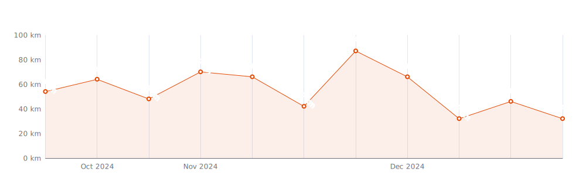
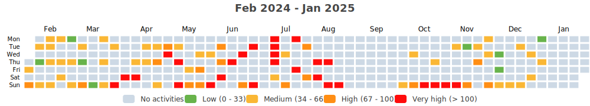
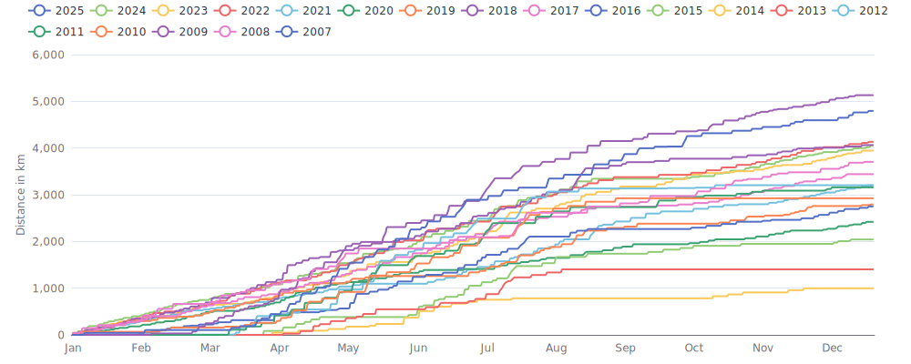

    

Since I began cycling `19 years and 4 months` ago on `02-01-2007`,
I had `1333 cycling days`. 
I recorded a total distance of `56 439 km`
(`1.41` trips around the world 🌍 and
`0.147` trips to the moon 🌕),
an elevation of `672 484 m`
(`76.0` times Mount Everest 🏔)
and a total time of `4mos 3w 2d 4h 14m` 🎉

That's a daily average of `9 km`,
a weekly average of `61 km` and a
monthly average of `263 km` 🐣

I burned `1435701 calories` doing so, that's about `5 317` pizza slices 🍕

---

<kbd><a href="#weekly-distances">Weekly distances</a></kbd> |
<kbd><a href="#activities">Activities</a></kbd> |
<kbd><a href="#monthly-stats">Monthly stats</a></kbd> |
<kbd><a href="#activity-intensity">Activity intensity</a></kbd> |
<kbd><a href="#stats-per-weekday">Stats per weekday</a></kbd> |
<kbd><a href="#daytime-stats">Daytime stats</a></kbd> |
<kbd><a href="#stats-per-bike">Stats per bike</a></kbd> |
<kbd><a href="#best-power-outputs-over-time">Power outputs</a></kbd> |
<kbd><a href="#eddington-chart">Eddington</a></kbd> |
<kbd><a href="#yearly-distances">Yearly distances</a></kbd> |
<kbd><a href="#distance-breakdown">Distance breakdown</a></kbd> |
<kbd><a href="#challenge-consistency">Challenge consistency</a></kbd> |
<kbd><a href="#completed-challenges">Completed challenges</a></kbd>

## Weekly distances

## Activities

<table>
    <tr>
        <th></th>
        <th></th>
        <th align="center"></th>
        <th align="center"></th>
        <th align="center"></th>
        <th align="center"></th>
        <th align="center"></th>
        <th align="center"></th>
    </tr>
            <tr>
            <td>27-10-24</td>
            <td>
                
<a href="https://www.strava.com/activities/12756258866" title="Kcal: 1452 | Gear: YT Szepter ">⛅ Lille, Vlaanderen - Morn...</a>
            </td>
            <td align="center">47 km</td>
            <td align="center">124 m</td>
            <td align="center">2:12:56</td>
            <td align="center">158 w</td>
            <td align="center">21.1 km/h</td>
            <td align="center">148</td>
        </tr>
            <tr>
            <td>24-10-24</td>
            <td>
                                
<a href="https://www.strava.com/activities/12734442660" title="Kcal: 454 | Gear: Tacx Neo ">Germany - Hamburg - Trail ...</a>
            </td>
            <td align="center">18 km</td>
            <td align="center">349 m</td>
            <td align="center">56:01</td>
            <td align="center">145 w</td>
            <td align="center">18.8 km/h</td>
            <td align="center">133</td>
        </tr>
            <tr>
            <td>20-10-24</td>
            <td>
                
<a href="https://www.strava.com/activities/12699593880" title="Kcal: 1535 | Gear: YT Szepter ">🌧 TT Meerle Hoogstraten, G...</a>
            </td>
            <td align="center">47 km</td>
            <td align="center">106 m</td>
            <td align="center">2:14:58</td>
            <td align="center">163 w</td>
            <td align="center">20.9 km/h</td>
            <td align="center">153</td>
        </tr>
            <tr>
            <td>20-10-24</td>
            <td>
                
<a href="https://www.strava.com/activities/12698160101" title="Kcal: 177 | Gear: YT Szepter ">⛅ TT Meerle Hoogstraten, V...</a>
            </td>
            <td align="center">7 km</td>
            <td align="center">31 m</td>
            <td align="center">20:53</td>
            <td align="center">127 w</td>
            <td align="center">20.1 km/h</td>
            <td align="center">154</td>
        </tr>
            <tr>
            <td>13-10-24</td>
            <td>
                                
<a href="https://www.strava.com/activities/12643556880" title="Kcal: 942 | Gear: Tacx Neo ">Italy - Passo della Mendola</a>
            </td>
            <td align="center">18 km</td>
            <td align="center">1 002 m</td>
            <td align="center">1:38:49</td>
            <td align="center">167 w</td>
            <td align="center">11 km/h</td>
            <td align="center">149</td>
        </tr>
        </table>

    
Older activities

    <table>
        <tr>
            <th></th>
            <th></th>
            <th align="center"></th>
            <th align="center"></th>
            <th align="center"></th>
            <th align="center"></th>
            <th align="center"></th>
            <th align="center"></th>
        </tr>
                    <tr>
                <td>09-10-24</td>
                <td>
                                    
<a href="https://www.strava.com/activities/12614816200" title="Kcal: 491 | Gear: Tacx Neo ">Mallorca - Coll d&#039;Honor to...</a>
                </td>
                <td align="center">21 km</td>
                <td align="center">446 m</td>
                <td align="center">1:02:05</td>
                <td align="center">138 w</td>
                <td align="center">20 km/h</td>
                <td align="center">142</td>
            </tr>
                    <tr>
                <td>06-10-24</td>
                <td>
                                    
<a href="https://www.strava.com/activities/12589095482" title="Kcal: 613 | Gear: Tacx Neo ">Mallorca - Monestir de Lluc</a>
                </td>
                <td align="center">18 km</td>
                <td align="center">591 m</td>
                <td align="center">1:11:58</td>
                <td align="center">149 w</td>
                <td align="center">15.1 km/h</td>
                <td align="center">108</td>
            </tr>
                    <tr>
                <td>25-08-24</td>
                <td>
                    
<a href="https://www.strava.com/activities/12237570211" title="Kcal: 1554 | Gear: YT Szepter ">⛅ Zoersel, Vlaanderen - Mo...</a>
                </td>
                <td align="center">55 km</td>
                <td align="center">94 m</td>
                <td align="center">2:19:09</td>
                <td align="center">163 w</td>
                <td align="center">23.7 km/h</td>
                <td align="center">136</td>
            </tr>
                    <tr>
                <td>18-08-24</td>
                <td>
                    
<a href="https://www.strava.com/activities/12179060654" title="Kcal: 3274 | Gear: YT Szepter ">⛅ Rotselaar, Vlaanderen - ...</a>
                </td>
                <td align="center">120 km</td>
                <td align="center">830 m</td>
                <td align="center">5:14:12</td>
                <td align="center">151 w</td>
                <td align="center">23 km/h</td>
                <td align="center">150</td>
            </tr>
                    <tr>
                <td>15-08-24</td>
                <td>
                    
<a href="https://www.strava.com/activities/12152522113" title="Kcal: 1410 | Gear: YT Szepter ">⛅ Mortsel, Vlaanderen - Mo...</a>
                </td>
                <td align="center">52 km</td>
                <td align="center">107 m</td>
                <td align="center">2:10:00</td>
                <td align="center">158 w</td>
                <td align="center">23.8 km/h</td>
                <td align="center">139</td>
            </tr>
                    <tr>
                <td>10-08-24</td>
                <td>
                    
<a href="https://www.strava.com/activities/12111533893" title="Kcal: 2046 | Gear: YT Szepter ">☀️ Herentals, Vlaanderen -...</a>
                </td>
                <td align="center">73 km</td>
                <td align="center">215 m</td>
                <td align="center">3:18:45</td>
                <td align="center">149 w</td>
                <td align="center">22.1 km/h</td>
                <td align="center">139</td>
            </tr>
                    <tr>
                <td>08-08-24</td>
                <td>
                    
<a href="https://www.strava.com/activities/12096336858" title="Kcal: 1470 | Gear: YT Szepter ">I tried to be normal once....</a>
                </td>
                <td align="center">49 km</td>
                <td align="center">600 m</td>
                <td align="center">2:19:13</td>
                <td align="center">153 w</td>
                <td align="center">21.2 km/h</td>
                <td align="center">134</td>
            </tr>
                    <tr>
                <td>03-08-24</td>
                <td>
                    
<a href="https://www.strava.com/activities/12051201276" title="Kcal: 1373 | Gear: Stumpie ">⛅ Antwerpen, Vlaanderen - ...</a>
                </td>
                <td align="center">30 km</td>
                <td align="center">171 m</td>
                <td align="center">1:51:41</td>
                <td align="center">167 w</td>
                <td align="center">15.9 km/h</td>
                <td align="center">152</td>
            </tr>
                    <tr>
                <td>30-07-24</td>
                <td>
                    
<a href="https://www.strava.com/activities/12019859917" title="Kcal: 1151 | Gear: Stumpie ">⛅ Oud-Heverlee, Vlaanderen...</a>
                </td>
                <td align="center">27 km</td>
                <td align="center">441 m</td>
                <td align="center">1:47:19</td>
                <td align="center">146 w</td>
                <td align="center">15.1 km/h</td>
                <td align="center">138</td>
            </tr>
                    <tr>
                <td>26-07-24</td>
                <td>
                    
<a href="https://www.strava.com/activities/11987027595" title="Kcal: 1510 | Gear: YT Szepter ">⛅ Gravel naar Meerdaelbos,...</a>
                </td>
                <td align="center">51 km</td>
                <td align="center">504 m</td>
                <td align="center">2:18:18</td>
                <td align="center">158 w</td>
                <td align="center">22 km/h</td>
                <td align="center">134</td>
            </tr>
                    <tr>
                <td>22-07-24</td>
                <td>
                    
<a href="https://www.strava.com/activities/11951516179" title="Kcal: 2482 | Gear: YT Szepter ">⛅ Blegny, Wallonie - Morni...</a>
                </td>
                <td align="center">74 km</td>
                <td align="center">1 342 m</td>
                <td align="center">4:02:30</td>
                <td align="center">147 w</td>
                <td align="center">18.2 km/h</td>
                <td align="center">141</td>
            </tr>
                    <tr>
                <td>21-07-24</td>
                <td>
                    
<a href="https://www.strava.com/activities/11942224858" title="Kcal: 1423 | Gear: YT Szepter ">⛅ Mechelen, Vlaanderen - M...</a>
                </td>
                <td align="center">53 km</td>
                <td align="center">104 m</td>
                <td align="center">2:20:38</td>
                <td align="center">146 w</td>
                <td align="center">22.6 km/h</td>
                <td align="center">128</td>
            </tr>
                    <tr>
                <td>17-07-24</td>
                <td>
                    
<a href="https://www.strava.com/activities/11910805629" title="Kcal: 370 | Gear: Litespeed T5G ">⛅ auto gaan halen</a>
                </td>
                <td align="center">17 km</td>
                <td align="center">30 m</td>
                <td align="center">41:01</td>
                <td align="center">103 w</td>
                <td align="center">25.3 km/h</td>
                <td align="center">122</td>
            </tr>
                    <tr>
                <td>13-07-24</td>
                <td>
                    
<a href="https://www.strava.com/activities/11878060108" title="Kcal: 1589 | Gear: Stumpie ">⛅ laatste dag val Di Sole;...</a>
                </td>
                <td align="center">47 km</td>
                <td align="center">1 874 m</td>
                <td align="center">3:23:57</td>
                <td align="center">92 w</td>
                <td align="center">13.9 km/h</td>
                <td align="center">117</td>
            </tr>
                    <tr>
                <td>11-07-24</td>
                <td>
                    
<a href="https://www.strava.com/activities/11863266352" title="Kcal: 2860 | Gear: Stumpie ">☀️ Dag 4 Dimaro Folgarida,...</a>
                </td>
                <td align="center">73 km</td>
                <td align="center">1 552 m</td>
                <td align="center">5:23:27</td>
                <td align="center">120 w</td>
                <td align="center">13.6 km/h</td>
                <td align="center">123</td>
            </tr>
                    <tr>
                <td>10-07-24</td>
                <td>
                    
<a href="https://www.strava.com/activities/11855497307" title="Kcal: 1343 | Gear: Stumpie ">⛅ dag 3 deel twee, na de l...</a>
                </td>
                <td align="center">53 km</td>
                <td align="center">527 m</td>
                <td align="center">3:39:14</td>
                <td align="center">74 w</td>
                <td align="center">14.4 km/h</td>
                <td align="center">117</td>
            </tr>
                    <tr>
                <td>10-07-24</td>
                <td>
                    
<a href="https://www.strava.com/activities/11853218351" title="Kcal: 1548 | Gear: Stumpie ">⛅ Dag 3 deel 1, naar de li...</a>
                </td>
                <td align="center">18 km</td>
                <td align="center">1 021 m</td>
                <td align="center">2:26:14</td>
                <td align="center">151 w</td>
                <td align="center">7.2 km/h</td>
                <td align="center">125</td>
            </tr>
                    <tr>
                <td>09-07-24</td>
                <td>
                    
<a href="https://www.strava.com/activities/11846524333" title="Kcal: 3147 | Gear: Stumpie ">☀️ Dimaro Folgarida, Trent...</a>
                </td>
                <td align="center">71 km</td>
                <td align="center">1 813 m</td>
                <td align="center">5:49:39</td>
                <td align="center">123 w</td>
                <td align="center">12.2 km/h</td>
                <td align="center">129</td>
            </tr>
                    <tr>
                <td>08-07-24</td>
                <td>
                    
<a href="https://www.strava.com/activities/11838742502" title="Kcal: 2462 | Gear: Stumpie ">⛅ Dimaro Folgarida, Trenti...</a>
                </td>
                <td align="center">40 km</td>
                <td align="center">1 669 m</td>
                <td align="center">4:21:50</td>
                <td align="center">126 w</td>
                <td align="center">9.2 km/h</td>
                <td align="center">148</td>
            </tr>
                    <tr>
                <td>30-06-24</td>
                <td>
                    
<a href="https://www.strava.com/activities/11774978798" title="Kcal: 3740 | Gear: YT Szepter ">⛅ bolero Maasmechelen grav...</a>
                </td>
                <td align="center">122 km</td>
                <td align="center">601 m</td>
                <td align="center">5:26:17</td>
                <td align="center">168 w</td>
                <td align="center">22.5 km/h</td>
                <td align="center">147</td>
            </tr>
                    <tr>
                <td>25-06-24</td>
                <td>
                    
<a href="https://www.strava.com/activities/11737373578" title="Kcal: 1731 | Gear: YT Szepter ">☀️ Zaventem, Vlaanderen - ...</a>
                </td>
                <td align="center">56 km</td>
                <td align="center">776 m</td>
                <td align="center">3:03:37</td>
                <td align="center">135 w</td>
                <td align="center">18.2 km/h</td>
                <td align="center">143</td>
            </tr>
                    <tr>
                <td>23-06-24</td>
                <td>
                    
<a href="https://www.strava.com/activities/11721825355" title="Kcal: 1251 | Gear: Nicolai ☠️ ">⛅ Antwerpen, Vlaanderen - ...</a>
                </td>
                <td align="center">36 km</td>
                <td align="center">176 m</td>
                <td align="center">2:07:04</td>
                <td align="center">140 w</td>
                <td align="center">16.9 km/h</td>
                <td align="center">148</td>
            </tr>
                    <tr>
                <td>19-06-24</td>
                <td>
                    
<a href="https://www.strava.com/activities/11690708763" title="Kcal: 1714 | Gear: Litespeed T5G ">⛅ Bertem, Vlaanderen - Aft...</a>
                </td>
                <td align="center">66 km</td>
                <td align="center">733 m</td>
                <td align="center">2:41:58</td>
                <td align="center">153 w</td>
                <td align="center">24.5 km/h</td>
                <td align="center">136</td>
            </tr>
                    <tr>
                <td>13-06-24</td>
                <td>
                    
<a href="https://www.strava.com/activities/11644179925" title="Kcal: 1670 | Gear: Litespeed T5G ">☀️ Bertem, Vlaanderen - Af...</a>
                </td>
                <td align="center">62 km</td>
                <td align="center">736 m</td>
                <td align="center">2:35:43</td>
                <td align="center">156 w</td>
                <td align="center">23.8 km/h</td>
                <td align="center">133</td>
            </tr>
                    <tr>
                <td>08-06-24</td>
                <td>
                    
<a href="https://www.strava.com/activities/11604483562" title="Kcal: 3013 | Gear: YT Szepter ">☀️ Ninove, Vlaanderen - Mo...</a>
                </td>
                <td align="center">100 km</td>
                <td align="center">940 m</td>
                <td align="center">5:04:41</td>
                <td align="center">142 w</td>
                <td align="center">19.7 km/h</td>
                <td align="center">145</td>
            </tr>
                    <tr>
                <td>06-06-24</td>
                <td>
                    
<a href="https://www.strava.com/activities/11588797026" title="Kcal: 1377 | Gear: Litespeed T5G ">⛅ Bertem, Vlaanderen - Aft...</a>
                </td>
                <td align="center">53 km</td>
                <td align="center">555 m</td>
                <td align="center">2:05:59</td>
                <td align="center">159 w</td>
                <td align="center">25 km/h</td>
                <td align="center">130</td>
            </tr>
                    <tr>
                <td>04-06-24</td>
                <td>
                    
<a href="https://www.strava.com/activities/11571472934" title="Kcal: 1267 | Gear: Litespeed T5G ">⛅ Mortsel, Vlaanderen - Af...</a>
                </td>
                <td align="center">52 km</td>
                <td align="center">134 m</td>
                <td align="center">1:58:12</td>
                <td align="center">155 w</td>
                <td align="center">26.2 km/h</td>
                <td align="center">129</td>
            </tr>
                    <tr>
                <td>02-06-24</td>
                <td>
                    
<a href="https://www.strava.com/activities/11553523286" title="Kcal: 1405 | Gear: YT Szepter ">⛅ Lille, Vlaanderen - Morn...</a>
                </td>
                <td align="center">44 km</td>
                <td align="center">111 m</td>
                <td align="center">2:00:10</td>
                <td align="center">171 w</td>
                <td align="center">22.2 km/h</td>
                <td align="center">153</td>
            </tr>
                    <tr>
                <td>29-05-24</td>
                <td>
                                    
<a href="https://www.strava.com/activities/11525590390" title="Kcal: 611 | Gear: Tacx Neo ">ROUVY - Monno to Passo del...</a>
                </td>
                <td align="center">10 km</td>
                <td align="center">704 m</td>
                <td align="center">55:30</td>
                <td align="center">193 w</td>
                <td align="center">11.1 km/h</td>
                <td align="center">140</td>
            </tr>
                    <tr>
                <td>26-05-24</td>
                <td>
                                    
<a href="https://www.strava.com/activities/11500781383" title="Kcal: 931 | Gear: Tacx Neo ">ROUVY - Ortisei to Passo S...</a>
                </td>
                <td align="center">17 km</td>
                <td align="center">1 045 m</td>
                <td align="center">1:25:52</td>
                <td align="center">189 w</td>
                <td align="center">12.2 km/h</td>
                <td align="center">145</td>
            </tr>
                    <tr>
                <td>24-05-24</td>
                <td>
                                    
<a href="https://www.strava.com/activities/11486867177" title="Kcal: 908 | Gear: Tacx Neo ">ROUVY - Predazzo to Passo ...</a>
                </td>
                <td align="center">20 km</td>
                <td align="center">959 m</td>
                <td align="center">1:24:19</td>
                <td align="center">188 w</td>
                <td align="center">14.3 km/h</td>
                <td align="center">145</td>
            </tr>
                    <tr>
                <td>22-05-24</td>
                <td>
                                    
<a href="https://www.strava.com/activities/11471749989" title="Kcal: 508 | Gear: Tacx Neo ">ROUVY - Coll de Femenia</a>
                </td>
                <td align="center">14 km</td>
                <td align="center">497 m</td>
                <td align="center">50:20</td>
                <td align="center">176 w</td>
                <td align="center">16.7 km/h</td>
                <td align="center">136</td>
            </tr>
                    <tr>
                <td>19-05-24</td>
                <td>
                    
<a href="https://www.strava.com/activities/11446300190" title="Kcal: 1459 | Gear: Stumpie ">🌫️ Grenspark interval trai...</a>
                </td>
                <td align="center">34 km</td>
                <td align="center">213 m</td>
                <td align="center">2:14:38</td>
                <td align="center">152 w</td>
                <td align="center">15.2 km/h</td>
                <td align="center">146</td>
            </tr>
                    <tr>
                <td>17-05-24</td>
                <td>
                                    
<a href="https://www.strava.com/activities/11432554773" title="Kcal: 557 | Gear: Tacx Neo ">ROUVY - Le Prese to Pradel...</a>
                </td>
                <td align="center">19 km</td>
                <td align="center">543 m</td>
                <td align="center">1:01:25</td>
                <td align="center">158 w</td>
                <td align="center">18.6 km/h</td>
                <td align="center">124</td>
            </tr>
                    <tr>
                <td>12-05-24</td>
                <td>
                    
<a href="https://www.strava.com/activities/11393822565" title="Kcal: 2500 | Gear: YT Szepter ">⛅ Aarschot, Vlaanderen - L...</a>
                </td>
                <td align="center">93 km</td>
                <td align="center">746 m</td>
                <td align="center">4:23:49</td>
                <td align="center">135 w</td>
                <td align="center">21 km/h</td>
                <td align="center">138</td>
            </tr>
                    <tr>
                <td>09-05-24</td>
                <td>
                    
<a href="https://www.strava.com/activities/11368540687" title="Kcal: 2301 | Gear: YT Szepter ">🌫️ Bierbeek, 666 gravel - ...</a>
                </td>
                <td align="center">75 km</td>
                <td align="center">850 m</td>
                <td align="center">3:33:57</td>
                <td align="center">156 w</td>
                <td align="center">21 km/h</td>
                <td align="center">152</td>
            </tr>
                    <tr>
                <td>07-05-24</td>
                <td>
                                    
<a href="https://www.strava.com/activities/11353455711" title="Kcal: 504 | Gear: Tacx Neo ">ROUVY - Wye Valley | Babbl...</a>
                </td>
                <td align="center">31 km</td>
                <td align="center">454 m</td>
                <td align="center">1:07:01</td>
                <td align="center">131 w</td>
                <td align="center">27.8 km/h</td>
                <td align="center">127</td>
            </tr>
                    <tr>
                <td>01-05-24</td>
                <td>
                    
<a href="https://www.strava.com/activities/11306715373" title="Kcal: 1773 | Gear: YT Szepter ">⛅ Lille, Ultimate  Gravel ...</a>
                </td>
                <td align="center">59 km</td>
                <td align="center">138 m</td>
                <td align="center">2:58:10</td>
                <td align="center">143 w</td>
                <td align="center">20 km/h</td>
                <td align="center">135</td>
            </tr>
                    <tr>
                <td>30-04-24</td>
                <td>
                    
<a href="https://www.strava.com/activities/11299691506" title="Kcal: 1246 | Gear: Litespeed T5G ">⛅ Mortsel, Vlaanderen - Af...</a>
                </td>
                <td align="center">48 km</td>
                <td align="center">131 m</td>
                <td align="center">1:49:14</td>
                <td align="center">168 w</td>
                <td align="center">26.4 km/h</td>
                <td align="center">129</td>
            </tr>
                    <tr>
                <td>28-04-24</td>
                <td>
                    
<a href="https://www.strava.com/activities/11281407121" title="Kcal: 982 | Gear: Nicolai ☠️ ">⛅ Antwerpen, Vlaanderen - ...</a>
                </td>
                <td align="center">24 km</td>
                <td align="center">168 m</td>
                <td align="center">1:39:14</td>
                <td align="center">141 w</td>
                <td align="center">14.6 km/h</td>
                <td align="center">153</td>
            </tr>
                    <tr>
                <td>25-04-24</td>
                <td>
                                    
<a href="https://www.strava.com/activities/11262210301" title="Kcal: 703 | Gear: Tacx Neo ">ROUVY - Tour of the Alps 2...</a>
                </td>
                <td align="center">14 km</td>
                <td align="center">802 m</td>
                <td align="center">1:08:23</td>
                <td align="center">181 w</td>
                <td align="center">12.3 km/h</td>
                <td align="center">144</td>
            </tr>
                    <tr>
                <td>23-04-24</td>
                <td>
                                    
<a href="https://www.strava.com/activities/11246774857" title="Kcal: 505 | Gear: Tacx Neo ">ROUVY - Tour of the Alps 2...</a>
                </td>
                <td align="center">23 km</td>
                <td align="center">528 m</td>
                <td align="center">59:52</td>
                <td align="center">147 w</td>
                <td align="center">23.4 km/h</td>
                <td align="center">132</td>
            </tr>
                    <tr>
                <td>18-04-24</td>
                <td>
                                    
<a href="https://www.strava.com/activities/11210865015" title="Kcal: 730 | Gear: Tacx Neo ">ROUVY - Tour of the Alps 2...</a>
                </td>
                <td align="center">24 km</td>
                <td align="center">753 m</td>
                <td align="center">1:19:04</td>
                <td align="center">161 w</td>
                <td align="center">18.4 km/h</td>
                <td align="center">129</td>
            </tr>
                    <tr>
                <td>16-04-24</td>
                <td>
                                    
<a href="https://www.strava.com/activities/11195456841" title="Kcal: 461 | Gear: Tacx Neo ">ROUVY - Tour of the Alps 2...</a>
                </td>
                <td align="center">19 km</td>
                <td align="center">434 m</td>
                <td align="center">48:40</td>
                <td align="center">165 w</td>
                <td align="center">23.9 km/h</td>
                <td align="center">128</td>
            </tr>
                    <tr>
                <td>13-04-24</td>
                <td>
                    
<a href="https://www.strava.com/activities/11172256759" title="Kcal: 2618 | Gear: YT Szepter ">⛅ Gravel Wellen, Eddington...</a>
                </td>
                <td align="center">93 km</td>
                <td align="center">734 m</td>
                <td align="center">4:23:50</td>
                <td align="center">142 w</td>
                <td align="center">21.2 km/h</td>
                <td align="center">136</td>
            </tr>
                    <tr>
                <td>11-04-24</td>
                <td>
                                    
<a href="https://www.strava.com/activities/11157849918" title="Kcal: 603 | Gear: Tacx Neo ">ROUVY - Tour of the Alps 2...</a>
                </td>
                <td align="center">26 km</td>
                <td align="center">495 m</td>
                <td align="center">1:06:10</td>
                <td align="center">159 w</td>
                <td align="center">23.3 km/h</td>
                <td align="center">144</td>
            </tr>
                    <tr>
                <td>06-04-24</td>
                <td>
                    
<a href="https://www.strava.com/activities/11118743479" title="Kcal: 2015 | Gear: YT Szepter ">⛅ Ossendrecht, Noord-Braba...</a>
                </td>
                <td align="center">64 km</td>
                <td align="center">233 m</td>
                <td align="center">3:07:58</td>
                <td align="center">156 w</td>
                <td align="center">20.5 km/h</td>
                <td align="center">148</td>
            </tr>
                    <tr>
                <td>31-03-24</td>
                <td>
                    
<a href="https://www.strava.com/activities/11075437771" title="Kcal: 1077 | Gear: Litespeed T5G ">⛅ Lier, Vlaanderen - Lunch...</a>
                </td>
                <td align="center">46 km</td>
                <td align="center">106 m</td>
                <td align="center">1:44:11</td>
                <td align="center">149 w</td>
                <td align="center">26.6 km/h</td>
                <td align="center">145</td>
            </tr>
                    <tr>
                <td>31-03-24</td>
                <td>
                    
<a href="https://www.strava.com/activities/11074567236" title="Kcal: 538 | Gear: Litespeed T5G ">☀️ Mortsel, Vlaanderen - M...</a>
                </td>
                <td align="center">21 km</td>
                <td align="center">73 m</td>
                <td align="center">49:16</td>
                <td align="center">159 w</td>
                <td align="center">25.2 km/h</td>
                <td align="center">145</td>
            </tr>
                    <tr>
                <td>26-03-24</td>
                <td>
                                    
<a href="https://www.strava.com/activities/11043053913" title="Kcal: 474 | Gear: Tacx Neo ">ROUVY - La Vuelta 2023 | S...</a>
                </td>
                <td align="center">26 km</td>
                <td align="center">311 m</td>
                <td align="center">51:03</td>
                <td align="center">161 w</td>
                <td align="center">30.4 km/h</td>
                <td align="center">134</td>
            </tr>
            </table>

## Monthly stats

<table>
    <thead>
    <tr>
        <th>&nbsp;&nbsp;&nbsp;&nbsp;&nbsp;</th>
        <th># of rides</th>
        <th align="center"></th>
        <th align="center"></th>
        <th align="center"></th>
        <th align="center"></th>
    </tr>
    </thead>
    <tbody>
            <tr>
            <td align="center">October 2024</td>
            <td align="center">7</td>
            <td align="center">175 km</td>
            <td align="center">2 649 m</td>
            <td align="center">9h 37m</td>
            <td align="center">0</td>
        </tr>
            <tr>
            <td align="center">August 2024</td>
            <td align="center">6</td>
            <td align="center">379 km</td>
            <td align="center">2 017 m</td>
            <td align="center">17h 13m</td>
            <td align="center">5</td>
        </tr>
            <tr>
            <td align="center">July 2024</td>
            <td align="center">11</td>
            <td align="center">524 km</td>
            <td align="center">10 877 m</td>
            <td align="center">1d 12h 14m</td>
            <td align="center">5</td>
        </tr>
            <tr>
            <td align="center">June 2024</td>
            <td align="center">9</td>
            <td align="center">590 km</td>
            <td align="center">4 762 m</td>
            <td align="center">1d 3h 3m</td>
            <td align="center">7</td>
        </tr>
            <tr>
            <td align="center">May 2024</td>
            <td align="center">10</td>
            <td align="center">373 km</td>
            <td align="center">6 149 m</td>
            <td align="center">19h 55m</td>
            <td align="center">5</td>
        </tr>
            <tr>
            <td align="center">April 2024</td>
            <td align="center">9</td>
            <td align="center">336 km</td>
            <td align="center">4 278 m</td>
            <td align="center">16h 22m</td>
            <td align="center">2</td>
        </tr>
            <tr>
            <td align="center">March 2024</td>
            <td align="center">11</td>
            <td align="center">334 km</td>
            <td align="center">3 610 m</td>
            <td align="center">13h 19m</td>
            <td align="center">0</td>
        </tr>
            <tr>
            <td align="center">February 2024</td>
            <td align="center">14</td>
            <td align="center">349 km</td>
            <td align="center">5 193 m</td>
            <td align="center">14h 56m</td>
            <td align="center">0</td>
        </tr>
            <tr>
            <td align="center">January 2024</td>
            <td align="center">12</td>
            <td align="center">399 km</td>
            <td align="center">3 671 m</td>
            <td align="center">14h 41m</td>
            <td align="center">2</td>
        </tr>
            <tr>
            <td align="center">December 2023</td>
            <td align="center">11</td>
            <td align="center">281 km</td>
            <td align="center">5 059 m</td>
            <td align="center">12h 21m</td>
            <td align="center">0</td>
        </tr>
            <tr>
            <td align="center">November 2023</td>
            <td align="center">8</td>
            <td align="center">161 km</td>
            <td align="center">1 624 m</td>
            <td align="center">5h 39m</td>
            <td align="center">0</td>
        </tr>
            <tr>
            <td align="center">October 2023</td>
            <td align="center">8</td>
            <td align="center">201 km</td>
            <td align="center">1 674 m</td>
            <td align="center">8h 56m</td>
            <td align="center">2</td>
        </tr>
            <tr>
            <td align="center">September 2023</td>
            <td align="center">4</td>
            <td align="center">207 km</td>
            <td align="center">906 m</td>
            <td align="center">9h 44m</td>
            <td align="center">2</td>
        </tr>
            <tr>
            <td align="center">August 2023</td>
            <td align="center">8</td>
            <td align="center">358 km</td>
            <td align="center">2 679 m</td>
            <td align="center">17h 42m</td>
            <td align="center">3</td>
        </tr>
            <tr>
            <td align="center">July 2023</td>
            <td align="center">11</td>
            <td align="center">650 km</td>
            <td align="center">14 737 m</td>
            <td align="center">1d 21h 55m</td>
            <td align="center">7</td>
        </tr>
            <tr>
            <td align="center">June 2023</td>
            <td align="center">9</td>
            <td align="center">494 km</td>
            <td align="center">5 206 m</td>
            <td align="center">1d 3h</td>
            <td align="center">4</td>
        </tr>
            <tr>
            <td align="center">May 2023</td>
            <td align="center">5</td>
            <td align="center">307 km</td>
            <td align="center">2 129 m</td>
            <td align="center">14h 25m</td>
            <td align="center">5</td>
        </tr>
            <tr>
            <td align="center">April 2023</td>
            <td align="center">10</td>
            <td align="center">466 km</td>
            <td align="center">4 120 m</td>
            <td align="center">20h 46m</td>
            <td align="center">1</td>
        </tr>
            <tr>
            <td align="center">March 2023</td>
            <td align="center">6</td>
            <td align="center">165 km</td>
            <td align="center">1 877 m</td>
            <td align="center">6h 44m</td>
            <td align="center">0</td>
        </tr>
            <tr>
            <td align="center">February 2023</td>
            <td align="center">10</td>
            <td align="center">278 km</td>
            <td align="center">2 158 m</td>
            <td align="center">11h 7m</td>
            <td align="center">0</td>
        </tr>
            <tr>
            <td align="center">January 2023</td>
            <td align="center">11</td>
            <td align="center">321 km</td>
            <td align="center">4 055 m</td>
            <td align="center">13h 28m</td>
            <td align="center">0</td>
        </tr>
            <tr>
            <td align="center">December 2022</td>
            <td align="center">6</td>
            <td align="center">196 km</td>
            <td align="center">2 228 m</td>
            <td align="center">8h 37m</td>
            <td align="center">0</td>
        </tr>
            <tr>
            <td align="center">November 2022</td>
            <td align="center">8</td>
            <td align="center">298 km</td>
            <td align="center">2 318 m</td>
            <td align="center">11h 22m</td>
            <td align="center">0</td>
        </tr>
            <tr>
            <td align="center">October 2022</td>
            <td align="center">4</td>
            <td align="center">212 km</td>
            <td align="center">404 m</td>
            <td align="center">10h 25m</td>
            <td align="center">0</td>
        </tr>
            <tr>
            <td align="center">September 2022</td>
            <td align="center">2</td>
            <td align="center">116 km</td>
            <td align="center">1 131 m</td>
            <td align="center">5h 57m</td>
            <td align="center">0</td>
        </tr>
            <tr>
            <td align="center">August 2022</td>
            <td align="center">8</td>
            <td align="center">394 km</td>
            <td align="center">3 335 m</td>
            <td align="center">19h 45m</td>
            <td align="center">0</td>
        </tr>
            <tr>
            <td align="center">July 2022</td>
            <td align="center">10</td>
            <td align="center">528 km</td>
            <td align="center">11 436 m</td>
            <td align="center">1d 16h 26m</td>
            <td align="center">1</td>
        </tr>
            <tr>
            <td align="center">June 2022</td>
            <td align="center">6</td>
            <td align="center">366 km</td>
            <td align="center">8 219 m</td>
            <td align="center">1d 2h 10m</td>
            <td align="center">8</td>
        </tr>
            <tr>
            <td align="center">May 2022</td>
            <td align="center">12</td>
            <td align="center">591 km</td>
            <td align="center">8 352 m</td>
            <td align="center">1d 9h 44m</td>
            <td align="center">7</td>
        </tr>
            <tr>
            <td align="center">April 2022</td>
            <td align="center">8</td>
            <td align="center">283 km</td>
            <td align="center">2 497 m</td>
            <td align="center">14h 39m</td>
            <td align="center">0</td>
        </tr>
            <tr>
            <td align="center">March 2022</td>
            <td align="center">13</td>
            <td align="center">485 km</td>
            <td align="center">2 565 m</td>
            <td align="center">20h 30m</td>
            <td align="center">0</td>
        </tr>
            <tr>
            <td align="center">February 2022</td>
            <td align="center">7</td>
            <td align="center">204 km</td>
            <td align="center">1 464 m</td>
            <td align="center">7h 13m</td>
            <td align="center">0</td>
        </tr>
            <tr>
            <td align="center">January 2022</td>
            <td align="center">14</td>
            <td align="center">360 km</td>
            <td align="center">4 125 m</td>
            <td align="center">15h 2m</td>
            <td align="center">0</td>
        </tr>
            <tr>
            <td align="center">December 2021</td>
            <td align="center">11</td>
            <td align="center">233 km</td>
            <td align="center">2 027 m</td>
            <td align="center">8h 14m</td>
            <td align="center">0</td>
        </tr>
            <tr>
            <td align="center">November 2021</td>
            <td align="center">7</td>
            <td align="center">158 km</td>
            <td align="center">1 247 m</td>
            <td align="center">6h 22m</td>
            <td align="center">0</td>
        </tr>
            <tr>
            <td align="center">October 2021</td>
            <td align="center">5</td>
            <td align="center">154 km</td>
            <td align="center">1 618 m</td>
            <td align="center">8h 22m</td>
            <td align="center">0</td>
        </tr>
            <tr>
            <td align="center">September 2021</td>
            <td align="center">6</td>
            <td align="center">283 km</td>
            <td align="center">1 756 m</td>
            <td align="center">14h 57m</td>
            <td align="center">3</td>
        </tr>
            <tr>
            <td align="center">August 2021</td>
            <td align="center">14</td>
            <td align="center">508 km</td>
            <td align="center">10 550 m</td>
            <td align="center">1d 13h 20m</td>
            <td align="center">3</td>
        </tr>
            <tr>
            <td align="center">July 2021</td>
            <td align="center">11</td>
            <td align="center">456 km</td>
            <td align="center">3 604 m</td>
            <td align="center">22h 46m</td>
            <td align="center">2</td>
        </tr>
            <tr>
            <td align="center">June 2021</td>
            <td align="center">9</td>
            <td align="center">301 km</td>
            <td align="center">2 382 m</td>
            <td align="center">15h 22m</td>
            <td align="center">0</td>
        </tr>
            <tr>
            <td align="center">May 2021</td>
            <td align="center">3</td>
            <td align="center">91 km</td>
            <td align="center">420 m</td>
            <td align="center">4h 39m</td>
            <td align="center">0</td>
        </tr>
            <tr>
            <td align="center">April 2021</td>
            <td align="center">9</td>
            <td align="center">214 km</td>
            <td align="center">1 475 m</td>
            <td align="center">10h 20m</td>
            <td align="center">0</td>
        </tr>
            <tr>
            <td align="center">March 2021</td>
            <td align="center">9</td>
            <td align="center">216 km</td>
            <td align="center">2 797 m</td>
            <td align="center">8h 52m</td>
            <td align="center">0</td>
        </tr>
            <tr>
            <td align="center">February 2021</td>
            <td align="center">9</td>
            <td align="center">248 km</td>
            <td align="center">1 454 m</td>
            <td align="center">10h 32m</td>
            <td align="center">0</td>
        </tr>
            <tr>
            <td align="center">January 2021</td>
            <td align="center">12</td>
            <td align="center">276 km</td>
            <td align="center">3 134 m</td>
            <td align="center">12h 47m</td>
            <td align="center">0</td>
        </tr>
            <tr>
            <td align="center">December 2020</td>
            <td align="center">8</td>
            <td align="center">186 km</td>
            <td align="center">2 410 m</td>
            <td align="center">8h 37m</td>
            <td align="center">0</td>
        </tr>
            <tr>
            <td align="center">November 2020</td>
            <td align="center">6</td>
            <td align="center">189 km</td>
            <td align="center">801 m</td>
            <td align="center">9h 58m</td>
            <td align="center">0</td>
        </tr>
            <tr>
            <td align="center">October 2020</td>
            <td align="center">4</td>
            <td align="center">104 km</td>
            <td align="center">1 122 m</td>
            <td align="center">5h 24m</td>
            <td align="center">0</td>
        </tr>
            <tr>
            <td align="center">September 2020</td>
            <td align="center">3</td>
            <td align="center">129 km</td>
            <td align="center">765 m</td>
            <td align="center">6h 52m</td>
            <td align="center">0</td>
        </tr>
            <tr>
            <td align="center">August 2020</td>
            <td align="center">8</td>
            <td align="center">226 km</td>
            <td align="center">1 281 m</td>
            <td align="center">16h 56m</td>
            <td align="center">0</td>
        </tr>
            <tr>
            <td align="center">July 2020</td>
            <td align="center">5</td>
            <td align="center">175 km</td>
            <td align="center">1 598 m</td>
            <td align="center">10h 46m</td>
            <td align="center">0</td>
        </tr>
            <tr>
            <td align="center">June 2020</td>
            <td align="center">3</td>
            <td align="center">81 km</td>
            <td align="center">875 m</td>
            <td align="center">5h 1m</td>
            <td align="center">0</td>
        </tr>
            <tr>
            <td align="center">May 2020</td>
            <td align="center">9</td>
            <td align="center">239 km</td>
            <td align="center">1 902 m</td>
            <td align="center">14h 1m</td>
            <td align="center">0</td>
        </tr>
            <tr>
            <td align="center">April 2020</td>
            <td align="center">13</td>
            <td align="center">404 km</td>
            <td align="center">1 850 m</td>
            <td align="center">23h 29m</td>
            <td align="center">0</td>
        </tr>
            <tr>
            <td align="center">March 2020</td>
            <td align="center">10</td>
            <td align="center">217 km</td>
            <td align="center">3 169 m</td>
            <td align="center">10h 35m</td>
            <td align="center">0</td>
        </tr>
            <tr>
            <td align="center">February 2020</td>
            <td align="center">10</td>
            <td align="center">237 km</td>
            <td align="center">2 817 m</td>
            <td align="center">10h 33m</td>
            <td align="center">0</td>
        </tr>
            <tr>
            <td align="center">January 2020</td>
            <td align="center">12</td>
            <td align="center">182 km</td>
            <td align="center">2 476 m</td>
            <td align="center">8h 49m</td>
            <td align="center">0</td>
        </tr>
            <tr>
            <td align="center">December 2019</td>
            <td align="center">5</td>
            <td align="center">100 km</td>
            <td align="center">621 m</td>
            <td align="center">5h 13m</td>
            <td align="center">0</td>
        </tr>
            <tr>
            <td align="center">November 2019</td>
            <td align="center">7</td>
            <td align="center">198 km</td>
            <td align="center">1 754 m</td>
            <td align="center">8h 28m</td>
            <td align="center">0</td>
        </tr>
            <tr>
            <td align="center">October 2019</td>
            <td align="center">2</td>
            <td align="center">72 km</td>
            <td align="center">426 m</td>
            <td align="center">2h 26m</td>
            <td align="center">0</td>
        </tr>
            <tr>
            <td align="center">September 2019</td>
            <td align="center">3</td>
            <td align="center">149 km</td>
            <td align="center">2 073 m</td>
            <td align="center">7h 59m</td>
            <td align="center">0</td>
        </tr>
            <tr>
            <td align="center">August 2019</td>
            <td align="center">9</td>
            <td align="center">473 km</td>
            <td align="center">7 241 m</td>
            <td align="center">1d 14h 12m</td>
            <td align="center">0</td>
        </tr>
            <tr>
            <td align="center">July 2019</td>
            <td align="center">11</td>
            <td align="center">422 km</td>
            <td align="center">4 562 m</td>
            <td align="center">1d 1h 18m</td>
            <td align="center">0</td>
        </tr>
            <tr>
            <td align="center">June 2019</td>
            <td align="center">1</td>
            <td align="center">76 km</td>
            <td align="center">105 m</td>
            <td align="center">3h 28m</td>
            <td align="center">0</td>
        </tr>
            <tr>
            <td align="center">May 2019</td>
            <td align="center">6</td>
            <td align="center">157 km</td>
            <td align="center">0 m</td>
            <td align="center">6h 26m</td>
            <td align="center">0</td>
        </tr>
            <tr>
            <td align="center">April 2019</td>
            <td align="center">8</td>
            <td align="center">345 km</td>
            <td align="center">1 085 m</td>
            <td align="center">13h 7m</td>
            <td align="center">0</td>
        </tr>
            <tr>
            <td align="center">March 2019</td>
            <td align="center">9</td>
            <td align="center">299 km</td>
            <td align="center">2 410 m</td>
            <td align="center">12h 41m</td>
            <td align="center">0</td>
        </tr>
            <tr>
            <td align="center">February 2019</td>
            <td align="center">4</td>
            <td align="center">120 km</td>
            <td align="center">1 557 m</td>
            <td align="center">4h 38m</td>
            <td align="center">0</td>
        </tr>
            <tr>
            <td align="center">January 2019</td>
            <td align="center">9</td>
            <td align="center">297 km</td>
            <td align="center">3 384 m</td>
            <td align="center">10h 58m</td>
            <td align="center">0</td>
        </tr>
            <tr>
            <td align="center">December 2018</td>
            <td align="center">3</td>
            <td align="center">75 km</td>
            <td align="center">693 m</td>
            <td align="center">2h 31m</td>
            <td align="center">0</td>
        </tr>
            <tr>
            <td align="center">November 2018</td>
            <td align="center">6</td>
            <td align="center">181 km</td>
            <td align="center">832 m</td>
            <td align="center">8h 18m</td>
            <td align="center">0</td>
        </tr>
            <tr>
            <td align="center">October 2018</td>
            <td align="center">1</td>
            <td align="center">37 km</td>
            <td align="center">22 m</td>
            <td align="center">2h 14m</td>
            <td align="center">0</td>
        </tr>
            <tr>
            <td align="center">September 2018</td>
            <td align="center">5</td>
            <td align="center">203 km</td>
            <td align="center">943 m</td>
            <td align="center">11h 5m</td>
            <td align="center">0</td>
        </tr>
            <tr>
            <td align="center">August 2018</td>
            <td align="center">13</td>
            <td align="center">614 km</td>
            <td align="center">10 639 m</td>
            <td align="center">1d 22h 37m</td>
            <td align="center">1</td>
        </tr>
            <tr>
            <td align="center">July 2018</td>
            <td align="center">10</td>
            <td align="center">489 km</td>
            <td align="center">3 422 m</td>
            <td align="center">1d 7h 29m</td>
            <td align="center">1</td>
        </tr>
            <tr>
            <td align="center">June 2018</td>
            <td align="center">7</td>
            <td align="center">338 km</td>
            <td align="center">2 315 m</td>
            <td align="center">19h 13m</td>
            <td align="center">0</td>
        </tr>
            <tr>
            <td align="center">May 2018</td>
            <td align="center">6</td>
            <td align="center">267 km</td>
            <td align="center">1 547 m</td>
            <td align="center">12h 13m</td>
            <td align="center">0</td>
        </tr>
            <tr>
            <td align="center">April 2018</td>
            <td align="center">14</td>
            <td align="center">643 km</td>
            <td align="center">5 795 m</td>
            <td align="center">1d 6h 29m</td>
            <td align="center">0</td>
        </tr>
            <tr>
            <td align="center">March 2018</td>
            <td align="center">15</td>
            <td align="center">482 km</td>
            <td align="center">3 606 m</td>
            <td align="center">23h 49m</td>
            <td align="center">0</td>
        </tr>
            <tr>
            <td align="center">February 2018</td>
            <td align="center">8</td>
            <td align="center">263 km</td>
            <td align="center">2 701 m</td>
            <td align="center">10h 47m</td>
            <td align="center">0</td>
        </tr>
            <tr>
            <td align="center">January 2018</td>
            <td align="center">11</td>
            <td align="center">344 km</td>
            <td align="center">3 686 m</td>
            <td align="center">12h 34m</td>
            <td align="center">0</td>
        </tr>
            <tr>
            <td align="center">December 2017</td>
            <td align="center">5</td>
            <td align="center">153 km</td>
            <td align="center">1 212 m</td>
            <td align="center">5h 17m</td>
            <td align="center">0</td>
        </tr>
            <tr>
            <td align="center">November 2017</td>
            <td align="center">11</td>
            <td align="center">345 km</td>
            <td align="center">4 078 m</td>
            <td align="center">14h 40m</td>
            <td align="center">0</td>
        </tr>
            <tr>
            <td align="center">October 2017</td>
            <td align="center">6</td>
            <td align="center">174 km</td>
            <td align="center">1 194 m</td>
            <td align="center">6h 23m</td>
            <td align="center">0</td>
        </tr>
            <tr>
            <td align="center">September 2017</td>
            <td align="center">1</td>
            <td align="center">22 km</td>
            <td align="center">96 m</td>
            <td align="center">1h 41m</td>
            <td align="center">0</td>
        </tr>
            <tr>
            <td align="center">August 2017</td>
            <td align="center">7</td>
            <td align="center">248 km</td>
            <td align="center">1 171 m</td>
            <td align="center">15h 30m</td>
            <td align="center">1</td>
        </tr>
            <tr>
            <td align="center">July 2017</td>
            <td align="center">11</td>
            <td align="center">398 km</td>
            <td align="center">11 626 m</td>
            <td align="center">1d 14h 35m</td>
            <td align="center">3</td>
        </tr>
            <tr>
            <td align="center">June 2017</td>
            <td align="center">7</td>
            <td align="center">434 km</td>
            <td align="center">4 919 m</td>
            <td align="center">1d 1h 8m</td>
            <td align="center">0</td>
        </tr>
            <tr>
            <td align="center">May 2017</td>
            <td align="center">9</td>
            <td align="center">423 km</td>
            <td align="center">5 498 m</td>
            <td align="center">1d 59m</td>
            <td align="center">0</td>
        </tr>
            <tr>
            <td align="center">April 2017</td>
            <td align="center">9</td>
            <td align="center">373 km</td>
            <td align="center">3 922 m</td>
            <td align="center">16h 47m</td>
            <td align="center">0</td>
        </tr>
            <tr>
            <td align="center">March 2017</td>
            <td align="center">7</td>
            <td align="center">268 km</td>
            <td align="center">1 940 m</td>
            <td align="center">12h 9m</td>
            <td align="center">0</td>
        </tr>
            <tr>
            <td align="center">February 2017</td>
            <td align="center">9</td>
            <td align="center">277 km</td>
            <td align="center">2 316 m</td>
            <td align="center">12h 20m</td>
            <td align="center">0</td>
        </tr>
            <tr>
            <td align="center">January 2017</td>
            <td align="center">10</td>
            <td align="center">297 km</td>
            <td align="center">3 611 m</td>
            <td align="center">11h 46m</td>
            <td align="center">0</td>
        </tr>
            <tr>
            <td align="center">December 2016</td>
            <td align="center">8</td>
            <td align="center">255 km</td>
            <td align="center">928 m</td>
            <td align="center">12h 22m</td>
            <td align="center">0</td>
        </tr>
            <tr>
            <td align="center">November 2016</td>
            <td align="center">3</td>
            <td align="center">73 km</td>
            <td align="center">0 m</td>
            <td align="center">2h 58m</td>
            <td align="center">0</td>
        </tr>
            <tr>
            <td align="center">October 2016</td>
            <td align="center">4</td>
            <td align="center">157 km</td>
            <td align="center">273 m</td>
            <td align="center">7h 43m</td>
            <td align="center">0</td>
        </tr>
            <tr>
            <td align="center">August 2016</td>
            <td align="center">4</td>
            <td align="center">161 km</td>
            <td align="center">1 751 m</td>
            <td align="center">10h 51m</td>
            <td align="center">0</td>
        </tr>
            <tr>
            <td align="center">July 2016</td>
            <td align="center">12</td>
            <td align="center">608 km</td>
            <td align="center">13 766 m</td>
            <td align="center">1d 17h 10m</td>
            <td align="center">1</td>
        </tr>
            <tr>
            <td align="center">June 2016</td>
            <td align="center">9</td>
            <td align="center">352 km</td>
            <td align="center">2 796 m</td>
            <td align="center">20h 40m</td>
            <td align="center">0</td>
        </tr>
            <tr>
            <td align="center">May 2016</td>
            <td align="center">10</td>
            <td align="center">596 km</td>
            <td align="center">5 746 m</td>
            <td align="center">1d 4h 56m</td>
            <td align="center">1</td>
        </tr>
            <tr>
            <td align="center">April 2016</td>
            <td align="center">10</td>
            <td align="center">216 km</td>
            <td align="center">1 242 m</td>
            <td align="center">15h 8m</td>
            <td align="center">0</td>
        </tr>
            <tr>
            <td align="center">March 2016</td>
            <td align="center">6</td>
            <td align="center">93 km</td>
            <td align="center">62 m</td>
            <td align="center">6h 57m</td>
            <td align="center">0</td>
        </tr>
            <tr>
            <td align="center">February 2016</td>
            <td align="center">17</td>
            <td align="center">223 km</td>
            <td align="center">0 m</td>
            <td align="center">14h 41m</td>
            <td align="center">0</td>
        </tr>
            <tr>
            <td align="center">January 2016</td>
            <td align="center">11</td>
            <td align="center">0 km</td>
            <td align="center">0 m</td>
            <td align="center">10h 57m</td>
            <td align="center">0</td>
        </tr>
            <tr>
            <td align="center">December 2015</td>
            <td align="center">10</td>
            <td align="center">95 km</td>
            <td align="center">0 m</td>
            <td align="center">8h 33m</td>
            <td align="center">0</td>
        </tr>
            <tr>
            <td align="center">November 2015</td>
            <td align="center">8</td>
            <td align="center">41 km</td>
            <td align="center">80 m</td>
            <td align="center">10h 3m</td>
            <td align="center">0</td>
        </tr>
            <tr>
            <td align="center">October 2015</td>
            <td align="center">2</td>
            <td align="center">82 km</td>
            <td align="center">64 m</td>
            <td align="center">4h 13m</td>
            <td align="center">0</td>
        </tr>
            <tr>
            <td align="center">September 2015</td>
            <td align="center">2</td>
            <td align="center">88 km</td>
            <td align="center">180 m</td>
            <td align="center">5h 54m</td>
            <td align="center">0</td>
        </tr>
            <tr>
            <td align="center">August 2015</td>
            <td align="center">5</td>
            <td align="center">264 km</td>
            <td align="center">833 m</td>
            <td align="center">12h 36m</td>
            <td align="center">0</td>
        </tr>
            <tr>
            <td align="center">July 2015</td>
            <td align="center">9</td>
            <td align="center">423 km</td>
            <td align="center">12 983 m</td>
            <td align="center">1d 11h 12m</td>
            <td align="center">3</td>
        </tr>
            <tr>
            <td align="center">June 2015</td>
            <td align="center">12</td>
            <td align="center">670 km</td>
            <td align="center">6 405 m</td>
            <td align="center">1d 10h 40m</td>
            <td align="center">1</td>
        </tr>
            <tr>
            <td align="center">May 2015</td>
            <td align="center">5</td>
            <td align="center">0 km</td>
            <td align="center">0 m</td>
            <td align="center">9h 7m</td>
            <td align="center">0</td>
        </tr>
            <tr>
            <td align="center">April 2015</td>
            <td align="center">7</td>
            <td align="center">298 km</td>
            <td align="center">410 m</td>
            <td align="center">14h 16m</td>
            <td align="center">0</td>
        </tr>
            <tr>
            <td align="center">March 2015</td>
            <td align="center">9</td>
            <td align="center">83 km</td>
            <td align="center">127 m</td>
            <td align="center">11h 28m</td>
            <td align="center">0</td>
        </tr>
            <tr>
            <td align="center">February 2015</td>
            <td align="center">9</td>
            <td align="center">0 km</td>
            <td align="center">0 m</td>
            <td align="center">8h 35m</td>
            <td align="center">0</td>
        </tr>
            <tr>
            <td align="center">January 2015</td>
            <td align="center">12</td>
            <td align="center">0 km</td>
            <td align="center">0 m</td>
            <td align="center">12h 41m</td>
            <td align="center">0</td>
        </tr>
            <tr>
            <td align="center">December 2014</td>
            <td align="center">6</td>
            <td align="center">0 km</td>
            <td align="center">0 m</td>
            <td align="center">6h 5m</td>
            <td align="center">0</td>
        </tr>
            <tr>
            <td align="center">November 2014</td>
            <td align="center">7</td>
            <td align="center">130 km</td>
            <td align="center">188 m</td>
            <td align="center">10h 10m</td>
            <td align="center">0</td>
        </tr>
            <tr>
            <td align="center">October 2014</td>
            <td align="center">2</td>
            <td align="center">84 km</td>
            <td align="center">130 m</td>
            <td align="center">4h 18m</td>
            <td align="center">0</td>
        </tr>
            <tr>
            <td align="center">July 2014</td>
            <td align="center">2</td>
            <td align="center">75 km</td>
            <td align="center">490 m</td>
            <td align="center">3h 40m</td>
            <td align="center">0</td>
        </tr>
            <tr>
            <td align="center">June 2014</td>
            <td align="center">5</td>
            <td align="center">340 km</td>
            <td align="center">3 544 m</td>
            <td align="center">15h 59m</td>
            <td align="center">0</td>
        </tr>
            <tr>
            <td align="center">May 2014</td>
            <td align="center">4</td>
            <td align="center">242 km</td>
            <td align="center">2 324 m</td>
            <td align="center">11h 51m</td>
            <td align="center">0</td>
        </tr>
            <tr>
            <td align="center">April 2014</td>
            <td align="center">3</td>
            <td align="center">126 km</td>
            <td align="center">353 m</td>
            <td align="center">5h 26m</td>
            <td align="center">0</td>
        </tr>
            <tr>
            <td align="center">August 2013</td>
            <td align="center">2</td>
            <td align="center">121 km</td>
            <td align="center">2 454 m</td>
            <td align="center">7h 47m</td>
            <td align="center">0</td>
        </tr>
            <tr>
            <td align="center">July 2013</td>
            <td align="center">11</td>
            <td align="center">560 km</td>
            <td align="center">14 940 m</td>
            <td align="center">1d 19h 28m</td>
            <td align="center">0</td>
        </tr>
            <tr>
            <td align="center">June 2013</td>
            <td align="center">4</td>
            <td align="center">175 km</td>
            <td align="center">2 105 m</td>
            <td align="center">10h 28m</td>
            <td align="center">0</td>
        </tr>
            <tr>
            <td align="center">May 2013</td>
            <td align="center">4</td>
            <td align="center">254 km</td>
            <td align="center">2 560 m</td>
            <td align="center">11h 25m</td>
            <td align="center">0</td>
        </tr>
            <tr>
            <td align="center">April 2013</td>
            <td align="center">5</td>
            <td align="center">294 km</td>
            <td align="center">2 448 m</td>
            <td align="center">14h 22m</td>
            <td align="center">0</td>
        </tr>
            <tr>
            <td align="center">December 2012</td>
            <td align="center">1</td>
            <td align="center">5 km</td>
            <td align="center">16 m</td>
            <td align="center">1h 2m</td>
            <td align="center">0</td>
        </tr>
            <tr>
            <td align="center">October 2012</td>
            <td align="center">2</td>
            <td align="center">62 km</td>
            <td align="center">77 m</td>
            <td align="center">2h 56m</td>
            <td align="center">0</td>
        </tr>
            <tr>
            <td align="center">September 2012</td>
            <td align="center">1</td>
            <td align="center">8 km</td>
            <td align="center">30 m</td>
            <td align="center">53m</td>
            <td align="center">0</td>
        </tr>
            <tr>
            <td align="center">August 2012</td>
            <td align="center">3</td>
            <td align="center">191 km</td>
            <td align="center">2 232 m</td>
            <td align="center">8h 58m</td>
            <td align="center">0</td>
        </tr>
            <tr>
            <td align="center">July 2012</td>
            <td align="center">12</td>
            <td align="center">624 km</td>
            <td align="center">23 555 m</td>
            <td align="center">2d 22m</td>
            <td align="center">0</td>
        </tr>
            <tr>
            <td align="center">June 2012</td>
            <td align="center">7</td>
            <td align="center">556 km</td>
            <td align="center">11 841 m</td>
            <td align="center">1d 4h 8m</td>
            <td align="center">0</td>
        </tr>
            <tr>
            <td align="center">May 2012</td>
            <td align="center">9</td>
            <td align="center">894 km</td>
            <td align="center">13 319 m</td>
            <td align="center">1d 18h 53m</td>
            <td align="center">0</td>
        </tr>
            <tr>
            <td align="center">April 2012</td>
            <td align="center">4</td>
            <td align="center">258 km</td>
            <td align="center">3 375 m</td>
            <td align="center">12h 48m</td>
            <td align="center">0</td>
        </tr>
            <tr>
            <td align="center">March 2012</td>
            <td align="center">6</td>
            <td align="center">398 km</td>
            <td align="center">2 610 m</td>
            <td align="center">17h 52m</td>
            <td align="center">0</td>
        </tr>
            <tr>
            <td align="center">January 2012</td>
            <td align="center">1</td>
            <td align="center">5 km</td>
            <td align="center">29 m</td>
            <td align="center">58m</td>
            <td align="center">0</td>
        </tr>
            <tr>
            <td align="center">December 2011</td>
            <td align="center">3</td>
            <td align="center">69 km</td>
            <td align="center">1 589 m</td>
            <td align="center">6h 48m</td>
            <td align="center">0</td>
        </tr>
            <tr>
            <td align="center">November 2011</td>
            <td align="center">2</td>
            <td align="center">68 km</td>
            <td align="center">556 m</td>
            <td align="center">4h 11m</td>
            <td align="center">0</td>
        </tr>
            <tr>
            <td align="center">October 2011</td>
            <td align="center">3</td>
            <td align="center">146 km</td>
            <td align="center">1 033 m</td>
            <td align="center">6h 53m</td>
            <td align="center">0</td>
        </tr>
            <tr>
            <td align="center">September 2011</td>
            <td align="center">2</td>
            <td align="center">140 km</td>
            <td align="center">632 m</td>
            <td align="center">6h 35m</td>
            <td align="center">0</td>
        </tr>
            <tr>
            <td align="center">August 2011</td>
            <td align="center">3</td>
            <td align="center">204 km</td>
            <td align="center">1 953 m</td>
            <td align="center">10h 7m</td>
            <td align="center">0</td>
        </tr>
            <tr>
            <td align="center">July 2011</td>
            <td align="center">9</td>
            <td align="center">593 km</td>
            <td align="center">18 607 m</td>
            <td align="center">1d 19h 30m</td>
            <td align="center">0</td>
        </tr>
            <tr>
            <td align="center">June 2011</td>
            <td align="center">8</td>
            <td align="center">446 km</td>
            <td align="center">9 958 m</td>
            <td align="center">1d 6h 48m</td>
            <td align="center">0</td>
        </tr>
            <tr>
            <td align="center">May 2011</td>
            <td align="center">10</td>
            <td align="center">640 km</td>
            <td align="center">9 971 m</td>
            <td align="center">1d 17h 57m</td>
            <td align="center">0</td>
        </tr>
            <tr>
            <td align="center">April 2011</td>
            <td align="center">6</td>
            <td align="center">548 km</td>
            <td align="center">4 385 m</td>
            <td align="center">1d 2h 30m</td>
            <td align="center">0</td>
        </tr>
            <tr>
            <td align="center">March 2011</td>
            <td align="center">3</td>
            <td align="center">249 km</td>
            <td align="center">2 520 m</td>
            <td align="center">12h 39m</td>
            <td align="center">0</td>
        </tr>
            <tr>
            <td align="center">September 2010</td>
            <td align="center">1</td>
            <td align="center">75 km</td>
            <td align="center">116 m</td>
            <td align="center">3h 42m</td>
            <td align="center">0</td>
        </tr>
            <tr>
            <td align="center">August 2010</td>
            <td align="center">4</td>
            <td align="center">282 km</td>
            <td align="center">1 387 m</td>
            <td align="center">14h 8m</td>
            <td align="center">0</td>
        </tr>
            <tr>
            <td align="center">July 2010</td>
            <td align="center">11</td>
            <td align="center">655 km</td>
            <td align="center">18 867 m</td>
            <td align="center">2d 4h 55m</td>
            <td align="center">0</td>
        </tr>
            <tr>
            <td align="center">June 2010</td>
            <td align="center">9</td>
            <td align="center">569 km</td>
            <td align="center">4 396 m</td>
            <td align="center">1d 4h 59m</td>
            <td align="center">0</td>
        </tr>
            <tr>
            <td align="center">May 2010</td>
            <td align="center">8</td>
            <td align="center">494 km</td>
            <td align="center">8 400 m</td>
            <td align="center">1d 7h 3m</td>
            <td align="center">0</td>
        </tr>
            <tr>
            <td align="center">April 2010</td>
            <td align="center">10</td>
            <td align="center">523 km</td>
            <td align="center">2 124 m</td>
            <td align="center">1d 7h 6m</td>
            <td align="center">0</td>
        </tr>
            <tr>
            <td align="center">March 2010</td>
            <td align="center">3</td>
            <td align="center">99 km</td>
            <td align="center">3 688 m</td>
            <td align="center">12h 13m</td>
            <td align="center">0</td>
        </tr>
            <tr>
            <td align="center">February 2010</td>
            <td align="center">3</td>
            <td align="center">92 km</td>
            <td align="center">0 m</td>
            <td align="center">4h 37m</td>
            <td align="center">0</td>
        </tr>
            <tr>
            <td align="center">January 2010</td>
            <td align="center">7</td>
            <td align="center">66 km</td>
            <td align="center">0 m</td>
            <td align="center">11h 6m</td>
            <td align="center">0</td>
        </tr>
            <tr>
            <td align="center">December 2009</td>
            <td align="center">10</td>
            <td align="center">215 km</td>
            <td align="center">14 m</td>
            <td align="center">11h 3m</td>
            <td align="center">0</td>
        </tr>
            <tr>
            <td align="center">November 2009</td>
            <td align="center">10</td>
            <td align="center">286 km</td>
            <td align="center">404 m</td>
            <td align="center">13h 46m</td>
            <td align="center">0</td>
        </tr>
            <tr>
            <td align="center">October 2009</td>
            <td align="center">7</td>
            <td align="center">323 km</td>
            <td align="center">868 m</td>
            <td align="center">17h 28m</td>
            <td align="center">0</td>
        </tr>
            <tr>
            <td align="center">September 2009</td>
            <td align="center">3</td>
            <td align="center">157 km</td>
            <td align="center">759 m</td>
            <td align="center">7h 59m</td>
            <td align="center">0</td>
        </tr>
            <tr>
            <td align="center">August 2009</td>
            <td align="center">6</td>
            <td align="center">536 km</td>
            <td align="center">3 007 m</td>
            <td align="center">1d 1h 21m</td>
            <td align="center">0</td>
        </tr>
            <tr>
            <td align="center">July 2009</td>
            <td align="center">15</td>
            <td align="center">750 km</td>
            <td align="center">24 648 m</td>
            <td align="center">2d 15h 51m</td>
            <td align="center">0</td>
        </tr>
            <tr>
            <td align="center">June 2009</td>
            <td align="center">8</td>
            <td align="center">555 km</td>
            <td align="center">8 477 m</td>
            <td align="center">1d 6h 29m</td>
            <td align="center">0</td>
        </tr>
            <tr>
            <td align="center">May 2009</td>
            <td align="center">10</td>
            <td align="center">694 km</td>
            <td align="center">13 570 m</td>
            <td align="center">1d 17h 53m</td>
            <td align="center">0</td>
        </tr>
            <tr>
            <td align="center">April 2009</td>
            <td align="center">11</td>
            <td align="center">834 km</td>
            <td align="center">5 066 m</td>
            <td align="center">1d 12h 38m</td>
            <td align="center">0</td>
        </tr>
            <tr>
            <td align="center">March 2009</td>
            <td align="center">13</td>
            <td align="center">540 km</td>
            <td align="center">445 m</td>
            <td align="center">1d 2h 17m</td>
            <td align="center">0</td>
        </tr>
            <tr>
            <td align="center">February 2009</td>
            <td align="center">7</td>
            <td align="center">112 km</td>
            <td align="center">56 m</td>
            <td align="center">8h 56m</td>
            <td align="center">0</td>
        </tr>
            <tr>
            <td align="center">January 2009</td>
            <td align="center">1</td>
            <td align="center">0 km</td>
            <td align="center">0 m</td>
            <td align="center">1h 21m</td>
            <td align="center">0</td>
        </tr>
            <tr>
            <td align="center">December 2008</td>
            <td align="center">7</td>
            <td align="center">221 km</td>
            <td align="center">220 m</td>
            <td align="center">13h 49m</td>
            <td align="center">0</td>
        </tr>
            <tr>
            <td align="center">November 2008</td>
            <td align="center">8</td>
            <td align="center">180 km</td>
            <td align="center">34 m</td>
            <td align="center">10h 26m</td>
            <td align="center">0</td>
        </tr>
            <tr>
            <td align="center">October 2008</td>
            <td align="center">6</td>
            <td align="center">329 km</td>
            <td align="center">3 027 m</td>
            <td align="center">20h 9m</td>
            <td align="center">0</td>
        </tr>
            <tr>
            <td align="center">September 2008</td>
            <td align="center">4</td>
            <td align="center">225 km</td>
            <td align="center">2 111 m</td>
            <td align="center">12h 56m</td>
            <td align="center">0</td>
        </tr>
            <tr>
            <td align="center">August 2008</td>
            <td align="center">1</td>
            <td align="center">134 km</td>
            <td align="center">1 404 m</td>
            <td align="center">5h 19m</td>
            <td align="center">0</td>
        </tr>
            <tr>
            <td align="center">July 2008</td>
            <td align="center">8</td>
            <td align="center">520 km</td>
            <td align="center">13 435 m</td>
            <td align="center">1d 14h 31m</td>
            <td align="center">0</td>
        </tr>
            <tr>
            <td align="center">June 2008</td>
            <td align="center">3</td>
            <td align="center">245 km</td>
            <td align="center">2 250 m</td>
            <td align="center">10h 23m</td>
            <td align="center">0</td>
        </tr>
            <tr>
            <td align="center">May 2008</td>
            <td align="center">5</td>
            <td align="center">327 km</td>
            <td align="center">7 899 m</td>
            <td align="center">1d 2h</td>
            <td align="center">0</td>
        </tr>
            <tr>
            <td align="center">April 2008</td>
            <td align="center">8</td>
            <td align="center">418 km</td>
            <td align="center">2 055 m</td>
            <td align="center">21h 20m</td>
            <td align="center">0</td>
        </tr>
            <tr>
            <td align="center">March 2008</td>
            <td align="center">7</td>
            <td align="center">386 km</td>
            <td align="center">1 426 m</td>
            <td align="center">19h 59m</td>
            <td align="center">0</td>
        </tr>
            <tr>
            <td align="center">February 2008</td>
            <td align="center">5</td>
            <td align="center">381 km</td>
            <td align="center">2 299 m</td>
            <td align="center">17h 22m</td>
            <td align="center">0</td>
        </tr>
            <tr>
            <td align="center">January 2008</td>
            <td align="center">6</td>
            <td align="center">281 km</td>
            <td align="center">668 m</td>
            <td align="center">13h 12m</td>
            <td align="center">0</td>
        </tr>
            <tr>
            <td align="center">December 2007</td>
            <td align="center">6</td>
            <td align="center">201 km</td>
            <td align="center">403 m</td>
            <td align="center">12h 54m</td>
            <td align="center">0</td>
        </tr>
            <tr>
            <td align="center">November 2007</td>
            <td align="center">6</td>
            <td align="center">225 km</td>
            <td align="center">1 369 m</td>
            <td align="center">12h 12m</td>
            <td align="center">0</td>
        </tr>
            <tr>
            <td align="center">October 2007</td>
            <td align="center">7</td>
            <td align="center">337 km</td>
            <td align="center">6 117 m</td>
            <td align="center">22h 20m</td>
            <td align="center">0</td>
        </tr>
            <tr>
            <td align="center">September 2007</td>
            <td align="center">7</td>
            <td align="center">384 km</td>
            <td align="center">3 588 m</td>
            <td align="center">17h 44m</td>
            <td align="center">0</td>
        </tr>
            <tr>
            <td align="center">August 2007</td>
            <td align="center">5</td>
            <td align="center">498 km</td>
            <td align="center">4 581 m</td>
            <td align="center">1d 24m</td>
            <td align="center">0</td>
        </tr>
            <tr>
            <td align="center">July 2007</td>
            <td align="center">7</td>
            <td align="center">259 km</td>
            <td align="center">1 809 m</td>
            <td align="center">21h 9m</td>
            <td align="center">0</td>
        </tr>
            <tr>
            <td align="center">June 2007</td>
            <td align="center">19</td>
            <td align="center">837 km</td>
            <td align="center">18 459 m</td>
            <td align="center">2d 15h 14m</td>
            <td align="center">0</td>
        </tr>
            <tr>
            <td align="center">May 2007</td>
            <td align="center">10</td>
            <td align="center">723 km</td>
            <td align="center">12 200 m</td>
            <td align="center">1d 16h 58m</td>
            <td align="center">0</td>
        </tr>
            <tr>
            <td align="center">April 2007</td>
            <td align="center">12</td>
            <td align="center">805 km</td>
            <td align="center">7 808 m</td>
            <td align="center">1d 16h 20m</td>
            <td align="center">0</td>
        </tr>
            <tr>
            <td align="center">March 2007</td>
            <td align="center">9</td>
            <td align="center">342 km</td>
            <td align="center">1 525 m</td>
            <td align="center">1d 1h 21m</td>
            <td align="center">0</td>
        </tr>
            <tr>
            <td align="center">February 2007</td>
            <td align="center">10</td>
            <td align="center">62 km</td>
            <td align="center">0 m</td>
            <td align="center">19h 21m</td>
            <td align="center">0</td>
        </tr>
            <tr>
            <td align="center">January 2007</td>
            <td align="center">9</td>
            <td align="center">42 km</td>
            <td align="center">0 m</td>
            <td align="center">15h 3m</td>
            <td align="center">0</td>
        </tr>
        <tr>
        <td align="center"><b>Virtual/Indoor</b></td>
        <td align="center"><b>450</td>
        <td align="center"><b>10 742 km</b></td>
        <td align="center"><b>116 582 m</b></td>
        <td align="center"><b>2w 6d 13h 42m</b></td>
        <td align="center"></td>
    </tr>
    <tr>
        <td align="center"><b>Outside</b></td>
        <td align="center"><b>965</td>
        <td align="center"><b>45 697 km</b></td>
        <td align="center"><b>555 902 m</b></td>
        <td align="center"><b>4mos 2d 14h 31m</b></td>
        <td align="center"></td>
    </tr>
    <tr>
        <td align="center"><b>Total</b></td>
        <td align="center"><b>1415</td>
        <td align="center"><b>56 439 km</b></td>
        <td align="center"><b>672 484 m</b></td>
        <td align="center"><b>4mos 3w 2d 4h 14m</b></td>
        <td align="center"></td>
    </tr>
    </tbody>
</table>

## Activity intensity

## Stats per weekday

<table>
    <thead>
    <tr>
        <th></th>
        <th># of rides</th>
        <th align="center"></th>
        <th align="center"></th>
        <th align="center"></th>
        <th align="center"></th>
    </tr>
    </thead>
    <tbody>
            <tr>
            <td align="center">Monday</td>
            <td align="center">123</td>
            <td align="center">
                                    34 km avg /
                    4 143 km total
                            </td>
            <td align="center">67 237 m</td>
            <td align="center">1w 4d 9h 49m</td>
            <td align="center">15.1 km/h</td>
        </tr>
            <tr>
            <td align="center">Tuesday</td>
            <td align="center">285</td>
            <td align="center">
                                    28 km avg /
                    7 964 km total
                            </td>
            <td align="center">90 552 m</td>
            <td align="center">2w 4d 10h 21m</td>
            <td align="center">18.0 km/h</td>
        </tr>
            <tr>
            <td align="center">Wednesday</td>
            <td align="center">50</td>
            <td align="center">
                                    34 km avg /
                    1 720 km total
                            </td>
            <td align="center">36 690 m</td>
            <td align="center">5d 6h 11m</td>
            <td align="center">13.6 km/h</td>
        </tr>
            <tr>
            <td align="center">Thursday</td>
            <td align="center">214</td>
            <td align="center">
                                    31 km avg /
                    6 568 km total
                            </td>
            <td align="center">85 289 m</td>
            <td align="center">2w 1d 8h 55m</td>
            <td align="center">17.8 km/h</td>
        </tr>
            <tr>
            <td align="center">Friday</td>
            <td align="center">98</td>
            <td align="center">
                                    39 km avg /
                    3 788 km total
                            </td>
            <td align="center">65 801 m</td>
            <td align="center">1w 2d 20h 36m</td>
            <td align="center">16.0 km/h</td>
        </tr>
            <tr>
            <td align="center">Saturday</td>
            <td align="center">217</td>
            <td align="center">
                                    59 km avg /
                    12 847 km total
                            </td>
            <td align="center">131 140 m</td>
            <td align="center">1mo 1d 11h 58m</td>
            <td align="center">18.1 km/h</td>
        </tr>
            <tr>
            <td align="center">Sunday</td>
            <td align="center">428</td>
            <td align="center">
                                    45 km avg /
                    19 409 km total
                            </td>
            <td align="center">195 774 m</td>
            <td align="center">1mo 2w 3d 8h 19m</td>
            <td align="center">17.8 km/h</td>
        </tr>
        </tbody>
</table>

## Daytime stats

<table>
    <thead>
    <tr>
        <th></th>
        <th># of rides</th>
        <th align="center"></th>
        <th align="center"></th>
        <th align="center"></th>
        <th align="center"></th>
    </tr>
    </thead>
    <tbody>
            <tr>
            <td align="center">Morning (6h - 12h)</td>
            <td align="center">698</td>
            <td align="center">
                                    53 km avg /
                    37 265 km total
                            </td>
            <td align="center">507 714 m</td>
            <td align="center">3mos 1w 1d 18h 1m</td>
            <td align="center">16.7 km/h</td>
        </tr>
            <tr>
            <td align="center">Afternoon (12h - 17h)</td>
            <td align="center">621</td>
            <td align="center">
                                    27 km avg /
                    16 795 km total
                            </td>
            <td align="center">157 824 m</td>
            <td align="center">1mo 1w 1d 20h 24m</td>
            <td align="center">19.0 km/h</td>
        </tr>
            <tr>
            <td align="center">Evening (17h - 23h)</td>
            <td align="center">70</td>
            <td align="center">
                                    21 km avg /
                    1 497 km total
                            </td>
            <td align="center">6 946 m</td>
            <td align="center">3d 22h 22m</td>
            <td align="center">15.9 km/h</td>
        </tr>
            <tr>
            <td align="center">Night (23h - 6h)</td>
            <td align="center">26</td>
            <td align="center">
                                    34 km avg /
                    882 km total
                            </td>
            <td align="center">0 m</td>
            <td align="center">1d 15h 26m</td>
            <td align="center">22.4 km/h</td>
        </tr>
        </tbody>
</table>

## Stats per bike

<table>
    <thead>
    <tr>
        <th></th>
        <th># of rides</th>
        <th align="center"></th>
        <th align="center"></th>
        <th align="center"></th>
        <th align="center"></th>
    </tr>
    </thead>
    <tbody>
            <tr>
            <td align="center">Tacx Neo</td>
            <td align="center">420</td>
            <td align="center">
                                    24 km avg /
                    10 265 km total
                            </td>
            <td align="center">116 603 m</td>
            <td align="center">2w 4d 11h 39m</td>
            <td align="center">23.1 km/h</td>
        </tr>
            <tr>
            <td align="center">Stumpie</td>
            <td align="center">160</td>
            <td align="center">
                                    43 km avg /
                    6 833 km total
                            </td>
            <td align="center">93 134 m</td>
            <td align="center">2w 4d 5h 42m</td>
            <td align="center">15.6 km/h</td>
        </tr>
            <tr>
            <td align="center">YT Szepter</td>
            <td align="center">43</td>
            <td align="center">
                                    65 km avg /
                    2 786 km total
                            </td>
            <td align="center">17 691 m</td>
            <td align="center">5d 11h 10m</td>
            <td align="center">21.2 km/h</td>
        </tr>
            <tr>
            <td align="center">Litespeed T5G</td>
            <td align="center">45</td>
            <td align="center">
                                    55 km avg /
                    2 494 km total
                            </td>
            <td align="center">13 440 m</td>
            <td align="center">4d 8h 50m</td>
            <td align="center">23.8 km/h</td>
        </tr>
            <tr>
            <td align="center">Cheetah Forpleasure</td>
            <td align="center">31</td>
            <td align="center">
                                    50 km avg /
                    1 537 km total
                            </td>
            <td align="center">13 808 m</td>
            <td align="center">3d 19h 44m</td>
            <td align="center">16.8 km/h</td>
        </tr>
            <tr>
            <td align="center">Specialized Roubaix ☠️</td>
            <td align="center">35</td>
            <td align="center">
                                    77 km avg /
                    2 707 km total
                            </td>
            <td align="center">30 557 m</td>
            <td align="center">5d 9h 34m</td>
            <td align="center">20.9 km/h</td>
        </tr>
            <tr>
            <td align="center">Cannondale Jekyll ☠️</td>
            <td align="center">64</td>
            <td align="center">
                                    41 km avg /
                    2 621 km total
                            </td>
            <td align="center">53 859 m</td>
            <td align="center">1w 1d 6h 51m</td>
            <td align="center">13.2 km/h</td>
        </tr>
            <tr>
            <td align="center">Nicolai ☠️</td>
            <td align="center">21</td>
            <td align="center">
                                    46 km avg /
                    966 km total
                            </td>
            <td align="center">9 215 m</td>
            <td align="center">2d 10h 30m</td>
            <td align="center">16.5 km/h</td>
        </tr>
            <tr>
            <td align="center">Huurfiets ☠️</td>
            <td align="center">5</td>
            <td align="center">
                                    72 km avg /
                    359 km total
                            </td>
            <td align="center">4 504 m</td>
            <td align="center">19h 10m</td>
            <td align="center">18.7 km/h</td>
        </tr>
            <tr>
            <td align="center">Tacx Bushido ☠️</td>
            <td align="center">50</td>
            <td align="center">
                                    5 km avg /
                    252 km total
                            </td>
            <td align="center">411 m</td>
            <td align="center">2d 13h 40m</td>
            <td align="center">4.1 km/h</td>
        </tr>
            <tr>
            <td align="center">Other</td>
            <td align="center">541</td>
            <td align="center">
                                    48 km avg /
                    25 809 km total
                            </td>
            <td align="center">319 263 m</td>
            <td align="center">2mos 1w 2d 7h 19m</td>
            <td align="center">16.5 km/h</td>
        </tr>
        </tbody>
</table>

## Best power outputs over time

<table>
    <tr>
        <th align="center"></th>
        <th align="center" colspan="2"></th>
        <th></th>
    </tr>
                                <tr>
            <td align="center">5 s</td>
            <td align="center">786 w</td>
            <td align="center">10.05 w/kg</td>
            <td>
                                
<a href="https://www.strava.com/activities/1433581937" title="Kcal: 948 | Gear: None ">Londen 3 hill loop</a>
            </td>
        </tr>
                            <tr>
            <td align="center">10 s</td>
            <td align="center">743 w</td>
            <td align="center">9.5 w/kg</td>
            <td>
                                
<a href="https://www.strava.com/activities/1433581937" title="Kcal: 948 | Gear: None ">Londen 3 hill loop</a>
            </td>
        </tr>
                            <tr>
            <td align="center">30 s</td>
            <td align="center">524 w</td>
            <td align="center">6.7 w/kg</td>
            <td>
                
<a href="https://www.strava.com/activities/5567747480" title="Kcal: 1815 | Gear: None ">☀️ Droog maar saai parcours</a>
            </td>
        </tr>
                            <tr>
            <td align="center">1 m</td>
            <td align="center">407 w</td>
            <td align="center">5.2 w/kg</td>
            <td>
                
<a href="https://www.strava.com/activities/5706679299" title="Kcal: 1796 | Gear: None ">☀️ rondje Overijse</a>
            </td>
        </tr>
                            <tr>
            <td align="center">5 m</td>
            <td align="center">276 w</td>
            <td align="center">3.53 w/kg</td>
            <td>
                
<a href="https://www.strava.com/activities/9993028435" title="Kcal: 2717 | Gear: None ">🌧 Yuzzu Gravel Maasmechelen</a>
            </td>
        </tr>
                            <tr>
            <td align="center">8 m</td>
            <td align="center">250 w</td>
            <td align="center">3.2 w/kg</td>
            <td>
                
<a href="https://www.strava.com/activities/9095070860" title="Kcal: 1287 | Gear: None ">☀️ Mortsel, Vlaanderen - Afternoon Gravel Ride</a>
            </td>
        </tr>
                            <tr>
            <td align="center">20 m</td>
            <td align="center">230 w</td>
            <td align="center">2.94 w/kg</td>
            <td>
                
<a href="https://www.strava.com/activities/5567747480" title="Kcal: 1815 | Gear: None ">☀️ Droog maar saai parcours</a>
            </td>
        </tr>
                            <tr>
            <td align="center">1 h</td>
            <td align="center">203 w</td>
            <td align="center">2.6 w/kg</td>
            <td>
                
<a href="https://www.strava.com/activities/5757817499" title="Kcal: 2456 | Gear: None ">⛅ TT Grobbendonk</a>
            </td>
        </tr>
    </table>

## Eddington chart

> The Eddington number in the context of cycling is defined as the maximum number E such that the cyclist has cycled at least E km on at least E days.
>
> For example, an Eddington number of 70 would imply that the cyclist has cycled at least 70 km in a day on at least 70 occasions.
> Achieving a high Eddington number is difficult, since moving from, say, 70 to 75 will (probably) require more than five new long-distance rides, since any rides shorter than 75 km will no longer be included in the reckoning.

<table align="center">
    <tr>
        <th align="center">Eddington</th>
            <th align="center">91 km</th>
            <th align="center">92 km</th>
            <th align="center">93 km</th>
            <th align="center">94 km</th>
            <th align="center">95 km</th>
            <th align="center">96 km</th>
            <th align="center">97 km</th>
            <th align="center">98 km</th>
            <th align="center">99 km</th>
            <th align="center">100 km</th>
            <th align="center">101 km</th>
        </tr>
    <tr>
        <td align="center">Days needed</td>
            <td align="center">1</td>
            <td align="center">4</td>
            <td align="center">9</td>
            <td align="center">16</td>
            <td align="center">19</td>
            <td align="center">21</td>
            <td align="center">24</td>
            <td align="center">26</td>
            <td align="center">30</td>
            <td align="center">34</td>
            <td align="center">39</td>
        </tr>
</table>

## Yearly distances

<table>
    <thead>
    <tr>
        <th>Year</th>
        <th align="center"></th>
        <th>Δ prev year</th>
        <th align="center"></th>
        <th align="center"></th>
    </tr>
    </thead>
    <tbody>
            <tr>
            <td align="center">2024</td>
            <td align="center">3 458 km</td>
            <td align="center">
                                    -430 km
                            </td>
            <td align="center">43 206 m</td>
            <td align="center">1w 1h 23m</td>
        </tr>
            <tr>
            <td align="center">2023</td>
            <td align="center">3 888 km</td>
            <td align="center">
                                    -144 km
                            </td>
            <td align="center">46 224 m</td>
            <td align="center">1w 1d 1h 53m</td>
        </tr>
            <tr>
            <td align="center">2022</td>
            <td align="center">4 032 km</td>
            <td align="center">
                                    893 km
                            </td>
            <td align="center">48 074 m</td>
            <td align="center">1w 1d 21h 55m</td>
        </tr>
            <tr>
            <td align="center">2021</td>
            <td align="center">3 139 km</td>
            <td align="center">
                                    769 km
                            </td>
            <td align="center">32 464 m</td>
            <td align="center">6d 16h 38m</td>
        </tr>
            <tr>
            <td align="center">2020</td>
            <td align="center">2 370 km</td>
            <td align="center">
                                    -337 km
                            </td>
            <td align="center">21 066 m</td>
            <td align="center">5d 11h 5m</td>
        </tr>
            <tr>
            <td align="center">2019</td>
            <td align="center">2 707 km</td>
            <td align="center">
                                    -1 228 km
                            </td>
            <td align="center">25 218 m</td>
            <td align="center">5d 18h 59m</td>
        </tr>
            <tr>
            <td align="center">2018</td>
            <td align="center">3 935 km</td>
            <td align="center">
                                    523 km
                            </td>
            <td align="center">36 202 m</td>
            <td align="center">1w 1d 19h 24m</td>
        </tr>
            <tr>
            <td align="center">2017</td>
            <td align="center">3 412 km</td>
            <td align="center">
                                    678 km
                            </td>
            <td align="center">41 583 m</td>
            <td align="center">1w 17h 21m</td>
        </tr>
            <tr>
            <td align="center">2016</td>
            <td align="center">2 734 km</td>
            <td align="center">
                                    690 km
                            </td>
            <td align="center">26 564 m</td>
            <td align="center">1w 4h 28m</td>
        </tr>
            <tr>
            <td align="center">2015</td>
            <td align="center">2 044 km</td>
            <td align="center">
                                    1 047 km
                            </td>
            <td align="center">21 082 m</td>
            <td align="center">6d 23h 23m</td>
        </tr>
            <tr>
            <td align="center">2014</td>
            <td align="center">997 km</td>
            <td align="center">
                                    -406 km
                            </td>
            <td align="center">7 029 m</td>
            <td align="center">2d 9h 31m</td>
        </tr>
            <tr>
            <td align="center">2013</td>
            <td align="center">1 403 km</td>
            <td align="center">
                                    -1 598 km
                            </td>
            <td align="center">24 507 m</td>
            <td align="center">3d 15h 32m</td>
        </tr>
            <tr>
            <td align="center">2012</td>
            <td align="center">3 001 km</td>
            <td align="center">
                                    -102 km
                            </td>
            <td align="center">57 083 m</td>
            <td align="center">6d 20h 55m</td>
        </tr>
            <tr>
            <td align="center">2011</td>
            <td align="center">3 103 km</td>
            <td align="center">
                                    248 km
                            </td>
            <td align="center">51 202 m</td>
            <td align="center">1w 22h 3m</td>
        </tr>
            <tr>
            <td align="center">2010</td>
            <td align="center">2 855 km</td>
            <td align="center">
                                    -2 147 km
                            </td>
            <td align="center">38 977 m</td>
            <td align="center">1w 21h 54m</td>
        </tr>
            <tr>
            <td align="center">2009</td>
            <td align="center">5 001 km</td>
            <td align="center">
                                    1 354 km
                            </td>
            <td align="center">57 314 m</td>
            <td align="center">1w 4d 21h 5m</td>
        </tr>
            <tr>
            <td align="center">2008</td>
            <td align="center">3 648 km</td>
            <td align="center">
                                    -1 066 km
                            </td>
            <td align="center">36 828 m</td>
            <td align="center">1w 1d 17h 32m</td>
        </tr>
            <tr>
            <td align="center">2007</td>
            <td align="center">4 713 km</td>
            <td align="center">
                            </td>
            <td align="center">57 860 m</td>
            <td align="center">1w 6d 3h 5m</td>
        </tr>
        </tbody>
</table>

## Distance breakdown

<table>
    <thead>
    <tr>
        <th></th>
        <th># of rides</th>
        <th align="center"></th>
        <th align="center"></th>
        <th align="center"></th>
        <th align="center"></th>
    </tr>
    </thead>
    <tbody>
            <tr>
            <td align="center">0 - 20 km</td>
            <td align="center">156</td>
            <td align="center">
                                     13 km avg /
                     2 105 km total
                            </td>
            <td align="center">30 914 m</td>
            <td align="center">5d 7h 30m</td>
            <td align="center">16.5 km/h</td>
        </tr>
            <tr>
            <td align="center">20 - 40 km</td>
            <td align="center">528</td>
            <td align="center">
                                     29 km avg /
                     15 560 km total
                            </td>
            <td align="center">167 269 m</td>
            <td align="center">1mo 5d 8h 2m</td>
            <td align="center">19.4 km/h</td>
        </tr>
            <tr>
            <td align="center">40 - 60 km</td>
            <td align="center">315</td>
            <td align="center">
                                     48 km avg /
                     15 235 km total
                            </td>
            <td align="center">184 718 m</td>
            <td align="center">1mo 1w 1d 12h 12m</td>
            <td align="center">17.4 km/h</td>
        </tr>
            <tr>
            <td align="center">60 - 80 km</td>
            <td align="center">160</td>
            <td align="center">
                                     69 km avg /
                     10 974 km total
                            </td>
            <td align="center">150 200 m</td>
            <td align="center">3w 5d 21h 34m</td>
            <td align="center">17.0 km/h</td>
        </tr>
            <tr>
            <td align="center">80 - 100 km</td>
            <td align="center">58</td>
            <td align="center">
                                     89 km avg /
                     5 173 km total
                            </td>
            <td align="center">64 151 m</td>
            <td align="center">1w 4d 16h 11m</td>
            <td align="center">18.5 km/h</td>
        </tr>
            <tr>
            <td align="center">100 - 120 km</td>
            <td align="center">31</td>
            <td align="center">
                                     109 km avg /
                     3 375 km total
                            </td>
            <td align="center">30 489 m</td>
            <td align="center">6d 10h 50m</td>
            <td align="center">21.8 km/h</td>
        </tr>
            <tr>
            <td align="center">120 - 140 km</td>
            <td align="center">20</td>
            <td align="center">
                                     132 km avg /
                     2 635 km total
                            </td>
            <td align="center">32 131 m</td>
            <td align="center">4d 21h 35m</td>
            <td align="center">22.4 km/h</td>
        </tr>
            <tr>
            <td align="center">140 - 160 km</td>
            <td align="center">6</td>
            <td align="center">
                                     147 km avg /
                     882 km total
                            </td>
            <td align="center">7 018 m</td>
            <td align="center">1d 12h 1m</td>
            <td align="center">24.5 km/h</td>
        </tr>
            <tr>
            <td align="center">160 - 180 km</td>
            <td align="center">3</td>
            <td align="center">
                                     167 km avg /
                     501 km total
                            </td>
            <td align="center">5 594 m</td>
            <td align="center">21h 16m</td>
            <td align="center">23.6 km/h</td>
        </tr>
        </tbody>
</table>

## Challenge consistency

<table>
    <thead>
    <tr>
        <th></th>
                <th align="center">Nov 2024</th>
                <th align="center">Oct 2024</th>
                <th align="center">Sep 2024</th>
                <th align="center">Aug 2024</th>
                <th align="center">Jul 2024</th>
                <th align="center">Jun 2024</th>
                <th align="center">May 2024</th>
                <th align="center">Apr 2024</th>
                <th align="center">Mar 2024</th>
                <th align="center">Feb 2024</th>
                <th align="center">Jan 2024</th>
                <th align="center">Dec 2023</th>
                <th align="center">Nov 2023</th>
                <th align="center">Oct 2023</th>
                <th align="center">Sep 2023</th>
                <th align="center">Aug 2023</th>
                <th align="center">Jul 2023</th>
                <th align="center">Jun 2023</th>
                <th align="center">May 2023</th>
                <th align="center">Apr 2023</th>
                <th align="center">Mar 2023</th>
                <th align="center">Feb 2023</th>
                <th align="center">Jan 2023</th>
                <th align="center">Dec 2022</th>
                <th align="center">Nov 2022</th>
                <th align="center">Oct 2022</th>
                <th align="center">Sep 2022</th>
                <th align="center">Aug 2022</th>
                <th align="center">Jul 2022</th>
                <th align="center">Jun 2022</th>
                <th align="center">May 2022</th>
                <th align="center">Apr 2022</th>
                <th align="center">Mar 2022</th>
                <th align="center">Feb 2022</th>
                <th align="center">Jan 2022</th>
                <th align="center">Dec 2021</th>
                <th align="center">Nov 2021</th>
                <th align="center">Oct 2021</th>
                <th align="center">Sep 2021</th>
                <th align="center">Aug 2021</th>
                <th align="center">Jul 2021</th>
                <th align="center">Jun 2021</th>
                <th align="center">May 2021</th>
                <th align="center">Apr 2021</th>
                <th align="center">Mar 2021</th>
                <th align="center">Feb 2021</th>
                <th align="center">Jan 2021</th>
                <th align="center">Dec 2020</th>
                <th align="center">Nov 2020</th>
                <th align="center">Oct 2020</th>
                <th align="center">Sep 2020</th>
                <th align="center">Aug 2020</th>
                <th align="center">Jul 2020</th>
                <th align="center">Jun 2020</th>
                <th align="center">May 2020</th>
                <th align="center">Apr 2020</th>
                <th align="center">Mar 2020</th>
                <th align="center">Feb 2020</th>
                <th align="center">Jan 2020</th>
                <th align="center">Dec 2019</th>
                <th align="center">Nov 2019</th>
                <th align="center">Oct 2019</th>
                <th align="center">Sep 2019</th>
                <th align="center">Aug 2019</th>
                <th align="center">Jul 2019</th>
                <th align="center">Jun 2019</th>
                <th align="center">May 2019</th>
                <th align="center">Apr 2019</th>
                <th align="center">Mar 2019</th>
                <th align="center">Feb 2019</th>
                <th align="center">Jan 2019</th>
                <th align="center">Dec 2018</th>
                <th align="center">Nov 2018</th>
                <th align="center">Oct 2018</th>
                <th align="center">Sep 2018</th>
                <th align="center">Aug 2018</th>
                <th align="center">Jul 2018</th>
                <th align="center">Jun 2018</th>
                <th align="center">May 2018</th>
                <th align="center">Apr 2018</th>
                <th align="center">Mar 2018</th>
                <th align="center">Feb 2018</th>
                <th align="center">Jan 2018</th>
                <th align="center">Dec 2017</th>
                <th align="center">Nov 2017</th>
                <th align="center">Oct 2017</th>
                <th align="center">Sep 2017</th>
                <th align="center">Aug 2017</th>
                <th align="center">Jul 2017</th>
                <th align="center">Jun 2017</th>
                <th align="center">May 2017</th>
                <th align="center">Apr 2017</th>
                <th align="center">Mar 2017</th>
                <th align="center">Feb 2017</th>
                <th align="center">Jan 2017</th>
                <th align="center">Dec 2016</th>
                <th align="center">Nov 2016</th>
                <th align="center">Oct 2016</th>
                <th align="center">Sep 2016</th>
                <th align="center">Aug 2016</th>
                <th align="center">Jul 2016</th>
                <th align="center">Jun 2016</th>
                <th align="center">May 2016</th>
                <th align="center">Apr 2016</th>
                <th align="center">Mar 2016</th>
                <th align="center">Feb 2016</th>
                <th align="center">Jan 2016</th>
                <th align="center">Dec 2015</th>
                <th align="center">Nov 2015</th>
                <th align="center">Oct 2015</th>
                <th align="center">Sep 2015</th>
                <th align="center">Aug 2015</th>
                <th align="center">Jul 2015</th>
                <th align="center">Jun 2015</th>
                <th align="center">May 2015</th>
                <th align="center">Apr 2015</th>
                <th align="center">Mar 2015</th>
                <th align="center">Feb 2015</th>
                <th align="center">Jan 2015</th>
                <th align="center">Dec 2014</th>
                <th align="center">Nov 2014</th>
                <th align="center">Oct 2014</th>
                <th align="center">Sep 2014</th>
                <th align="center">Aug 2014</th>
                <th align="center">Jul 2014</th>
                <th align="center">Jun 2014</th>
                <th align="center">May 2014</th>
                <th align="center">Apr 2014</th>
                <th align="center">Mar 2014</th>
                <th align="center">Feb 2014</th>
                <th align="center">Jan 2014</th>
                <th align="center">Dec 2013</th>
                <th align="center">Nov 2013</th>
                <th align="center">Oct 2013</th>
                <th align="center">Sep 2013</th>
                <th align="center">Aug 2013</th>
                <th align="center">Jul 2013</th>
                <th align="center">Jun 2013</th>
                <th align="center">May 2013</th>
                <th align="center">Apr 2013</th>
                <th align="center">Mar 2013</th>
                <th align="center">Feb 2013</th>
                <th align="center">Jan 2013</th>
                <th align="center">Dec 2012</th>
                <th align="center">Nov 2012</th>
                <th align="center">Oct 2012</th>
                <th align="center">Sep 2012</th>
                <th align="center">Aug 2012</th>
                <th align="center">Jul 2012</th>
                <th align="center">Jun 2012</th>
                <th align="center">May 2012</th>
                <th align="center">Apr 2012</th>
                <th align="center">Mar 2012</th>
                <th align="center">Feb 2012</th>
                <th align="center">Jan 2012</th>
                <th align="center">Dec 2011</th>
                <th align="center">Nov 2011</th>
                <th align="center">Oct 2011</th>
                <th align="center">Sep 2011</th>
                <th align="center">Aug 2011</th>
                <th align="center">Jul 2011</th>
                <th align="center">Jun 2011</th>
                <th align="center">May 2011</th>
                <th align="center">Apr 2011</th>
                <th align="center">Mar 2011</th>
                <th align="center">Feb 2011</th>
                <th align="center">Jan 2011</th>
                <th align="center">Dec 2010</th>
                <th align="center">Nov 2010</th>
                <th align="center">Oct 2010</th>
                <th align="center">Sep 2010</th>
                <th align="center">Aug 2010</th>
                <th align="center">Jul 2010</th>
                <th align="center">Jun 2010</th>
                <th align="center">May 2010</th>
                <th align="center">Apr 2010</th>
                <th align="center">Mar 2010</th>
                <th align="center">Feb 2010</th>
                <th align="center">Jan 2010</th>
                <th align="center">Dec 2009</th>
                <th align="center">Nov 2009</th>
                <th align="center">Oct 2009</th>
                <th align="center">Sep 2009</th>
                <th align="center">Aug 2009</th>
                <th align="center">Jul 2009</th>
                <th align="center">Jun 2009</th>
                <th align="center">May 2009</th>
                <th align="center">Apr 2009</th>
                <th align="center">Mar 2009</th>
                <th align="center">Feb 2009</th>
                <th align="center">Jan 2009</th>
                <th align="center">Dec 2008</th>
                <th align="center">Nov 2008</th>
                <th align="center">Oct 2008</th>
                <th align="center">Sep 2008</th>
                <th align="center">Aug 2008</th>
                <th align="center">Jul 2008</th>
                <th align="center">Jun 2008</th>
                <th align="center">May 2008</th>
                <th align="center">Apr 2008</th>
                <th align="center">Mar 2008</th>
                <th align="center">Feb 2008</th>
                <th align="center">Jan 2008</th>
                <th align="center">Dec 2007</th>
                <th align="center">Nov 2007</th>
                <th align="center">Oct 2007</th>
                <th align="center">Sep 2007</th>
                <th align="center">Aug 2007</th>
                <th align="center">Jul 2007</th>
                <th align="center">Jun 2007</th>
                <th align="center">May 2007</th>
                <th align="center">Apr 2007</th>
                <th align="center">Mar 2007</th>
                <th align="center">Feb 2007</th>
                <th align="center">Jan 2007</th>
            </tr>
    </thead>
    <tbody>
            <tr>
            <td align="center">Ride a total of 200km</td>
                        <td align="center">
                            </td>
                        <td align="center">
                            </td>
                        <td align="center">
                            </td>
                        <td align="center">
                                    
                            </td>
                        <td align="center">
                                    
                            </td>
                        <td align="center">
                                    
                            </td>
                        <td align="center">
                                    
                            </td>
                        <td align="center">
                                    
                            </td>
                        <td align="center">
                                    
                            </td>
                        <td align="center">
                                    
                            </td>
                        <td align="center">
                                    
                            </td>
                        <td align="center">
                                    
                            </td>
                        <td align="center">
                            </td>
                        <td align="center">
                                    
                            </td>
                        <td align="center">
                                    
                            </td>
                        <td align="center">
                                    
                            </td>
                        <td align="center">
                                    
                            </td>
                        <td align="center">
                                    
                            </td>
                        <td align="center">
                                    
                            </td>
                        <td align="center">
                                    
                            </td>
                        <td align="center">
                            </td>
                        <td align="center">
                                    
                            </td>
                        <td align="center">
                                    
                            </td>
                        <td align="center">
                            </td>
                        <td align="center">
                                    
                            </td>
                        <td align="center">
                                    
                            </td>
                        <td align="center">
                            </td>
                        <td align="center">
                                    
                            </td>
                        <td align="center">
                                    
                            </td>
                        <td align="center">
                                    
                            </td>
                        <td align="center">
                                    
                            </td>
                        <td align="center">
                                    
                            </td>
                        <td align="center">
                                    
                            </td>
                        <td align="center">
                                    
                            </td>
                        <td align="center">
                                    
                            </td>
                        <td align="center">
                                    
                            </td>
                        <td align="center">
                            </td>
                        <td align="center">
                            </td>
                        <td align="center">
                                    
                            </td>
                        <td align="center">
                                    
                            </td>
                        <td align="center">
                                    
                            </td>
                        <td align="center">
                                    
                            </td>
                        <td align="center">
                            </td>
                        <td align="center">
                                    
                            </td>
                        <td align="center">
                                    
                            </td>
                        <td align="center">
                                    
                            </td>
                        <td align="center">
                                    
                            </td>
                        <td align="center">
                            </td>
                        <td align="center">
                            </td>
                        <td align="center">
                            </td>
                        <td align="center">
                            </td>
                        <td align="center">
                                    
                            </td>
                        <td align="center">
                            </td>
                        <td align="center">
                            </td>
                        <td align="center">
                                    
                            </td>
                        <td align="center">
                                    
                            </td>
                        <td align="center">
                                    
                            </td>
                        <td align="center">
                                    
                            </td>
                        <td align="center">
                            </td>
                        <td align="center">
                            </td>
                        <td align="center">
                            </td>
                        <td align="center">
                            </td>
                        <td align="center">
                            </td>
                        <td align="center">
                                    
                            </td>
                        <td align="center">
                                    
                            </td>
                        <td align="center">
                            </td>
                        <td align="center">
                            </td>
                        <td align="center">
                                    
                            </td>
                        <td align="center">
                                    
                            </td>
                        <td align="center">
                            </td>
                        <td align="center">
                                    
                            </td>
                        <td align="center">
                            </td>
                        <td align="center">
                            </td>
                        <td align="center">
                            </td>
                        <td align="center">
                                    
                            </td>
                        <td align="center">
                                    
                            </td>
                        <td align="center">
                                    
                            </td>
                        <td align="center">
                                    
                            </td>
                        <td align="center">
                                    
                            </td>
                        <td align="center">
                                    
                            </td>
                        <td align="center">
                                    
                            </td>
                        <td align="center">
                                    
                            </td>
                        <td align="center">
                                    
                            </td>
                        <td align="center">
                            </td>
                        <td align="center">
                                    
                            </td>
                        <td align="center">
                            </td>
                        <td align="center">
                            </td>
                        <td align="center">
                                    
                            </td>
                        <td align="center">
                                    
                            </td>
                        <td align="center">
                                    
                            </td>
                        <td align="center">
                                    
                            </td>
                        <td align="center">
                                    
                            </td>
                        <td align="center">
                                    
                            </td>
                        <td align="center">
                                    
                            </td>
                        <td align="center">
                                    
                            </td>
                        <td align="center">
                                    
                            </td>
                        <td align="center">
                            </td>
                        <td align="center">
                            </td>
                        <td align="center">
                            </td>
                        <td align="center">
                            </td>
                        <td align="center">
                                    
                            </td>
                        <td align="center">
                                    
                            </td>
                        <td align="center">
                                    
                            </td>
                        <td align="center">
                                    
                            </td>
                        <td align="center">
                            </td>
                        <td align="center">
                                    
                            </td>
                        <td align="center">
                            </td>
                        <td align="center">
                            </td>
                        <td align="center">
                            </td>
                        <td align="center">
                            </td>
                        <td align="center">
                            </td>
                        <td align="center">
                                    
                            </td>
                        <td align="center">
                                    
                            </td>
                        <td align="center">
                                    
                            </td>
                        <td align="center">
                            </td>
                        <td align="center">
                                    
                            </td>
                        <td align="center">
                            </td>
                        <td align="center">
                            </td>
                        <td align="center">
                            </td>
                        <td align="center">
                            </td>
                        <td align="center">
                            </td>
                        <td align="center">
                            </td>
                        <td align="center">
                            </td>
                        <td align="center">
                            </td>
                        <td align="center">
                            </td>
                        <td align="center">
                                    
                            </td>
                        <td align="center">
                                    
                            </td>
                        <td align="center">
                            </td>
                        <td align="center">
                            </td>
                        <td align="center">
                            </td>
                        <td align="center">
                            </td>
                        <td align="center">
                            </td>
                        <td align="center">
                            </td>
                        <td align="center">
                            </td>
                        <td align="center">
                            </td>
                        <td align="center">
                            </td>
                        <td align="center">
                                    
                            </td>
                        <td align="center">
                            </td>
                        <td align="center">
                                    
                            </td>
                        <td align="center">
                                    
                            </td>
                        <td align="center">
                            </td>
                        <td align="center">
                            </td>
                        <td align="center">
                            </td>
                        <td align="center">
                            </td>
                        <td align="center">
                            </td>
                        <td align="center">
                            </td>
                        <td align="center">
                            </td>
                        <td align="center">
                            </td>
                        <td align="center">
                                    
                            </td>
                        <td align="center">
                                    
                            </td>
                        <td align="center">
                                    
                            </td>
                        <td align="center">
                                    
                            </td>
                        <td align="center">
                                    
                            </td>
                        <td align="center">
                            </td>
                        <td align="center">
                            </td>
                        <td align="center">
                            </td>
                        <td align="center">
                            </td>
                        <td align="center">
                            </td>
                        <td align="center">
                            </td>
                        <td align="center">
                                    
                            </td>
                        <td align="center">
                                    
                            </td>
                        <td align="center">
                                    
                            </td>
                        <td align="center">
                                    
                            </td>
                        <td align="center">
                                    
                            </td>
                        <td align="center">
                                    
                            </td>
                        <td align="center">
                            </td>
                        <td align="center">
                            </td>
                        <td align="center">
                            </td>
                        <td align="center">
                            </td>
                        <td align="center">
                            </td>
                        <td align="center">
                            </td>
                        <td align="center">
                                    
                            </td>
                        <td align="center">
                                    
                            </td>
                        <td align="center">
                                    
                            </td>
                        <td align="center">
                                    
                            </td>
                        <td align="center">
                                    
                            </td>
                        <td align="center">
                            </td>
                        <td align="center">
                            </td>
                        <td align="center">
                            </td>
                        <td align="center">
                                    
                            </td>
                        <td align="center">
                                    
                            </td>
                        <td align="center">
                                    
                            </td>
                        <td align="center">
                            </td>
                        <td align="center">
                                    
                            </td>
                        <td align="center">
                                    
                            </td>
                        <td align="center">
                                    
                            </td>
                        <td align="center">
                                    
                            </td>
                        <td align="center">
                                    
                            </td>
                        <td align="center">
                                    
                            </td>
                        <td align="center">
                            </td>
                        <td align="center">
                            </td>
                        <td align="center">
                                    
                            </td>
                        <td align="center">
                            </td>
                        <td align="center">
                                    
                            </td>
                        <td align="center">
                                    
                            </td>
                        <td align="center">
                            </td>
                        <td align="center">
                                    
                            </td>
                        <td align="center">
                                    
                            </td>
                        <td align="center">
                                    
                            </td>
                        <td align="center">
                                    
                            </td>
                        <td align="center">
                                    
                            </td>
                        <td align="center">
                                    
                            </td>
                        <td align="center">
                                    
                            </td>
                        <td align="center">
                                    
                            </td>
                        <td align="center">
                                    
                            </td>
                        <td align="center">
                                    
                            </td>
                        <td align="center">
                                    
                            </td>
                        <td align="center">
                                    
                            </td>
                        <td align="center">
                                    
                            </td>
                        <td align="center">
                                    
                            </td>
                        <td align="center">
                                    
                            </td>
                        <td align="center">
                                    
                            </td>
                        <td align="center">
                                    
                            </td>
                        <td align="center">
                            </td>
                        <td align="center">
                            </td>
                    </tr>
            <tr>
            <td align="center">Ride a total of 600km</td>
                        <td align="center">
                            </td>
                        <td align="center">
                            </td>
                        <td align="center">
                            </td>
                        <td align="center">
                            </td>
                        <td align="center">
                            </td>
                        <td align="center">
                            </td>
                        <td align="center">
                            </td>
                        <td align="center">
                            </td>
                        <td align="center">
                            </td>
                        <td align="center">
                            </td>
                        <td align="center">
                            </td>
                        <td align="center">
                            </td>
                        <td align="center">
                            </td>
                        <td align="center">
                            </td>
                        <td align="center">
                            </td>
                        <td align="center">
                            </td>
                        <td align="center">
                                    
                            </td>
                        <td align="center">
                            </td>
                        <td align="center">
                            </td>
                        <td align="center">
                            </td>
                        <td align="center">
                            </td>
                        <td align="center">
                            </td>
                        <td align="center">
                            </td>
                        <td align="center">
                            </td>
                        <td align="center">
                            </td>
                        <td align="center">
                            </td>
                        <td align="center">
                            </td>
                        <td align="center">
                            </td>
                        <td align="center">
                            </td>
                        <td align="center">
                            </td>
                        <td align="center">
                            </td>
                        <td align="center">
                            </td>
                        <td align="center">
                            </td>
                        <td align="center">
                            </td>
                        <td align="center">
                            </td>
                        <td align="center">
                            </td>
                        <td align="center">
                            </td>
                        <td align="center">
                            </td>
                        <td align="center">
                            </td>
                        <td align="center">
                            </td>
                        <td align="center">
                            </td>
                        <td align="center">
                            </td>
                        <td align="center">
                            </td>
                        <td align="center">
                            </td>
                        <td align="center">
                            </td>
                        <td align="center">
                            </td>
                        <td align="center">
                            </td>
                        <td align="center">
                            </td>
                        <td align="center">
                            </td>
                        <td align="center">
                            </td>
                        <td align="center">
                            </td>
                        <td align="center">
                            </td>
                        <td align="center">
                            </td>
                        <td align="center">
                            </td>
                        <td align="center">
                            </td>
                        <td align="center">
                            </td>
                        <td align="center">
                            </td>
                        <td align="center">
                            </td>
                        <td align="center">
                            </td>
                        <td align="center">
                            </td>
                        <td align="center">
                            </td>
                        <td align="center">
                            </td>
                        <td align="center">
                            </td>
                        <td align="center">
                            </td>
                        <td align="center">
                            </td>
                        <td align="center">
                            </td>
                        <td align="center">
                            </td>
                        <td align="center">
                            </td>
                        <td align="center">
                            </td>
                        <td align="center">
                            </td>
                        <td align="center">
                            </td>
                        <td align="center">
                            </td>
                        <td align="center">
                            </td>
                        <td align="center">
                            </td>
                        <td align="center">
                            </td>
                        <td align="center">
                                    
                            </td>
                        <td align="center">
                            </td>
                        <td align="center">
                            </td>
                        <td align="center">
                            </td>
                        <td align="center">
                                    
                            </td>
                        <td align="center">
                            </td>
                        <td align="center">
                            </td>
                        <td align="center">
                            </td>
                        <td align="center">
                            </td>
                        <td align="center">
                            </td>
                        <td align="center">
                            </td>
                        <td align="center">
                            </td>
                        <td align="center">
                            </td>
                        <td align="center">
                            </td>
                        <td align="center">
                            </td>
                        <td align="center">
                            </td>
                        <td align="center">
                            </td>
                        <td align="center">
                            </td>
                        <td align="center">
                            </td>
                        <td align="center">
                            </td>
                        <td align="center">
                            </td>
                        <td align="center">
                            </td>
                        <td align="center">
                            </td>
                        <td align="center">
                            </td>
                        <td align="center">
                            </td>
                        <td align="center">
                                    
                            </td>
                        <td align="center">
                            </td>
                        <td align="center">
                            </td>
                        <td align="center">
                            </td>
                        <td align="center">
                            </td>
                        <td align="center">
                            </td>
                        <td align="center">
                            </td>
                        <td align="center">
                            </td>
                        <td align="center">
                            </td>
                        <td align="center">
                            </td>
                        <td align="center">
                            </td>
                        <td align="center">
                            </td>
                        <td align="center">
                            </td>
                        <td align="center">
                                    
                            </td>
                        <td align="center">
                            </td>
                        <td align="center">
                            </td>
                        <td align="center">
                            </td>
                        <td align="center">
                            </td>
                        <td align="center">
                            </td>
                        <td align="center">
                            </td>
                        <td align="center">
                            </td>
                        <td align="center">
                            </td>
                        <td align="center">
                            </td>
                        <td align="center">
                            </td>
                        <td align="center">
                            </td>
                        <td align="center">
                            </td>
                        <td align="center">
                            </td>
                        <td align="center">
                            </td>
                        <td align="center">
                            </td>
                        <td align="center">
                            </td>
                        <td align="center">
                            </td>
                        <td align="center">
                            </td>
                        <td align="center">
                            </td>
                        <td align="center">
                            </td>
                        <td align="center">
                            </td>
                        <td align="center">
                            </td>
                        <td align="center">
                            </td>
                        <td align="center">
                            </td>
                        <td align="center">
                            </td>
                        <td align="center">
                            </td>
                        <td align="center">
                            </td>
                        <td align="center">
                            </td>
                        <td align="center">
                            </td>
                        <td align="center">
                            </td>
                        <td align="center">
                            </td>
                        <td align="center">
                            </td>
                        <td align="center">
                            </td>
                        <td align="center">
                            </td>
                        <td align="center">
                                    
                            </td>
                        <td align="center">
                            </td>
                        <td align="center">
                                    
                            </td>
                        <td align="center">
                            </td>
                        <td align="center">
                            </td>
                        <td align="center">
                            </td>
                        <td align="center">
                            </td>
                        <td align="center">
                            </td>
                        <td align="center">
                            </td>
                        <td align="center">
                            </td>
                        <td align="center">
                            </td>
                        <td align="center">
                            </td>
                        <td align="center">
                            </td>
                        <td align="center">
                            </td>
                        <td align="center">
                                    
                            </td>
                        <td align="center">
                            </td>
                        <td align="center">
                            </td>
                        <td align="center">
                            </td>
                        <td align="center">
                            </td>
                        <td align="center">
                            </td>
                        <td align="center">
                            </td>
                        <td align="center">
                            </td>
                        <td align="center">
                            </td>
                        <td align="center">
                            </td>
                        <td align="center">
                                    
                            </td>
                        <td align="center">
                            </td>
                        <td align="center">
                            </td>
                        <td align="center">
                            </td>
                        <td align="center">
                            </td>
                        <td align="center">
                            </td>
                        <td align="center">
                            </td>
                        <td align="center">
                            </td>
                        <td align="center">
                            </td>
                        <td align="center">
                            </td>
                        <td align="center">
                            </td>
                        <td align="center">
                            </td>
                        <td align="center">
                                    
                            </td>
                        <td align="center">
                            </td>
                        <td align="center">
                                    
                            </td>
                        <td align="center">
                                    
                            </td>
                        <td align="center">
                            </td>
                        <td align="center">
                            </td>
                        <td align="center">
                            </td>
                        <td align="center">
                            </td>
                        <td align="center">
                            </td>
                        <td align="center">
                            </td>
                        <td align="center">
                            </td>
                        <td align="center">
                            </td>
                        <td align="center">
                            </td>
                        <td align="center">
                            </td>
                        <td align="center">
                            </td>
                        <td align="center">
                            </td>
                        <td align="center">
                            </td>
                        <td align="center">
                            </td>
                        <td align="center">
                            </td>
                        <td align="center">
                            </td>
                        <td align="center">
                            </td>
                        <td align="center">
                            </td>
                        <td align="center">
                            </td>
                        <td align="center">
                            </td>
                        <td align="center">
                            </td>
                        <td align="center">
                                    
                            </td>
                        <td align="center">
                                    
                            </td>
                        <td align="center">
                                    
                            </td>
                        <td align="center">
                            </td>
                        <td align="center">
                            </td>
                        <td align="center">
                            </td>
                    </tr>
            <tr>
            <td align="center">Complete a 100km ride</td>
                        <td align="center">
                            </td>
                        <td align="center">
                            </td>
                        <td align="center">
                            </td>
                        <td align="center">
                                    
                            </td>
                        <td align="center">
                            </td>
                        <td align="center">
                                    
                            </td>
                        <td align="center">
                            </td>
                        <td align="center">
                            </td>
                        <td align="center">
                            </td>
                        <td align="center">
                            </td>
                        <td align="center">
                            </td>
                        <td align="center">
                            </td>
                        <td align="center">
                            </td>
                        <td align="center">
                            </td>
                        <td align="center">
                            </td>
                        <td align="center">
                                    
                            </td>
                        <td align="center">
                                    
                            </td>
                        <td align="center">
                                    
                            </td>
                        <td align="center">
                                    
                            </td>
                        <td align="center">
                            </td>
                        <td align="center">
                            </td>
                        <td align="center">
                            </td>
                        <td align="center">
                            </td>
                        <td align="center">
                            </td>
                        <td align="center">
                            </td>
                        <td align="center">
                            </td>
                        <td align="center">
                            </td>
                        <td align="center">
                            </td>
                        <td align="center">
                                    
                            </td>
                        <td align="center">
                            </td>
                        <td align="center">
                                    
                            </td>
                        <td align="center">
                            </td>
                        <td align="center">
                            </td>
                        <td align="center">
                            </td>
                        <td align="center">
                            </td>
                        <td align="center">
                            </td>
                        <td align="center">
                            </td>
                        <td align="center">
                            </td>
                        <td align="center">
                            </td>
                        <td align="center">
                            </td>
                        <td align="center">
                            </td>
                        <td align="center">
                            </td>
                        <td align="center">
                            </td>
                        <td align="center">
                            </td>
                        <td align="center">
                            </td>
                        <td align="center">
                            </td>
                        <td align="center">
                            </td>
                        <td align="center">
                            </td>
                        <td align="center">
                            </td>
                        <td align="center">
                            </td>
                        <td align="center">
                            </td>
                        <td align="center">
                            </td>
                        <td align="center">
                            </td>
                        <td align="center">
                            </td>
                        <td align="center">
                            </td>
                        <td align="center">
                            </td>
                        <td align="center">
                            </td>
                        <td align="center">
                            </td>
                        <td align="center">
                            </td>
                        <td align="center">
                            </td>
                        <td align="center">
                            </td>
                        <td align="center">
                            </td>
                        <td align="center">
                            </td>
                        <td align="center">
                            </td>
                        <td align="center">
                            </td>
                        <td align="center">
                            </td>
                        <td align="center">
                            </td>
                        <td align="center">
                                    
                            </td>
                        <td align="center">
                            </td>
                        <td align="center">
                            </td>
                        <td align="center">
                            </td>
                        <td align="center">
                            </td>
                        <td align="center">
                            </td>
                        <td align="center">
                            </td>
                        <td align="center">
                            </td>
                        <td align="center">
                            </td>
                        <td align="center">
                            </td>
                        <td align="center">
                            </td>
                        <td align="center">
                            </td>
                        <td align="center">
                                    
                            </td>
                        <td align="center">
                            </td>
                        <td align="center">
                            </td>
                        <td align="center">
                            </td>
                        <td align="center">
                            </td>
                        <td align="center">
                            </td>
                        <td align="center">
                            </td>
                        <td align="center">
                            </td>
                        <td align="center">
                            </td>
                        <td align="center">
                            </td>
                        <td align="center">
                            </td>
                        <td align="center">
                            </td>
                        <td align="center">
                            </td>
                        <td align="center">
                            </td>
                        <td align="center">
                            </td>
                        <td align="center">
                            </td>
                        <td align="center">
                            </td>
                        <td align="center">
                            </td>
                        <td align="center">
                            </td>
                        <td align="center">
                            </td>
                        <td align="center">
                            </td>
                        <td align="center">
                            </td>
                        <td align="center">
                            </td>
                        <td align="center">
                                    
                            </td>
                        <td align="center">
                                    
                            </td>
                        <td align="center">
                            </td>
                        <td align="center">
                            </td>
                        <td align="center">
                            </td>
                        <td align="center">
                            </td>
                        <td align="center">
                            </td>
                        <td align="center">
                            </td>
                        <td align="center">
                            </td>
                        <td align="center">
                                    
                            </td>
                        <td align="center">
                            </td>
                        <td align="center">
                                    
                            </td>
                        <td align="center">
                            </td>
                        <td align="center">
                            </td>
                        <td align="center">
                            </td>
                        <td align="center">
                            </td>
                        <td align="center">
                            </td>
                        <td align="center">
                            </td>
                        <td align="center">
                            </td>
                        <td align="center">
                            </td>
                        <td align="center">
                            </td>
                        <td align="center">
                            </td>
                        <td align="center">
                            </td>
                        <td align="center">
                                    
                            </td>
                        <td align="center">
                                    
                            </td>
                        <td align="center">
                            </td>
                        <td align="center">
                            </td>
                        <td align="center">
                            </td>
                        <td align="center">
                            </td>
                        <td align="center">
                            </td>
                        <td align="center">
                            </td>
                        <td align="center">
                            </td>
                        <td align="center">
                            </td>
                        <td align="center">
                            </td>
                        <td align="center">
                                    
                            </td>
                        <td align="center">
                            </td>
                        <td align="center">
                            </td>
                        <td align="center">
                                    
                            </td>
                        <td align="center">
                            </td>
                        <td align="center">
                            </td>
                        <td align="center">
                            </td>
                        <td align="center">
                            </td>
                        <td align="center">
                            </td>
                        <td align="center">
                            </td>
                        <td align="center">
                            </td>
                        <td align="center">
                            </td>
                        <td align="center">
                            </td>
                        <td align="center">
                                    
                            </td>
                        <td align="center">
                                    
                            </td>
                        <td align="center">
                                    
                            </td>
                        <td align="center">
                                    
                            </td>
                        <td align="center">
                            </td>
                        <td align="center">
                            </td>
                        <td align="center">
                            </td>
                        <td align="center">
                            </td>
                        <td align="center">
                            </td>
                        <td align="center">
                            </td>
                        <td align="center">
                            </td>
                        <td align="center">
                                    
                            </td>
                        <td align="center">
                            </td>
                        <td align="center">
                                    
                            </td>
                        <td align="center">
                                    
                            </td>
                        <td align="center">
                                    
                            </td>
                        <td align="center">
                            </td>
                        <td align="center">
                            </td>
                        <td align="center">
                            </td>
                        <td align="center">
                            </td>
                        <td align="center">
                            </td>
                        <td align="center">
                            </td>
                        <td align="center">
                            </td>
                        <td align="center">
                                    
                            </td>
                        <td align="center">
                            </td>
                        <td align="center">
                                    
                            </td>
                        <td align="center">
                                    
                            </td>
                        <td align="center">
                            </td>
                        <td align="center">
                            </td>
                        <td align="center">
                            </td>
                        <td align="center">
                            </td>
                        <td align="center">
                            </td>
                        <td align="center">
                            </td>
                        <td align="center">
                            </td>
                        <td align="center">
                                    
                            </td>
                        <td align="center">
                            </td>
                        <td align="center">
                                    
                            </td>
                        <td align="center">
                                    
                            </td>
                        <td align="center">
                                    
                            </td>
                        <td align="center">
                            </td>
                        <td align="center">
                            </td>
                        <td align="center">
                            </td>
                        <td align="center">
                            </td>
                        <td align="center">
                            </td>
                        <td align="center">
                            </td>
                        <td align="center">
                            </td>
                        <td align="center">
                                    
                            </td>
                        <td align="center">
                            </td>
                        <td align="center">
                                    
                            </td>
                        <td align="center">
                                    
                            </td>
                        <td align="center">
                                    
                            </td>
                        <td align="center">
                                    
                            </td>
                        <td align="center">
                                    
                            </td>
                        <td align="center">
                            </td>
                        <td align="center">
                            </td>
                        <td align="center">
                            </td>
                        <td align="center">
                            </td>
                        <td align="center">
                            </td>
                        <td align="center">
                                    
                            </td>
                        <td align="center">
                            </td>
                        <td align="center">
                                    
                            </td>
                        <td align="center">
                                    
                            </td>
                        <td align="center">
                                    
                            </td>
                        <td align="center">
                            </td>
                        <td align="center">
                            </td>
                        <td align="center">
                            </td>
                    </tr>
            <tr>
            <td align="center">Climb a total of 7500m</td>
                        <td align="center">
                            </td>
                        <td align="center">
                            </td>
                        <td align="center">
                            </td>
                        <td align="center">
                            </td>
                        <td align="center">
                                    
                            </td>
                        <td align="center">
                            </td>
                        <td align="center">
                            </td>
                        <td align="center">
                            </td>
                        <td align="center">
                            </td>
                        <td align="center">
                            </td>
                        <td align="center">
                            </td>
                        <td align="center">
                            </td>
                        <td align="center">
                            </td>
                        <td align="center">
                            </td>
                        <td align="center">
                            </td>
                        <td align="center">
                            </td>
                        <td align="center">
                                    
                            </td>
                        <td align="center">
                            </td>
                        <td align="center">
                            </td>
                        <td align="center">
                            </td>
                        <td align="center">
                            </td>
                        <td align="center">
                            </td>
                        <td align="center">
                            </td>
                        <td align="center">
                            </td>
                        <td align="center">
                            </td>
                        <td align="center">
                            </td>
                        <td align="center">
                            </td>
                        <td align="center">
                            </td>
                        <td align="center">
                                    
                            </td>
                        <td align="center">
                                    
                            </td>
                        <td align="center">
                                    
                            </td>
                        <td align="center">
                            </td>
                        <td align="center">
                            </td>
                        <td align="center">
                            </td>
                        <td align="center">
                            </td>
                        <td align="center">
                            </td>
                        <td align="center">
                            </td>
                        <td align="center">
                            </td>
                        <td align="center">
                            </td>
                        <td align="center">
                                    
                            </td>
                        <td align="center">
                            </td>
                        <td align="center">
                            </td>
                        <td align="center">
                            </td>
                        <td align="center">
                            </td>
                        <td align="center">
                            </td>
                        <td align="center">
                            </td>
                        <td align="center">
                            </td>
                        <td align="center">
                            </td>
                        <td align="center">
                            </td>
                        <td align="center">
                            </td>
                        <td align="center">
                            </td>
                        <td align="center">
                            </td>
                        <td align="center">
                            </td>
                        <td align="center">
                            </td>
                        <td align="center">
                            </td>
                        <td align="center">
                            </td>
                        <td align="center">
                            </td>
                        <td align="center">
                            </td>
                        <td align="center">
                            </td>
                        <td align="center">
                            </td>
                        <td align="center">
                            </td>
                        <td align="center">
                            </td>
                        <td align="center">
                            </td>
                        <td align="center">
                            </td>
                        <td align="center">
                            </td>
                        <td align="center">
                            </td>
                        <td align="center">
                            </td>
                        <td align="center">
                            </td>
                        <td align="center">
                            </td>
                        <td align="center">
                            </td>
                        <td align="center">
                            </td>
                        <td align="center">
                            </td>
                        <td align="center">
                            </td>
                        <td align="center">
                            </td>
                        <td align="center">
                            </td>
                        <td align="center">
                                    
                            </td>
                        <td align="center">
                            </td>
                        <td align="center">
                            </td>
                        <td align="center">
                            </td>
                        <td align="center">
                            </td>
                        <td align="center">
                            </td>
                        <td align="center">
                            </td>
                        <td align="center">
                            </td>
                        <td align="center">
                            </td>
                        <td align="center">
                            </td>
                        <td align="center">
                            </td>
                        <td align="center">
                            </td>
                        <td align="center">
                            </td>
                        <td align="center">
                                    
                            </td>
                        <td align="center">
                            </td>
                        <td align="center">
                            </td>
                        <td align="center">
                            </td>
                        <td align="center">
                            </td>
                        <td align="center">
                            </td>
                        <td align="center">
                            </td>
                        <td align="center">
                            </td>
                        <td align="center">
                            </td>
                        <td align="center">
                            </td>
                        <td align="center">
                            </td>
                        <td align="center">
                            </td>
                        <td align="center">
                                    
                            </td>
                        <td align="center">
                            </td>
                        <td align="center">
                            </td>
                        <td align="center">
                            </td>
                        <td align="center">
                            </td>
                        <td align="center">
                            </td>
                        <td align="center">
                            </td>
                        <td align="center">
                            </td>
                        <td align="center">
                            </td>
                        <td align="center">
                            </td>
                        <td align="center">
                            </td>
                        <td align="center">
                            </td>
                        <td align="center">
                                    
                            </td>
                        <td align="center">
                            </td>
                        <td align="center">
                            </td>
                        <td align="center">
                            </td>
                        <td align="center">
                            </td>
                        <td align="center">
                            </td>
                        <td align="center">
                            </td>
                        <td align="center">
                            </td>
                        <td align="center">
                            </td>
                        <td align="center">
                            </td>
                        <td align="center">
                            </td>
                        <td align="center">
                            </td>
                        <td align="center">
                            </td>
                        <td align="center">
                            </td>
                        <td align="center">
                            </td>
                        <td align="center">
                            </td>
                        <td align="center">
                            </td>
                        <td align="center">
                            </td>
                        <td align="center">
                            </td>
                        <td align="center">
                            </td>
                        <td align="center">
                            </td>
                        <td align="center">
                            </td>
                        <td align="center">
                            </td>
                        <td align="center">
                            </td>
                        <td align="center">
                                    
                            </td>
                        <td align="center">
                            </td>
                        <td align="center">
                            </td>
                        <td align="center">
                            </td>
                        <td align="center">
                            </td>
                        <td align="center">
                            </td>
                        <td align="center">
                            </td>
                        <td align="center">
                            </td>
                        <td align="center">
                            </td>
                        <td align="center">
                            </td>
                        <td align="center">
                            </td>
                        <td align="center">
                            </td>
                        <td align="center">
                                    
                            </td>
                        <td align="center">
                                    
                            </td>
                        <td align="center">
                                    
                            </td>
                        <td align="center">
                            </td>
                        <td align="center">
                            </td>
                        <td align="center">
                            </td>
                        <td align="center">
                            </td>
                        <td align="center">
                            </td>
                        <td align="center">
                            </td>
                        <td align="center">
                            </td>
                        <td align="center">
                            </td>
                        <td align="center">
                            </td>
                        <td align="center">
                                    
                            </td>
                        <td align="center">
                                    
                            </td>
                        <td align="center">
                                    
                            </td>
                        <td align="center">
                            </td>
                        <td align="center">
                            </td>
                        <td align="center">
                            </td>
                        <td align="center">
                            </td>
                        <td align="center">
                            </td>
                        <td align="center">
                            </td>
                        <td align="center">
                            </td>
                        <td align="center">
                            </td>
                        <td align="center">
                            </td>
                        <td align="center">
                                    
                            </td>
                        <td align="center">
                            </td>
                        <td align="center">
                                    
                            </td>
                        <td align="center">
                            </td>
                        <td align="center">
                            </td>
                        <td align="center">
                            </td>
                        <td align="center">
                            </td>
                        <td align="center">
                            </td>
                        <td align="center">
                            </td>
                        <td align="center">
                            </td>
                        <td align="center">
                            </td>
                        <td align="center">
                            </td>
                        <td align="center">
                                    
                            </td>
                        <td align="center">
                                    
                            </td>
                        <td align="center">
                                    
                            </td>
                        <td align="center">
                            </td>
                        <td align="center">
                            </td>
                        <td align="center">
                            </td>
                        <td align="center">
                            </td>
                        <td align="center">
                            </td>
                        <td align="center">
                            </td>
                        <td align="center">
                            </td>
                        <td align="center">
                            </td>
                        <td align="center">
                            </td>
                        <td align="center">
                                    
                            </td>
                        <td align="center">
                            </td>
                        <td align="center">
                                    
                            </td>
                        <td align="center">
                            </td>
                        <td align="center">
                            </td>
                        <td align="center">
                            </td>
                        <td align="center">
                            </td>
                        <td align="center">
                            </td>
                        <td align="center">
                            </td>
                        <td align="center">
                            </td>
                        <td align="center">
                            </td>
                        <td align="center">
                            </td>
                        <td align="center">
                            </td>
                        <td align="center">
                                    
                            </td>
                        <td align="center">
                                    
                            </td>
                        <td align="center">
                                    
                            </td>
                        <td align="center">
                            </td>
                        <td align="center">
                            </td>
                        <td align="center">
                            </td>
                    </tr>
            <tr>
            <td align="center">2 days of activity for 4 weeks</td>
                        <td align="center">
                            </td>
                        <td align="center">
                            </td>
                        <td align="center">
                            </td>
                        <td align="center">
                            </td>
                        <td align="center">
                            </td>
                        <td align="center">
                            </td>
                        <td align="center">
                                    
                            </td>
                        <td align="center">
                            </td>
                        <td align="center">
                            </td>
                        <td align="center">
                                    
                            </td>
                        <td align="center">
                                    
                            </td>
                        <td align="center">
                                    
                            </td>
                        <td align="center">
                            </td>
                        <td align="center">
                            </td>
                        <td align="center">
                            </td>
                        <td align="center">
                            </td>
                        <td align="center">
                            </td>
                        <td align="center">
                                    
                            </td>
                        <td align="center">
                            </td>
                        <td align="center">
                                    
                            </td>
                        <td align="center">
                            </td>
                        <td align="center">
                                    
                            </td>
                        <td align="center">
                                    
                            </td>
                        <td align="center">
                            </td>
                        <td align="center">
                                    
                            </td>
                        <td align="center">
                            </td>
                        <td align="center">
                            </td>
                        <td align="center">
                                    
                            </td>
                        <td align="center">
                            </td>
                        <td align="center">
                            </td>
                        <td align="center">
                                    
                            </td>
                        <td align="center">
                            </td>
                        <td align="center">
                            </td>
                        <td align="center">
                            </td>
                        <td align="center">
                                    
                            </td>
                        <td align="center">
                            </td>
                        <td align="center">
                            </td>
                        <td align="center">
                            </td>
                        <td align="center">
                            </td>
                        <td align="center">
                            </td>
                        <td align="center">
                            </td>
                        <td align="center">
                                    
                            </td>
                        <td align="center">
                            </td>
                        <td align="center">
                                    
                            </td>
                        <td align="center">
                            </td>
                        <td align="center">
                            </td>
                        <td align="center">
                                    
                            </td>
                        <td align="center">
                            </td>
                        <td align="center">
                            </td>
                        <td align="center">
                            </td>
                        <td align="center">
                            </td>
                        <td align="center">
                            </td>
                        <td align="center">
                            </td>
                        <td align="center">
                            </td>
                        <td align="center">
                            </td>
                        <td align="center">
                                    
                            </td>
                        <td align="center">
                            </td>
                        <td align="center">
                            </td>
                        <td align="center">
                                    
                            </td>
                        <td align="center">
                            </td>
                        <td align="center">
                            </td>
                        <td align="center">
                            </td>
                        <td align="center">
                            </td>
                        <td align="center">
                            </td>
                        <td align="center">
                                    
                            </td>
                        <td align="center">
                            </td>
                        <td align="center">
                            </td>
                        <td align="center">
                            </td>
                        <td align="center">
                            </td>
                        <td align="center">
                            </td>
                        <td align="center">
                            </td>
                        <td align="center">
                            </td>
                        <td align="center">
                            </td>
                        <td align="center">
                            </td>
                        <td align="center">
                            </td>
                        <td align="center">
                            </td>
                        <td align="center">
                                    
                            </td>
                        <td align="center">
                            </td>
                        <td align="center">
                            </td>
                        <td align="center">
                            </td>
                        <td align="center">
                            </td>
                        <td align="center">
                                    
                            </td>
                        <td align="center">
                            </td>
                        <td align="center">
                            </td>
                        <td align="center">
                                    
                            </td>
                        <td align="center">
                            </td>
                        <td align="center">
                            </td>
                        <td align="center">
                            </td>
                        <td align="center">
                            </td>
                        <td align="center">
                            </td>
                        <td align="center">
                                    
                            </td>
                        <td align="center">
                            </td>
                        <td align="center">
                            </td>
                        <td align="center">
                            </td>
                        <td align="center">
                                    
                            </td>
                        <td align="center">
                            </td>
                        <td align="center">
                            </td>
                        <td align="center">
                            </td>
                        <td align="center">
                            </td>
                        <td align="center">
                            </td>
                        <td align="center">
                                    
                            </td>
                        <td align="center">
                                    
                            </td>
                        <td align="center">
                            </td>
                        <td align="center">
                            </td>
                        <td align="center">
                            </td>
                        <td align="center">
                                    
                            </td>
                        <td align="center">
                            </td>
                        <td align="center">
                            </td>
                        <td align="center">
                            </td>
                        <td align="center">
                            </td>
                        <td align="center">
                            </td>
                        <td align="center">
                            </td>
                        <td align="center">
                            </td>
                        <td align="center">
                                    
                            </td>
                        <td align="center">
                            </td>
                        <td align="center">
                            </td>
                        <td align="center">
                            </td>
                        <td align="center">
                            </td>
                        <td align="center">
                                    
                            </td>
                        <td align="center">
                            </td>
                        <td align="center">
                            </td>
                        <td align="center">
                            </td>
                        <td align="center">
                            </td>
                        <td align="center">
                            </td>
                        <td align="center">
                            </td>
                        <td align="center">
                            </td>
                        <td align="center">
                            </td>
                        <td align="center">
                            </td>
                        <td align="center">
                            </td>
                        <td align="center">
                            </td>
                        <td align="center">
                            </td>
                        <td align="center">
                            </td>
                        <td align="center">
                            </td>
                        <td align="center">
                            </td>
                        <td align="center">
                            </td>
                        <td align="center">
                            </td>
                        <td align="center">
                            </td>
                        <td align="center">
                            </td>
                        <td align="center">
                            </td>
                        <td align="center">
                            </td>
                        <td align="center">
                            </td>
                        <td align="center">
                            </td>
                        <td align="center">
                            </td>
                        <td align="center">
                            </td>
                        <td align="center">
                            </td>
                        <td align="center">
                            </td>
                        <td align="center">
                            </td>
                        <td align="center">
                            </td>
                        <td align="center">
                            </td>
                        <td align="center">
                            </td>
                        <td align="center">
                            </td>
                        <td align="center">
                            </td>
                        <td align="center">
                            </td>
                        <td align="center">
                            </td>
                        <td align="center">
                            </td>
                        <td align="center">
                            </td>
                        <td align="center">
                            </td>
                        <td align="center">
                            </td>
                        <td align="center">
                            </td>
                        <td align="center">
                            </td>
                        <td align="center">
                            </td>
                        <td align="center">
                            </td>
                        <td align="center">
                            </td>
                        <td align="center">
                            </td>
                        <td align="center">
                            </td>
                        <td align="center">
                            </td>
                        <td align="center">
                            </td>
                        <td align="center">
                            </td>
                        <td align="center">
                            </td>
                        <td align="center">
                            </td>
                        <td align="center">
                            </td>
                        <td align="center">
                            </td>
                        <td align="center">
                            </td>
                        <td align="center">
                            </td>
                        <td align="center">
                            </td>
                        <td align="center">
                            </td>
                        <td align="center">
                            </td>
                        <td align="center">
                            </td>
                        <td align="center">
                            </td>
                        <td align="center">
                            </td>
                        <td align="center">
                                    
                            </td>
                        <td align="center">
                            </td>
                        <td align="center">
                            </td>
                        <td align="center">
                            </td>
                        <td align="center">
                            </td>
                        <td align="center">
                            </td>
                        <td align="center">
                            </td>
                        <td align="center">
                                    
                            </td>
                        <td align="center">
                                    
                            </td>
                        <td align="center">
                            </td>
                        <td align="center">
                            </td>
                        <td align="center">
                            </td>
                        <td align="center">
                            </td>
                        <td align="center">
                            </td>
                        <td align="center">
                            </td>
                        <td align="center">
                            </td>
                        <td align="center">
                            </td>
                        <td align="center">
                            </td>
                        <td align="center">
                            </td>
                        <td align="center">
                            </td>
                        <td align="center">
                            </td>
                        <td align="center">
                            </td>
                        <td align="center">
                            </td>
                        <td align="center">
                            </td>
                        <td align="center">
                            </td>
                        <td align="center">
                            </td>
                        <td align="center">
                            </td>
                        <td align="center">
                            </td>
                        <td align="center">
                            </td>
                        <td align="center">
                                    
                            </td>
                        <td align="center">
                                    
                            </td>
                        <td align="center">
                                    
                            </td>
                        <td align="center">
                            </td>
                        <td align="center">
                                    
                            </td>
                        <td align="center">
                            </td>
                    </tr>
        </tbody>
</table>

## Completed challenges

## Want to have these statistics for yourself?

Follow [this tutorial](https://github.com/robiningelbrecht/strava-activities-template)
